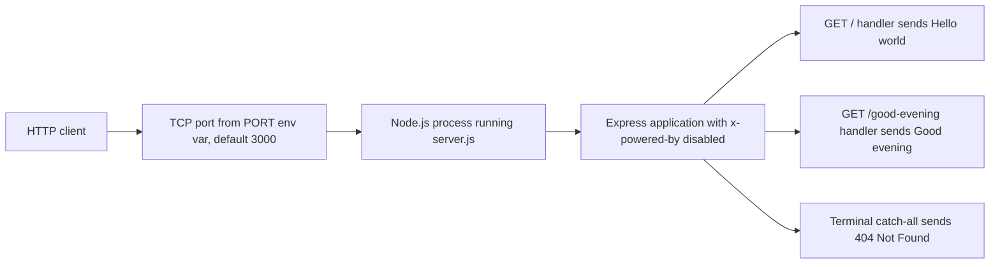
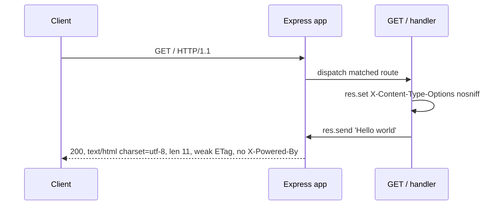
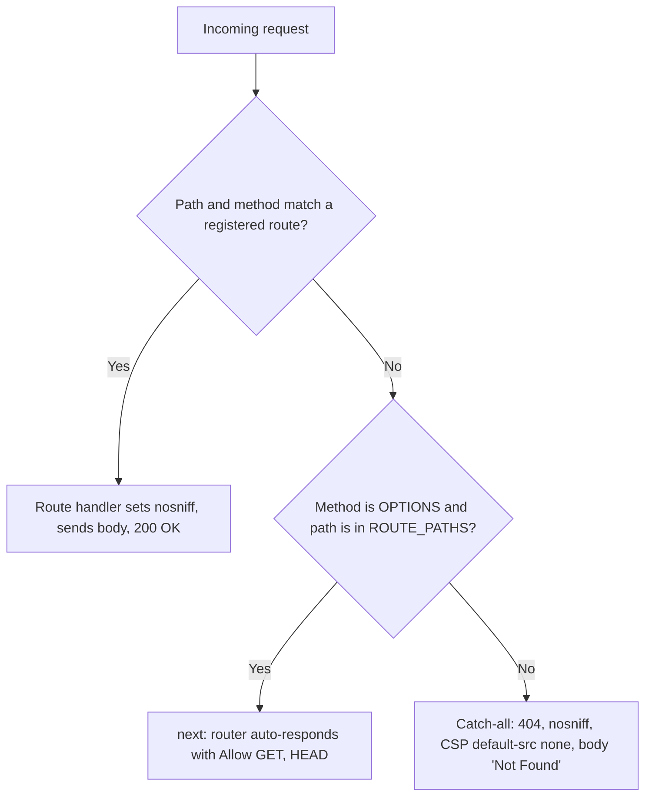
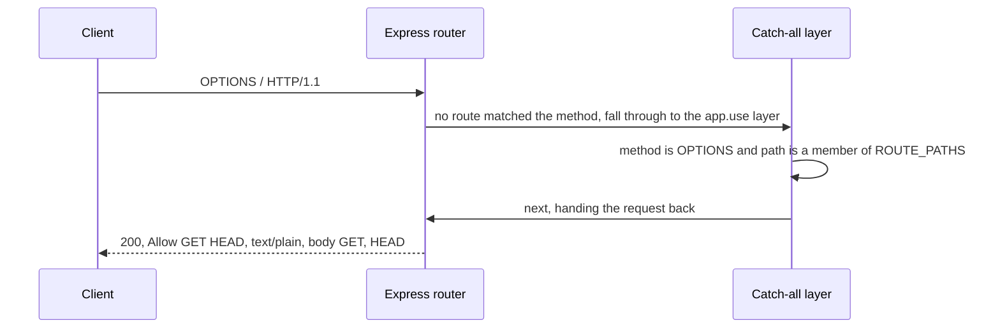
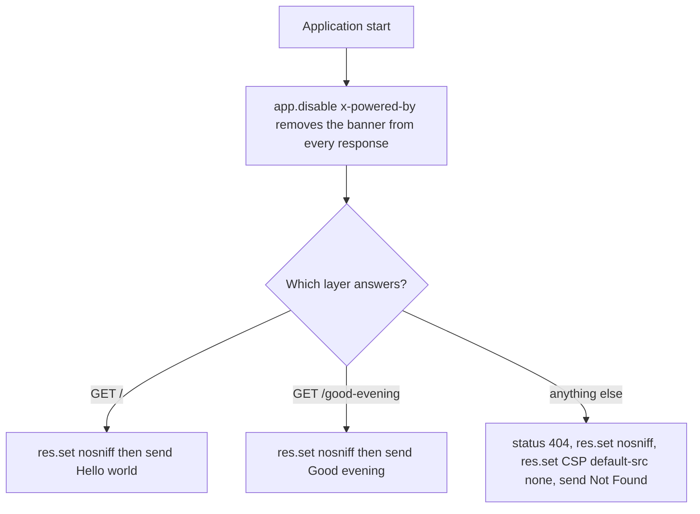
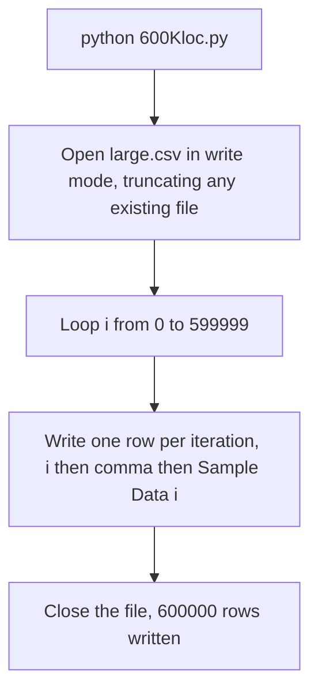

# check_status_2107_01

A minimal Node.js HTTP server built with the [Express](https://expressjs.com/) web framework. It exposes two plain-text `GET` endpoints — a pre-existing `Hello world` response and a newly added `Good evening` response. Alongside the server, the repository also carries an unrelated Python utility, `600Kloc.py`, which generates the roughly 16 MB synthetic dataset `large.csv` that is committed next to it.

Everything a newcomer needs in order to install, configure, run, call, verify and deploy the service is in this file, so the source does not have to be read first. Every command shown below was executed against this repository, and every status code, response body and header was transcribed from that output rather than inferred from the code.

## Table of Contents

- [Table of Contents](#table-of-contents)
- [Repository Contents](#repository-contents)
- [Prerequisites](#prerequisites)
- [Installation](#installation)
- [Configuration](#configuration)
- [Running the Server](#running-the-server)
- [API Reference](#api-reference)
- [Architecture](#architecture)
- [Code Walkthrough](#code-walkthrough)
- [Synthetic Dataset Utility](#synthetic-dataset-utility)
- [Deployment Guide](#deployment-guide)
- [Troubleshooting](#troubleshooting)
- [Documentation Maintenance](#documentation-maintenance)
- [License](#license)

## Repository Contents

The repository is flat: it has no subdirectories, and these eleven files are its entire tracked contents.

| File                       | Purpose                                                                                   | Status                   |
| -------------------------- | ----------------------------------------------------------------------------------------- | ------------------------ |
| `README.md`                | This document — the project's single documentation deliverable                            | Updated by this work     |
| `server.js`                | The Express HTTP service, annotated with JSDoc blocks and inline rationale comments       | Added by this work       |
| `package.json`             | Manifest declaring the `start`, `docs` and `lint:md` scripts and the `express` dependency | Added by this work       |
| `package-lock.json`        | Lockfile pinning `express` to exactly 5.2.1 across 68 recorded entries                    | Added by this work       |
| `.gitignore`               | Ignores `node_modules/`, npm failure logs, `.env`, `docs-api/` and `__pycache__/`         | Added by this work       |
| `.markdownlint-cli2.jsonc` | Markdown quality-gate configuration read by `npm run lint:md`                             | Added by this work       |
| `600Kloc.py`               | Synthetic dataset generator — writes 600,000 rows to `large.csv`                          | Pre-existing, unmodified |
| `large.csv`                | The generated dataset: 600,000 rows of two comma-separated columns                        | Pre-existing, unmodified |
| `asdas.py`                 | **Non-functional scratch file** — raises `NameError`; do not run                          | Pre-existing, unmodified |
| `sdfsd.py`                 | **Non-functional scratch file** — does not even parse (`SyntaxError`); do not run         | Pre-existing, unmodified |
| `testing.py`               | **Non-functional scratch file** — raises `NameError`; do not run                          | Pre-existing, unmodified |

The last three entries are scratch left over from unrelated experimentation, and they are named above only so that nobody tries to run them. Two raise `NameError` on their very first line; the third never reaches execution at all, because line 7 is the bare reserved word `as`, which the parser rejects with `SyntaxError: invalid syntax`. All three exit `1`. None of them is part of the service, and this documentation describes them rather than repairing them.

Two directories appear while you work but are never committed, because both are git-ignored:

- `node_modules/` — the installed dependency tree, recreated by `npm install` or `npm ci`.
- `docs-api/` — the HTML API reference emitted on demand by `npm run docs`. Keeping it out of the repository means the annotated `server.js` stays the single documentation of record and no stale generated copy can drift alongside it.

## Prerequisites

- **Node.js 22.x** (validated against Node.js v22.23.1, the LTS line codenamed "Jod")
- **npm 10.9.8+** — the version bundled with Node.js v22.23.1 (validated against npm 11.18.0)
- **Python 3** — required only for the optional [Synthetic Dataset Utility](#synthetic-dataset-utility), never for the server (validated against Python 3.12.3 and Python 3.13.7)

Check what you have before going further:

```bash
node --version    # -> v22.23.1
npm --version     # -> 11.18.0
```

`express` 5.2.1 declares `"engines": { "node": ">= 18" }`, and `package.json` restates that floor as `"engines": { "node": ">=18" }`. Node.js 18, 20 and 22 therefore all satisfy the dependency; 22.x is simply the line this documentation was validated against. Note that npm only _warns_ about an unsatisfied engine range unless `engine-strict` is configured, so a Node.js older than 18 will still install and start — and then fail in less obvious ways.

Nothing else is needed. The service reads no files, opens no database connection, and has no build or transpilation step.

## Installation

Clone the repository and install its single runtime dependency:

```bash
git clone https://github.com/lakshya-blitzy/check_status_2107_01.git
cd check_status_2107_01
npm install    # -> added 67 packages, and audited 68 packages
```

`npm install` materialises **`express` 5.2.1** — resolved from the `^5.2.1` range in `package.json` and pinned to that exact version by `package-lock.json` — together with its 67 transitive packages, into `node_modules/`. That directory is git-ignored and never committed; the lockfile _is_ committed, and it is what makes the tree reproducible. The install reports `found 0 vulnerabilities`.

Use `npm ci` instead when you want the lockfile honoured strictly and any pre-existing `node_modules/` discarded first:

```bash
npm ci    # -> added 67 packages, and audited 68 packages
```

Then prove the install worked before starting anything:

```bash
node -e "console.log(require('express/package.json').version)"    # -> 5.2.1
```

If that prints `5.2.1`, the service has everything it needs.

## Configuration

`PORT` is the service's **sole** configuration knob. There is no configuration file, no `.env` file is read by the code, and no other environment variable is consulted anywhere.

| Variable | Type                                   | Default | Precedence expression                                                                          | Example               |
| -------- | -------------------------------------- | ------- | ---------------------------------------------------------------------------------------------- | --------------------- |
| `PORT`   | Integer, 0-65535, supplied as a string | `3000`  | `process.env.PORT \|\| 3000` — any non-empty value wins, an unset or empty variable falls back | `PORT=8080 npm start` |

The expression is evaluated exactly once, when the listener is created at `server.js:L375`. The value arrives as a string — `PORT=8080` becomes `'8080'` — which Node accepts directly.

That value is passed on unvalidated, so it has to be a real TCP port, and the two ways of getting it wrong behave very differently:

- **A number Node cannot use as a port fails loudly.** `PORT=65536` is out of range, `PORT=8080.5` is not a whole number, and a whitespace-only value is rejected outright; each throws `RangeError [ERR_SOCKET_BAD_PORT]` and the process exits `1` without ever listening. `PORT=0` is legal but asks the kernel for any free port, so the service comes up somewhere unpredictable.
- **A value that is not a number at all fails silently.** Node picks between a TCP port and an inter-process socket by converting the argument with `Number()`, so `PORT=abc` or `PORT=-1` is read as a file-system path: the process binds a Unix-domain socket of that name in the working directory, never listens on TCP, prints nothing, and never exits. A supervisor watching only process liveness would call that healthy while every TCP client is refused.

`server.js:L338-L374` carries the same contract beside the statement it governs. The readiness probe under [Deployment Guide](#deployment-guide) distinguishes the two cases, which is why a deployment should be gated on that probe rather than on process liveness.

## Running the Server

```bash
npm start    # -> node server.js
```

`npm start` runs `node server.js`, which binds port 3000, so the service answers at `http://localhost:3000/`. Invoking Node directly is exactly equivalent:

```bash
node server.js
```

Override the port through the environment:

```bash
PORT=8080 npm start    # the service then answers at http://localhost:8080/
```

The process writes nothing to standard output — this service logs nothing by design — so a silent terminal means it started successfully, and the way to confirm it is a request rather than a log line:

```bash
curl -s http://localhost:3000/    # -> Hello world
```

Stop it with `Ctrl+C` when it runs in the foreground, or by sending `SIGTERM` to the process when it runs detached. The service holds no state and writes no files, so it can be stopped and restarted at any moment without cleanup.

## API Reference

The service exposes two endpoints and one terminal catch-all. Every value in this section was transcribed from `curl` output against a running instance rather than read off the source, and the base URL used throughout is `http://localhost:3000/`.

| Method                           | Path                   | Status          | Response body          | `Content-Length` | `Content-Type`             |
| -------------------------------- | ---------------------- | --------------- | ---------------------- | ---------------- | -------------------------- |
| `GET`                            | `/`                    | `200 OK`        | `Hello world`          | `11`             | `text/html; charset=utf-8` |
| `GET`                            | `/good-evening`        | `200 OK`        | `Good evening`         | `12`             | `text/html; charset=utf-8` |
| `GET`                            | any other path         | `404 Not Found` | `Not Found`            | `9`              | `text/html; charset=utf-8` |
| `POST`, `PUT`, `DELETE`, `PATCH` | any path, `/` included | `404 Not Found` | `Not Found`            | `9`              | `text/html; charset=utf-8` |
| `OPTIONS`                        | `/` or `/good-evening` | `200 OK`        | `GET, HEAD`            | `9`              | `text/plain`               |
| `HEAD`                           | `/` or `/good-evening` | `200 OK`        | none — body suppressed | `11` or `12`     | `text/html; charset=utf-8` |

Two points about that table are worth stating before the detail, because both routinely surprise a first-time caller:

- **The bodies are plain-text strings, but they are served as HTML.** `Content-Type: text/html; charset=utf-8` is not set by this project. Express sets it: `res.send` is handed a string, finds no content type already set, and calls `this.type('html')` at `node_modules/express/lib/response.js:L138`. The bytes themselves are exactly `Hello world`, `Good evening` and `Not Found`, with no markup. This is the framework's documented default and it is left exactly as it is.
- **A `404` says nothing about why.** An unknown path and an unhandled method on a _known_ path produce the same status, the same body and the same headers, deliberately.

Every transcript below omits the `Date`, `Connection` and `Keep-Alive` headers, which are present on every real response and vary per request.

### GET /

Answers the service root with the fixed greeting `Hello world`. Nothing from the request takes part in the body, so every caller receives the same 11 bytes.

- **Status** — `200 OK`
- **Body** — `Hello world` (11 bytes, no trailing newline)
- **Headers** — `X-Content-Type-Options: nosniff`, `Content-Type: text/html; charset=utf-8`, `Content-Length: 11`, `ETag: W/"b-e1AsOh9IyGCa4hLN+2Od7jlnP14"`. `X-Powered-By` is absent.

```bash
curl -i http://localhost:3000/
# -> HTTP/1.1 200 OK
# -> X-Content-Type-Options: nosniff
# -> Content-Type: text/html; charset=utf-8
# -> Content-Length: 11
# -> ETag: W/"b-e1AsOh9IyGCa4hLN+2Od7jlnP14"
# ->
# -> Hello world
```

Because the body is a constant, the weak `ETag` is stable across restarts, and a conditional request is answered without a body:

```bash
curl -i -H 'If-None-Match: W/"b-e1AsOh9IyGCa4hLN+2Od7jlnP14"' http://localhost:3000/
# -> HTTP/1.1 304 Not Modified
# -> X-Content-Type-Options: nosniff
# -> ETag: W/"b-e1AsOh9IyGCa4hLN+2Od7jlnP14"
```

Note that the `304` carries neither `Content-Type` nor `Content-Length`, which Express strips for a not-modified response.

### GET /good-evening

Answers `/good-evening` with the fixed greeting `Good evening`. It is registered as an independent route rather than as a branch inside the root handler, so an unrelated path still reaches the catch-all instead of receiving a greeting by accident.

- **Status** — `200 OK`
- **Body** — `Good evening` (12 bytes)
- **Headers** — `X-Content-Type-Options: nosniff`, `Content-Type: text/html; charset=utf-8`, `Content-Length: 12`, `ETag: W/"c-ak9U7+O0BzTfZwhjDzBQxAnHCaU"`. `X-Powered-By` is absent.

```bash
curl -i http://localhost:3000/good-evening
# -> HTTP/1.1 200 OK
# -> X-Content-Type-Options: nosniff
# -> Content-Type: text/html; charset=utf-8
# -> Content-Length: 12
# -> ETag: W/"c-ak9U7+O0BzTfZwhjDzBQxAnHCaU"
# ->
# -> Good evening
```

Route matching is Express's own, which is case-insensitive and tolerates a trailing slash, so `GET /GOOD-EVENING` and `GET /good-evening/` also reach this handler. That tolerance does **not** extend to the `OPTIONS` carve-out described below, which compares paths exactly.

### Unmatched paths and methods (404)

Anything the two routes above did not handle is answered by a single terminal catch-all with a generic `404 Not Found`.

- **Status** — `404 Not Found`
- **Body** — `Not Found` (9 bytes)
- **Headers** — `X-Content-Type-Options: nosniff`, `Content-Security-Policy: default-src 'none'`, `Content-Type: text/html; charset=utf-8`, `Content-Length: 9`, `ETag: W/"9-0gXL1ngzMqISxa6S1zx3F4wtLyg"`. `X-Powered-By` is absent.

```bash
curl -i http://localhost:3000/nope
# -> HTTP/1.1 404 Not Found
# -> X-Content-Type-Options: nosniff
# -> Content-Security-Policy: default-src 'none'
# -> Content-Type: text/html; charset=utf-8
# -> Content-Length: 9
# -> ETag: W/"9-0gXL1ngzMqISxa6S1zx3F4wtLyg"
# ->
# -> Not Found
```

**An unhandled method on a known path gets the same response.** A `POST` to `/` — a path the service really does serve — is answered with a `404`, not a `405`, and that `404` is byte-identical to the one above: same status, same body, same `Content-Length`, the same `Content-Security-Policy`, and the same `ETag`, because the body producing it is the same constant.

```bash
curl -i -X POST http://localhost:3000/
# -> HTTP/1.1 404 Not Found
# -> X-Content-Type-Options: nosniff
# -> Content-Security-Policy: default-src 'none'
# -> Content-Type: text/html; charset=utf-8
# -> Content-Length: 9
# -> ETag: W/"9-0gXL1ngzMqISxa6S1zx3F4wtLyg"
# ->
# -> Not Found
```

The response is therefore not diagnostic: it cannot tell you whether the path was wrong or the method was. That is the intended behaviour and is worth understanding rather than debugging — see the routing flowchart under [Architecture](#architecture).

**The body never echoes the request.** No path, no method and no header is reflected back. The body is the literal string `Not Found` at `server.js:L335`, so a crafted path cannot be bounced back through the response, and the identical answer for a path mismatch and a method mismatch means the response does not disclose which of the two occurred. `Content-Security-Policy: default-src 'none'` is added on this branch only, at `server.js:L327`: an error body is never a document, so denying every fetch directive costs nothing here, whereas applying it to the two `200` responses would change the service's payload behaviour rather than harden an error page.

This is hardening, not route concealment: a registered path still answers `200` where an unregistered one answers `404`.

### OPTIONS and HEAD behaviour

Both verbs work without being registered anywhere in the project's source, and neither is handled by project code.

**`OPTIONS` on a registered path is answered by Express, not by this service.** The catch-all is a path-less `app.use` layer, so it runs for every method including `OPTIONS`; left alone it would swallow method-discovery requests and answer `404`. Instead it tests the request at `server.js:L306` and, for an `OPTIONS` aimed at one of the two canonical paths, calls `next()` at `server.js:L311` to hand the request back. Express's own automatic responder then writes the whole reply at `node_modules/router/index.js:L710-L714`.

```bash
curl -i -X OPTIONS http://localhost:3000/
# -> HTTP/1.1 200 OK
# -> Allow: GET, HEAD
# -> Content-Length: 9
# -> Content-Type: text/plain
# -> X-Content-Type-Options: nosniff
# ->
# -> GET, HEAD
```

This is the one response in the service whose content type genuinely is `text/plain`: it is written by the router at `node_modules/router/index.js:L712`, never by `res.send`, so the HTML default described above does not apply to it. Membership in the carve-out is an exact string comparison, so `OPTIONS /GOOD-EVENING` and `OPTIONS /good-evening/` are _not_ members and receive the generic `404` even though `GET` on those spellings reaches the route.

`HEAD` appears in that `Allow` list without being registered because Express's router appends it to a `GET` route's method list automatically.

**`HEAD` returns the `GET` headers with the body suppressed.**

```bash
curl -I http://localhost:3000/
# -> HTTP/1.1 200 OK
# -> X-Content-Type-Options: nosniff
# -> Content-Type: text/html; charset=utf-8
# -> Content-Length: 11
# -> ETag: W/"b-e1AsOh9IyGCa4hLN+2Od7jlnP14"
```

The headers are identical to `GET /`, weak `ETag` included, and `Content-Length: 11` still advertises the size of the body that a `GET` would have returned. No bytes follow.

### Response header reference

Seven header facts describe the whole observable surface. Four of them come from Express rather than from this project's code, which is exactly why they are tabulated with their origin.

| Header                    | Observed value                            | Sent on                                  | Set by                                |
| ------------------------- | ----------------------------------------- | ---------------------------------------- | ------------------------------------- |
| `Content-Type`            | `text/html; charset=utf-8`                | both `200` bodies and the `404` body     | Express default, `response.js:L138`   |
| `Content-Length`          | `11`, `12` or `9`                         | every response, `HEAD` included          | Express, from the constant body       |
| `X-Content-Type-Options`  | `nosniff`                                 | all three bodies and the `OPTIONS` reply | Project code, `server.js:L157`        |
| `ETag`                    | weak, `W/"b-e1AsOh9IyGCa4hLN+2Od7jlnP14"` | both `200` bodies and the `404` body     | Express default, `application.js:L95` |
| `Content-Security-Policy` | `default-src 'none'`                      | the `404` response only                  | Project code, `server.js:L327`        |
| `Allow`                   | `GET, HEAD`                               | the `OPTIONS` reply only                 | Express router, `index.js:L710`       |
| `X-Powered-By`            | absent, measured occurrences `0`          | never                                    | Disabled at `server.js:L106`          |

The full provenance of each, so that no framework default is mistaken for a project decision:

- **`Content-Type`** — `node_modules/express/lib/response.js:L138` calls `this.type('html')` for a string body when no content type has already been set. This is the sole origin of `text/html; charset=utf-8` on the three plain-text bodies.
- **`Content-Length`** — computed by Express from the constant body bytes: `11` for `Hello world`, `12` for `Good evening`, `9` for `Not Found`. A `HEAD` reply still carries it.
- **`X-Content-Type-Options`** — set by project code on each response path, at `server.js:L157` for `/`, `server.js:L197` for `/good-evening` and `server.js:L319` for the catch-all. It pins a browser to the declared type instead of letting it sniff the bytes. The copy on the `OPTIONS` reply is a separate one, written by the router at `node_modules/router/index.js:L713`.
- **`ETag`** — weak because Express defaults the `etag` setting to `'weak'` at `node_modules/express/lib/application.js:L95`. It is derived from the constant body, which is what makes the conditional `304` shown above cheap and reproducible.
- **`Content-Security-Policy`** — project code, `404` branch only, at `server.js:L327`. `default-src 'none'` denies every fetch destination, so an error body cannot become a springboard for loading anything else: a browser that lands on a `404` refuses even a same-origin `fetch` issued from that document. The two success responses deliberately omit it, so an ordinary caller of `/` is unaffected.
- **`Allow`** — written by Express's router at `node_modules/router/index.js:L710`, immediately before it sets `Content-Length`, `Content-Type: text/plain` and `X-Content-Type-Options`, then ends the response.
- **`X-Powered-By`** — Express _enables_ this setting by default at `node_modules/express/lib/application.js:L94`, so it would otherwise disclose the server technology on every response. `app.disable('x-powered-by')` at `server.js:L106` switches it off; measured occurrences across every probe in this document: `0`.

## Architecture

The whole system is one Node.js process holding one Express application with three registered layers. There is no database, no cache, no queue, no static asset directory and no template engine. The diagrams below are GitHub-native Mermaid, so they need no build step and no renderer dependency; each one names the source lines it was derived from, so a change to those lines makes the corresponding diagram's staleness locatable.

**D-1 — component and deployment topology.**



A single process serves every request, and the only externally supplied input is the port. Scaling out means running more copies of this process behind something that balances across them; nothing in the service coordinates between copies, because nothing in it holds state.

**D-2 — the successful `GET /` request lifecycle.** This is where the response headers come from, and the API Reference simply tabulates the outcome.



Project code contributes one header and one constant string. Everything else on the wire — the content type, the length, the weak validator, and the absence of a technology banner — is Express behaviour that this service either accepts or explicitly switches off.

**D-3 — routing and 404 decision logic.** This is the most load-bearing diagram in the document, because it explains the two outcomes that surprise callers: a `POST` to a path the service _does_ serve still yields the generic 404, while an `OPTIONS` to that same path does not.



**D-4 — `OPTIONS` method discovery.** The catch-all steps aside rather than answering, which is the only reason method discovery works at all.



**D-5 — response-header hardening points.** Three of them, on three different paths through the application.



`X-Content-Type-Options: nosniff` is set per route rather than in a shared middleware: with only two endpoints, keeping each response contract readable in one place is worth more than removing the duplication. `Content-Security-Policy` is deliberately confined to the error branch — the two `200` responses are the service's payload, not an error surface, and adding a policy there would change behaviour rather than harden anything.

**Framework defaults versus project decisions.** Most of what a client observes is Express, not this repository, and the distinction matters when something looks wrong:

- Express sets `Content-Type: text/html; charset=utf-8` on a string body at `node_modules/express/lib/response.js:L138`.
- Express enables `X-Powered-By` by default at `node_modules/express/lib/application.js:L94`, which is precisely why the project has to disable it.
- Express defaults `ETag` to weak at `node_modules/express/lib/application.js:L95`, which is where the `W/` prefix and the conditional `304` come from.
- Express's router answers `OPTIONS` itself at `node_modules/router/index.js:L710-L714`, including the `Allow` list, the `text/plain` content type and its own `nosniff`.

The project's own decisions are far smaller in number: disable the technology banner, set `nosniff` on every response it writes, add a restrictive `Content-Security-Policy` to error responses only, keep the 404 body constant, and defer `OPTIONS` on real paths to the router.

## Code Walkthrough

`server.js` is 375 lines, of which 23 are executable; the remainder is the documentation layer — JSDoc blocks that `npm run docs` renders, and inline comments that explain _why_ each statement is written the way it is. The constructs below appear in source order, each with the line it occupies in the current file.

**The file and module block — `server.js:L1-L27`.** A single JSDoc block carrying `@file`, `@module server`, `@requires express`, `@version` and `@license`. It is what makes the generated API reference name the module and its dependency, and it states up front which observable behaviours belong to Express rather than to this file.

**Strict mode — `server.js:L33`.** `'use strict'` is not redundant here. CommonJS modules are not strict by default — only ES modules are — and `package.json` declares `"type": "commonjs"`, so strict semantics have to be requested explicitly. Without the directive, an accidental assignment to an undeclared identifier would silently create a global rather than throw.

**Local type declarations — `server.js:L45-L76`.** Three documentation-only declarations: `@typedef ExpressRequest`, `@typedef ExpressResponse` and `@callback ExpressNext`. They exist so the handler annotations can name the objects that reach them, declaring only the members this file actually touches. They are deliberately _not_ written as TypeScript-style dynamic-import type expressions, because the documentation generator pinned by `npm run docs` rejects that syntax as an invalid type expression, exits non-zero, and silently discards every annotated type — a documentation failure that still looks like a successful build.

**The dependency — `server.js:L88`.** `const express = require('express')` is the file's only `require`. `require` rather than `import` because both this file and the manifest are CommonJS.

**The application — `server.js:L97`.** `const app = express()` builds the single request dispatcher that owns the router, the settings table and the layer stack registered below.

**Removing the technology banner — `server.js:L106`.** `app.disable('x-powered-by')`. **Why it is needed:** Express turns this setting _on_ during its default configuration at `node_modules/express/lib/application.js:L94`, so without this line every response would advertise `X-Powered-By: Express`. Disabling the setting removes a header that discloses the server technology and that no caller needs. This single statement is the reason `X-Powered-By` is absent from every transcript in this document.

**`GET /` — `server.js:L143-L165`.** An anonymous arrow handler registered inline. It sets `X-Content-Type-Options: nosniff` at `server.js:L157` and sends the constant `Hello world` at `server.js:L164`. Nothing from the request is interpolated, so the body is a literal with no injection surface, and both the `Content-Length: 11` and the weak `ETag` are derived from those constant bytes.

**`GET /good-evening` — `server.js:L193-L199`.** The same shape: `nosniff` at `server.js:L197`, then the constant `Good evening` at `server.js:L198`. Registered as its own route rather than as a branch inside the root handler, so an unrelated path falls through to the catch-all instead of being greeted by accident.

**`ROUTE_PATHS` — `server.js:L222`.** `const ROUTE_PATHS = new Set(['/', '/good-evening'])`. **Why it exists:** solely so the catch-all can recognise an `OPTIONS` request aimed at a path this file really registered and step aside, letting Express's own automatic `Allow` responder at `node_modules/router/index.js:L710` answer it. A `Set` makes that membership test one constant-time lookup instead of a scan. Membership is exact string comparison, whereas Express route matching is case-insensitive and tolerates a trailing slash — so `OPTIONS /GOOD-EVENING` and `OPTIONS /good-evening/` are not members even though `GET` on those spellings reaches the route. The declaration is kept immediately below the two `app.get` calls it mirrors, because it has to be edited in the same change that adds or removes a route or the carve-out goes stale.

**The terminal catch-all — `server.js:L293-L336`.** Registered last, on purpose: registration order is dispatch order, so moving this layer above the two routes would make it answer `404` for every request, `/` included.

**Why `app.use()` and not `app.get('*')`.** Express 5 matches paths through `router` 2.2.0 and `path-to-regexp` 8.4.2, which require **named** wildcards. Registering the bare `'*'` pattern now throws at registration time with `Missing parameter name at index 1: *`, so a wildcard `app.get` catch-all would crash the process at start-up. The Express 5 spellings are `/*splat`, or `/{*splat}` when the root path must match too. A path-less `app.use` sidesteps that syntax change entirely and — unlike an `app.get` route — also catches unhandled methods such as `POST`, which is what makes one layer sufficient here.

Inside the layer:

- `server.js:L306` tests `req.method === 'OPTIONS' && ROUTE_PATHS.has(req.path)`.
- `server.js:L311` returns `next()` for that case. The `return` is load-bearing: without it, execution would fall into the 404 branch and the handler would try to answer a request it had just delegated, which Node reports as an attempt to set headers after they are sent.
- `server.js:L314` sets the status to `404`.
- `server.js:L319` sets `X-Content-Type-Options: nosniff` — it matters most here, since an error body is the one most likely to be opened in a browser tab by accident.
- `server.js:L327` sets `Content-Security-Policy: default-src 'none'`, on this branch only.
- `server.js:L335` sends the constant `Not Found`.

**Why the 404 body never echoes the request.** The body at `server.js:L335` is a literal. No path, no method and no header is reflected back, so a crafted path cannot be bounced through the response, and an unmatched path and an unhandled method on a matched path share one identical status, body and header set — the response therefore does not disclose which of the two produced it. It is reflection hardening, not route concealment: a registered path still answers `200` where an unregistered one answers `404`.

**Binding the listener — `server.js:L375`.** `app.listen(process.env.PORT || 3000)` is both the service's only configuration read and its last statement, so every layer above is registered before the first connection can be accepted. The rationale comment at `server.js:L338-L374` documents the full `PORT` contract, including the malformed-value behaviour summarised under [Configuration](#configuration).

## Synthetic Dataset Utility

`600Kloc.py` is unrelated to the HTTP service and is not needed to run it. It generates the committed dataset `large.csv`, and its entire source is three lines (`600Kloc.py:L1-L3`):

```python
with open("large.csv", "w") as f:
    for i in range(600000):
        f.write(f"{i},Sample Data {i}\n")
```

**D-6 — dataset generation.**



Run it with:

```bash
python 600Kloc.py    # use python3 on systems where python is not on PATH
```

Each row has the shape `<i>,Sample Data <i>` for `i` from `0` through `599999`, giving 600,000 rows of two comma-separated columns. The script uses nothing beyond the standard library, so any Python 3 interpreter runs it.

> **This command is destructive.** `600Kloc.py:L1` opens `large.csv` in write mode, which truncates the committed file immediately and without prompting. Regenerating it is not a read-only operation, and any local change to the dataset is lost.

A second, milder side effect: CPython writes a `__pycache__/` bytecode cache whenever a module in this tree is _imported_. Running the script directly as a program does not create one, but importing it — or importing anything else here — does, which is why `__pycache__/` is git-ignored.

### Verifying the dataset

Check the dataset by row count and content:

```bash
wc -l large.csv                                        # -> 600000
grep -cP '^[0-9]+,Sample Data [0-9]+\r?$' large.csv    # -> 600000
awk -F, 'NF==2' large.csv | wc -l                      # -> 600000
head -n 1 large.csv                                    # -> 0,Sample Data 0
tail -n 1 large.csv                                    # -> 599999,Sample Data 599999
```

The `\r?$` in that pattern is not decoration. Every row of the committed file terminates with CRLF, so an anchored pattern that does not tolerate the carriage return matches nothing and returns `0` — which looks exactly like a corrupt dataset and is not one. Always use the CRLF-tolerant form above.

**Verify by row count and content, never by byte size.** The committed CRLF form measures 15,977,780 bytes. A copy regenerated on a platform that writes bare LF measures 15,377,780 — exactly 600,000 bytes smaller, one per row — with an identical row count, identical first row and identical last row. That 600,000-byte difference is correct behaviour, not damage, so `wc -c` is not a validity check.

## Deployment Guide

Deployment is deliberately small: one foreground process, one runtime dependency, one environment variable, no build step and no persistent state. The six subsections below cover the whole operational surface — starting the process, setting its port, placing a supervisor and a reverse proxy in front of it, proving a running instance healthy, promoting and rolling back a change, and the limits worth planning around. Every command shown here was executed against this repository.

### Starting the process

```bash
npm start        # -> node server.js
node server.js   # equivalent direct invocation
```

Either form binds port 3000 by default and begins serving immediately; there is no warm-up, no migration step and no readiness delay beyond process start. The process runs in the foreground and prints nothing.

What it deliberately does **not** do: it does not fork or cluster, it does not daemonise itself, it does not write a PID file, it does not rotate or emit logs, and it does not restart itself after a crash. Anything you need from that list belongs to the process manager described below, not to the service.

### Port and environment configuration

```bash
PORT=8080 npm start
```

`PORT` is read once as `process.env.PORT || 3000` at `server.js:L375`: any non-empty value wins, and an unset or empty variable falls back to `3000`. It is the only environment variable the service consults, so a platform that injects a port needs no code change. The malformed-value behaviour — a loud `RangeError` for an out-of-range or fractional port, and a silent Unix-domain socket bind for a non-numeric one — is documented under [Configuration](#configuration) and is the reason the health check below is a request rather than a liveness check.

### Running behind a reverse proxy

Run the process under a supervisor that owns restart policy and log capture — a `systemd` unit or a Node process manager both work, and neither requires any change to the service. Point a reverse proxy at the bound port and terminate TLS there; the service speaks plain HTTP only.

One consequence to plan around: `app.set('trust proxy')` is **not** enabled in this service. Express therefore treats the proxy itself as the peer, so `X-Forwarded-For` and `X-Forwarded-Proto` are not interpreted, `req.ip` reflects the proxy rather than the original client, and `req.protocol` reports the scheme of the proxy-to-service hop rather than the client-to-proxy one. Nothing in this service reads any of those values, so the responses documented here are unaffected — but any logging or access control you add at the proxy layer has to derive the client address at the proxy, because the service will not.

### Health verification

The service has no dedicated health endpoint and none is needed: the root route is a fixed, cheap, side-effect-free response, which makes it a sound readiness probe on its own.

```bash
curl -sf http://localhost:3000/    # exits 0 when healthy
```

| Probe                                                | Expected exit code | Meaning                           |
| ---------------------------------------------------- | ------------------ | --------------------------------- |
| `curl -sf http://localhost:3000/`                    | `0`                | A TCP listener answered `200`     |
| `curl -sf http://localhost:3000/nope`                | `22`               | Listener answered, but with `404` |
| `curl -sf http://localhost:3000/` with nothing bound | `7`                | Nothing is listening on the port  |

Exit code `7` is the one that catches the silent failure mode: it distinguishes "the process is running but bound nothing on TCP" from "the process is serving", which process liveness alone cannot do. Gate a deployment on this probe.

The full probe set, for a deeper post-deployment check:

```bash
curl -i http://localhost:3000/                # -> 200, Hello world, Content-Length 11
curl -i http://localhost:3000/good-evening    # -> 200, Good evening, Content-Length 12
curl -i http://localhost:3000/nope            # -> 404, Not Found, Content-Length 9
curl -i -X POST http://localhost:3000/        # -> 404, generic, request path not echoed
curl -i -X OPTIONS http://localhost:3000/     # -> 200, Allow: GET, HEAD
curl -I http://localhost:3000/                # -> 200, headers only, no body
```

### Promotion and rollback

Promotion is Git branch flow: work lands on `2107_01` and is promoted to `main` by merging that branch. The repository address is `https://github.com/lakshya-blitzy/check_status_2107_01`.

Rollback is equally plain, because deployment is nothing more than "check out a commit and start the process". Check out the previous commit, run `npm ci` so the dependency tree matches that commit's lockfile exactly, and start the process again. Recovery is idempotent and can be repeated safely: the service holds no state, writes no files, owns no schema and performs no migration, so re-running a deployment converges on the same result no matter how many times it is attempted, and there is no data to restore or replay.

**No formal RPO or RTO is defined for this service,** and none is meaningful for it: with no persistent state there is nothing to lose, so a recovery point objective has nothing to measure, and recovery time is bounded only by how quickly the process can be restarted.

### Operational notes

- **Engine floor.** `express` 5.2.1 declares `"engines": { "node": ">= 18" }`, and `package.json` restates `>=18`. Node.js 18, 20 and 22 all satisfy it; v22.23.1 is the validated line.
- **Stateless by construction.** No database, no cache, no session store, no file writes, no in-memory accumulation. Any instance can serve any request, and instances need not coordinate.
- **Fixed response cost.** Every response is a constant string of at most 12 bytes with a precomputed weak validator, so a conditional request is answered `304` without a body.
- **Generated documentation is not deployed.** `docs-api/` is produced on demand by `npm run docs` and is git-ignored, so it never ships as part of a release and can never go stale in the repository.
- **No pipeline.** There is no CI/CD automation in this repository. The quality gates listed under [Documentation Maintenance](#documentation-maintenance) are commands a contributor runs.

## Troubleshooting

Six failure modes account for essentially everything that goes wrong with this service. All six were reproduced against this repository.

### `EADDRINUSE` on start

**Symptom.** The process exits `1` immediately with `Error: listen EADDRINUSE: address already in use :::3000`, and the stack trace names `server.js:375`.

**Cause.** Something already holds port 3000 — very often an earlier copy of this same service left running in another terminal.

**Resolution.** Start on a different port, or free the one you want:

```bash
PORT=8080 npm start    # -> serves on 8080 instead
```

To free port 3000 instead, find the process holding it and stop that specific process. Note that `PORT=0` also starts successfully, but on a kernel-assigned port you then have to discover, so it is rarely what you want.

### `Cannot find module 'express'`

**Symptom.** `node server.js` throws `Error: Cannot find module 'express'` followed by a require stack, and never listens.

**Cause.** Dependencies were never installed, or `node_modules/` was deleted. The directory is git-ignored, so a fresh clone never has one.

**Resolution.**

```bash
npm ci                                                            # or: npm install
node -e "console.log(require('express/package.json').version)"    # -> 5.2.1
```

### Engine warning on a Node.js older than 18

**Symptom.** `npm install` prints an `EBADENGINE` warning about an unsupported engine, and the install then succeeds anyway.

**Cause.** `express` 5.2.1 declares `"engines": { "node": ">= 18" }` and `package.json` restates `>=18`, but npm only _warns_ about an unsatisfied engine range unless `engine-strict` is configured.

**Resolution.** Treat the warning as an error. Upgrade to a supported Node.js — v22.23.1 is the validated version — rather than continuing past it, because the failure it predicts appears later and further from its cause:

```bash
node --version    # -> v22.23.1
```

### An unexpected `404 Not Found`

**Symptom.** A request you believe is valid comes back `404` with the body `Not Found`.

**Cause.** The terminal catch-all answers **any** unmatched path _and_ any unhandled method on a matched path. Only `GET` and `HEAD` on `/` and `/good-evening` are served; a `POST` to `/` is a `404`, not a `405`. The body is the constant `Not Found` and never echoes the request, so the response cannot tell you which mismatch occurred.

**Resolution.** Compare your request against the decision logic in diagram **D-3** under [Architecture](#architecture), then check the method and the exact path separately. One `404` is expected and is nobody's bug: a browser requests `/favicon.ico` on its own the first time it opens the service, and the catch-all answers it like any other unknown path.

### A client surprised by `text/html; charset=utf-8`

**Symptom.** A caller expecting plain text receives `Content-Type: text/html; charset=utf-8`, and a browser's developer tools may additionally report quirks mode for the page.

**Cause.** `res.send` is handed a string, finds no content type already set, and calls `this.type('html')` at `node_modules/express/lib/response.js:L138`. The quirks-mode notice follows from that: the browser parses the bytes as an HTML document and a bare greeting carries no doctype. There is no markup to lay out, so nothing renders differently.

**Resolution.** None is needed, and none is applied. The **bodies** are plain-text strings — exactly `Hello world`, `Good evening` and `Not Found`, with no markup — and the header is documented Express behaviour that this service leaves as it is. A client that needs to treat the payload as text should do so on the strength of the documented contract in [API Reference](#api-reference) rather than the advertised type.

### A dataset check that reports zero rows

**Symptom.** An anchored `grep -c` over `large.csv` returns `0`, suggesting every row is malformed.

**Cause.** Every row of the committed file ends with CRLF, so a pattern anchored with `$` and no tolerance for the carriage return matches nothing.

**Resolution.** Use the CRLF-tolerant commands under [Synthetic Dataset Utility](#synthetic-dataset-utility), and never validate the file by byte size.

## Documentation Maintenance

Three gates keep this documentation honest, plus one advisory formatting check. Run them from the repository root; all four were executed against this repository.

| Command               | Gate                    | Required result               |
| --------------------- | ----------------------- | ----------------------------- |
| `npm run docs`        | JSDoc annotations parse | Exit `0` with no `ERROR` line |
| `npm run lint:md`     | Markdown style contract | Exit `0`, `Summary: 0 issues` |
| `markdown-link-check` | Link integrity          | Exit `0`, zero dead links     |
| `prettier --check`    | Formatting (advisory)   | Informational only            |

```bash
npm run docs       # -> npx --yes jsdoc@4.0.5 server.js -d docs-api
npm run lint:md    # -> npx --yes markdownlint-cli2@0.23.2 "**/*.md"
npx --yes markdown-link-check@3.14.2 --quiet README.md
npx --yes prettier@3.9.6 --check README.md
```

The first three are mandatory pass conditions. The Prettier check is **advisory only**: no Prettier configuration is committed to this repository, so its opinion is informational and is not a gate.

`npm run docs` regenerates the HTML API reference from the JSDoc blocks in `server.js` into `docs-api/`, which contains `index.html`, `module-server.html` and `server.js.html` alongside the `fonts/`, `scripts/` and `styles/` asset directories. Preview it by opening `docs-api/index.html` in a browser. That directory is git-ignored, so generated HTML can never drift into the repository and become a second, silently stale documentation of record. This README itself needs no build step and no local documentation server: it renders through GitHub's Markdown viewer, which is also what renders the Mermaid diagrams natively.

Two rules keep the gates from fighting each other, and both come from measured behaviour rather than preference:

- **Write every localhost address as an inline code span, never as an autolink.** The Markdown linter's `MD034` rule rightly rejects a bare URL, but the `<...>` autolink form that satisfies it is probed by `markdown-link-check`, which then fails because nothing is listening on a documentation example. A code span is neither a bare URL nor a link, so it satisfies `MD034` and is never probed — which is why no link-check ignore list is needed here. Addresses inside fenced `bash` blocks are already inert and need no special treatment.
- **Pad every table so its pipes align.** `.markdownlint-cli2.jsonc` enforces `MD060` with style `aligned`, which is stricter than the default: every pipe must sit at the same character offset on the header, delimiter and body rows, so one cell a single character too wide produces a finding. The response to such a finding is to pad the table, never to relax the rule. `MD013` is the one rule deliberately disabled, because the preserved lead paragraph and the contract tables are intentionally wide.

**The cross-layer contract.** `server.js` and this document describe the same HTTP contract in two places: the JSDoc blocks on each handler and the [API Reference](#api-reference) above. The two are bound together by `@see` cross-references from each handler block to the corresponding section here, so a change to either layer has a discoverable counterpart in the other. When you change a response, change both — and re-check the `server.js:Lx-Ly` citations in this document, since adding or removing lines shifts every citation below the edit.

## License

This project is licensed under the **ISC** licence, as declared by `"license": "ISC"` in `package.json`. It is stated here rather than in a separate file, because this README is the repository's single documentation deliverable.

Its one runtime dependency, `express` 5.2.1, is distributed under the MIT licence.
