##### 1. Technical Specification

## 1.1 Technical Specification

**Technical Specification**

Because the repository contains no domain documentation, product requirements, or business specifications, this Technical Specification documents the system strictly as it is implemented in code. The notions of "business problem," "stakeholders," and "value proposition" required by this section are therefore reported below as *observable purpose* derived from the source and file layout rather than from any stated business charter, and every gap is called out explicitly. No SLAs, KPIs, or business objectives are declared anywhere in the repository.

**Project Identity**

| Attribute | Value |
| --- | --- |
| Project name | check_status_2107_01 (per README.md and Git metadata) |
| Repository composition | 7 root files, 0 subfolders |
| Primary language | Python 3 (standard library only) |
| Functional entry point | 600Kloc.py |
| Generated artifact | large.csv (~16 MB, 600,000 rows) |

**Core problem addressed (as observed).** The single operational capability present in the repository is the programmatic generation of a large, uniformly structured CSV file. `600Kloc.py` addresses the narrow, technical need to produce a sizeable synthetic dataset — 600,000 rows of the form `<i>,Sample Data <i>` — on demand, using nothing beyond Python built-ins. No higher-level or domain business problem is described in the repository.

**Key stakeholders and users (as observed).** No stakeholder roles, user personas, ownership model, or access control are documented. The only inferable user is a developer or automated process that executes `600Kloc.py` from a Python 3 environment to generate or regenerate `large.csv` on the local filesystem.

**Expected business impact and value (as observed).** The repository defines no business-impact metrics, adoption goals, or value targets. Its observable value is purely utilitarian: it offers a repeatable, dependency-free way to produce a fixed, \~16 MB two-column sample dataset. The remaining four Python files, `sdfsd.py`, `asdas.py`, `test.py`, and `testing.py`, contain only placeholder identifier tokens and are non-functional (see Section 1.3), so they contribute no capability or value.

## 1.2 System Overview

This overview describes the system exactly as implemented across the repository's seven files. The system is not a service, application, or library; it is a single-purpose data-generation script accompanied by its generated output, a name-only README, and four non-functional placeholder files.

### 1.2.1 Project Context

**Business context and market positioning.** No business context, market positioning, target segment, or competitive framing is documented anywhere in the repository. The `README.md` provides only the project identifier `# check_status_2107_01` and no descriptive prose. The project name and the Git branch (`2107_01`) suggest a date/sequence-stamped status-check or scratch repository, but this is not corroborated by any in-repository documentation and is therefore not asserted as fact.

**Current system limitations / replacement context.** There is no evidence that this repository replaces or upgrades a prior system. No migration notes, changelogs, versioned modules, or legacy references exist. It stands alone as a greenfield fixture.

**Integration with the enterprise landscape.** The system performs no external integration. `600Kloc.py` relies solely on Python standard-library primitives (`open`, `range`, and f-string formatting) and writes to the local filesystem. There are no network calls, databases, APIs, message brokers, cloud SDKs, authentication mechanisms, environment variables, or third-party dependencies. Its only interface to the outside world is the local file `large.csv` that it creates in the current working directory.

### 1.2.2 High-Level Description

**Primary system capability.** The system's one capability is deterministic synthetic-CSV generation: on execution, `600Kloc.py` writes 600,000 comma-separated records of the form `<i>,Sample Data <i>` (for `i` from 0 through 599,999) into `large.csv`, opened in text write mode (`"w"`), which overwrites any pre-existing file of that name.

**Major system components.** The repository comprises the following files:

| File | Type / Status | Role |
| --- | --- | --- |
| 600Kloc.py | Python script (functional) | Generates large.csv; the sole entry point |
| large.csv | Data artifact (~16 MB) | Generated 600,000-row, 2-column dataset |
| README.md | Documentation (minimal) | Contains only the project-name heading |
| sdfsd.py | Python file (non-functional) | Placeholder tokens; fails to compile |
| asdas.py | Python file (non-functional) | Placeholder tokens; fails at runtime |
| test.py | Python file (non-functional) | Placeholder tokens; fails at runtime |
| testing.py | Python file (non-functional) | Placeholder tokens; fails at runtime |

**Core technical approach.** The generator is a three-line, top-level Python script with no functions, classes, imports, or exports. It uses a `with` context manager to open the output file (ensuring the file handle is closed on exit), a `for` loop over `range(600000)` to iterate, and an f-string to format each record before writing it line-by-line with a trailing newline. The approach is single-threaded, in-process, and dependency-free. The end-to-end data flow is shown below.

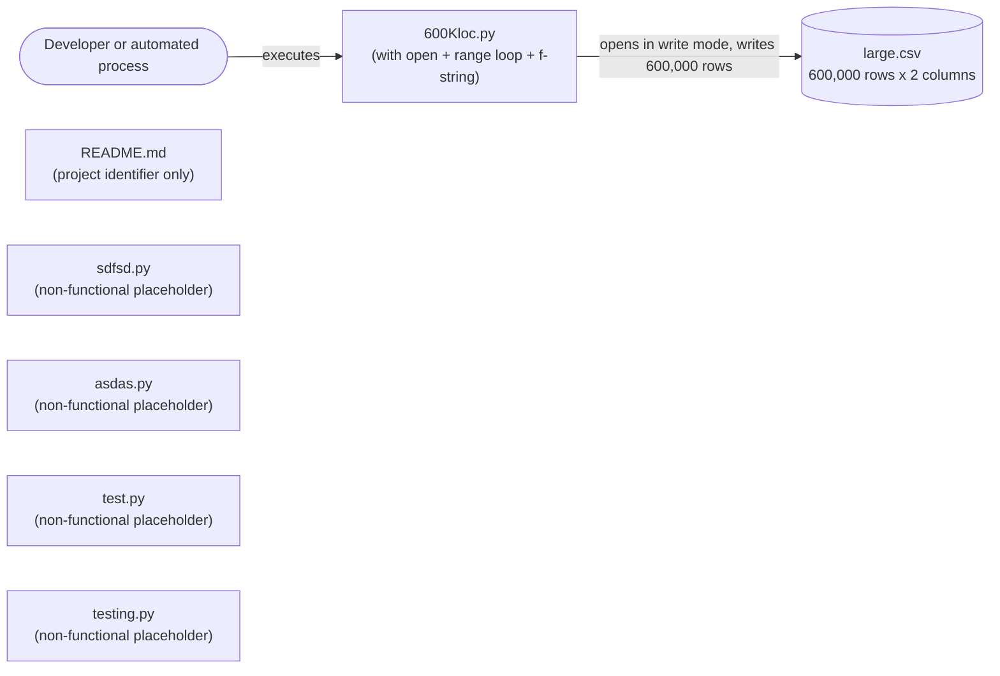
```mermaid
flowchart LR
    Dev([Developer or automated process])
    Script["600Kloc.py<br/>(with open + range loop + f-string)"]
    CSV[("large.csv<br/>600,000 rows x 2 columns")]
    Readme["README.md<br/>(project identifier only)"]
    P1["sdfsd.py<br/>(non-functional placeholder)"]
    P2["asdas.py<br/>(non-functional placeholder)"]
    P3["test.py<br/>(non-functional placeholder)"]
    P4["testing.py<br/>(non-functional placeholder)"]

    Dev -->|"executes"| Script
    Script -->|"opens in write mode, writes 600,000 rows"| CSV
```

### 1.2.3 Success Criteria

The repository does **not** define any formal success criteria, measurable business objectives, service-level agreements, or key performance indicators (KPIs). No metrics, targets, dashboards, or acceptance thresholds are present in any file. To avoid fabricating objectives, the criteria below are limited to *functional-correctness characteristics that are directly derivable from the source code* and the observed output dataset.

**Measurable objectives (derived from code and output).**

| Observable Objective | Target Derived from Code/Output |
| --- | --- |
| Successful generation | 600Kloc.py runs to completion without error |
| Row count | Exactly 600,000 rows in large.csv |
| Record structure | 2 comma-separated columns; no header; no blank lines |
| Record format | Row n (1-based) equals n-1,Sample Data n-1 |

**Critical success factors.** The observed prerequisites for the one capability to succeed are: (1) an available Python 3 interpreter, and (2) write permission for `large.csv` in the current working directory. No other environmental or configuration factors are referenced.

**Key performance indicators (KPIs).** None are defined in the repository. The only quantifiable, observed dataset properties are the fixed row count (600,000), the column count (2), and the approximate file size (\~16 MB / \~15.2 MiB); these are static characteristics of the generated artifact rather than performance targets, and no throughput, latency, or reliability KPI is specified anywhere in the code.

## 1.3 Scope

This scope statement is derived entirely from what the repository actually implements. Given that the project contains a single functional script, the in-scope surface is deliberately narrow and the out-of-scope surface is broad; both are enumerated to give stakeholders an unambiguous boundary.

### 1.3.1 In-Scope

**Core features and functionalities.** The only in-scope capability is the generation of the synthetic dataset:

| In-Scope Element | Description (grounded in code) |
| --- | --- |
| Must-have capability | Deterministic generation of large.csv via 600Kloc.py |
| Primary user workflow | Execute 600Kloc.py with Python 3 to create/overwrite large.csv |
| Essential integration | Local filesystem write only, using the Python standard library |
| Key technical requirement | Python 3 runtime and write access to the working directory |

**Implementation boundaries.** The system's boundaries are limited to a single local process and its output file:

- **System boundaries:** one standalone script (`600Kloc.py`), its generated output (`large.csv`), and a name-only `README.md`. There are no services, servers, network listeners, or background processes.
- **User groups covered:** none are formally defined; the effective actor is the single developer or automated process that runs the script locally.
- **Geographic / market coverage:** none. The project has no deployment footprint, locale handling, or market targeting.
- **Data domains included:** a single synthetic domain — an integer index paired with a templated label string (`Sample Data <i>`). The data is machine-generated and carries no real, personal, or business semantics.

### 1.3.2 Out-of-Scope

Everything not required to run the one generation script is out of scope. The following are explicitly excluded because no supporting code exists for them in the repository:

| Out-of-Scope Area | Status / Note |
| --- | --- |
| sdfsd.py, asdas.py, test.py, testing.py | Non-functional placeholders; provide no capability |
| Data consumption / analysis | No reading, parsing, validation, or analytics of large.csv |
| Configurability | No CLI arguments, parameters, or config for row count, format, or path |
| Operational tooling | No logging, custom error handling, tests, packaging, or CI/CD |
| External integrations | No databases, APIs, queues, cloud services, auth, or network I/O |

**Future-phase considerations.** No roadmap, backlog, TODOs, or future-phase notes are documented in the repository; therefore none are asserted here.

**Integration points not covered.** All external integration is out of scope. The system neither exposes nor consumes any interface beyond writing a single local file with the standard library.

**Unsupported use cases.** The repository does not support parameterizing the output (row count, record template, or destination path), regenerating to an alternate file, streaming or chunked/concurrent generation, appending to an existing dataset, validating or loading the produced CSV, or executing the placeholder files `sdfsd.py` (which fails to compile due to a reserved-keyword `SyntaxError`), `asdas.py` (which fails at runtime with a `NameError`), `test.py` (which likewise parses successfully but fails at runtime with a `NameError` on the undefined name `askjdnasd`), and `testing.py` (which likewise parses successfully but fails at runtime with a `NameError` on the undefined name `sada`).

## 1.4 References

The following repository files and locations were inspected as direct evidence for this section:

- `README.md` — Established the project identity; its entire content is the single heading `# check_status_2107_01`, with no additional documentation.
- `600Kloc.py` — Established the sole functional capability: a three-line standard-library script that opens `large.csv` in write mode and writes 600,000 records of the form `<i>,Sample Data <i>`.
- `large.csv` — Established the generated dataset's characteristics: \~16 MB (\~15.2 MiB), exactly 600,000 rows, two comma-separated columns, no header, no blank lines, deterministic record format.
- `sdfsd.py` — Established a non-functional placeholder file (11 bare identifier lines) that fails to compile with a `SyntaxError` due to the reserved keyword `as`.
- `asdas.py` — Established a non-functional placeholder file (two bare `asd` expressions) that compiles but fails at runtime with a `NameError`.
- `test.py` — Established a non-functional placeholder file (two bare identifier expressions, `askjdnasd` and `asda`) that compiles but fails at runtime with a `NameError` on the undefined name `askjdnasd`.
- `testing.py` — Established a non-functional placeholder file (five bare identifier tokens beginning with `sada`) that compiles but fails at runtime with a `NameError` on the undefined name `sada`.
- Repository root (`.`) — Established the overall structure: exactly seven files and no subfolders; no dependency manifests, configuration, tests, packaging, or CI.
- Repository Git metadata — Established the active branch name `2107_01` and confirmed the project identifier; the embedded remote credential was intentionally not reproduced.

# 2. Product Requirements

## 2.1 Feature Catalog

This section catalogs the product features of the `check_status_2107_01` repository. Consistent with the evidence-based approach of this Technical Specification, features are derived **strictly from the implemented source code**, not from any product charter — the repository contains no requirements documents, backlog, or business specifications (see Sections 1.1 and 1.3). Direct inspection of the seven repository files establishes exactly **one functional, testable feature**: the deterministic generation of a synthetic CSV dataset by `600Kloc.py`. The four remaining Python files (`sdfsd.py`, `asdas.py`, `test.py`, `testing.py`) are non-functional placeholder artifacts and are explicitly **not** catalogued as features; they are recorded in 2.1.3 solely for completeness. All feature and requirement identifiers follow the conventions `F-XXX` and `F-XXX-RQ-YYY`.

### 2.1.1 Feature Inventory

| Feature ID | Feature Name | Priority | Status |
|---|---|---|---|
| F-001 | Deterministic Synthetic CSV Data Generation | Critical | Completed |

Only one feature exists. F-001 represents the repository's sole operational capability; no additional feature IDs are assigned because no other functional capability is present in the codebase.

### 2.1.2 F-001 — Deterministic Synthetic CSV Data Generation

#### 2.1.2.1 Feature Metadata

| Attribute | Value |
|---|---|
| Unique ID | F-001 |
| Feature Name | Deterministic Synthetic CSV Data Generation |
| Feature Category | Data Generation / Synthetic Dataset Utility |
| Priority Level | Critical |
| Status | Completed |
| Source Artifact | `600Kloc.py` (3-line top-level script) |
| Generated Artifact | `large.csv` (~16 MB; 600,000 rows) |

Priority is assessed as **Critical** because F-001 is the *only* functional capability in the repository; without it the project has no operational purpose. Status is **Completed** because the generator script is present, compiles, runs to completion, and its committed output (`large.csv`) exists and matches the code's deterministic record rule.

#### 2.1.2.2 Description

**Overview.** F-001 programmatically produces a large, uniformly structured synthetic CSV file. On execution, `600Kloc.py` opens `large.csv` in text write mode and writes 600,000 comma-separated records of the form `<i>,Sample Data <i>` for `i` from 0 through 599,999, then closes the file handle via its `with` context manager.

**Business Value (as observed).** The repository declares no business objectives, KPIs, or value targets (consistent with Section 1.1). The observable, utilitarian value of F-001 is that it provides a repeatable, dependency-free means of producing a fixed ~16 MB two-column sample dataset — useful as test or fixture data for tooling that must be exercised against a sizeable file. No monetary, adoption, or impact target is stated anywhere in the repository.

**User Benefits (as observed).** The only inferable user is a developer or an automated process (Section 1.1). The benefit is a one-command, deterministic (re)generation of `large.csv` requiring nothing beyond a Python 3 interpreter — no configuration, no dependency installation, and no network access.

**Technical Context.** The feature is implemented as a single top-level script with no functions, classes, imports, or exports. It relies solely on Python standard-library primitives (`open`, `range`, and f-string formatting), executes single-threaded and in-process, and writes line-by-line to the local filesystem. The end-to-end data flow is depicted in the process flowchart in Section 1.2.2 (High-Level Description) and is elaborated in Section 2.3.

#### 2.1.2.3 Dependencies

| Dependency Type | Detail (grounded in code) |
|---|---|
| Prerequisite Features | None — F-001 is self-contained and depends on no other feature |
| System Dependencies | A Python 3 interpreter; write permission for `large.csv` in the current working directory; sufficient free disk space (~16 MB) |
| External Dependencies | None — no third-party packages are declared or imported; Python standard library only |
| Integration Requirements | None — the sole external interface is a local filesystem write of `large.csv`; no network, database, API, message broker, or environment-variable integration exists |

### 2.1.3 Non-Functional Placeholder Artifacts (Not Features)

For completeness, and to prevent misattribution, the repository's four remaining Python files are recorded here. None implements any capability, and none is assigned a feature ID:

| File | Content | Execution Result | Classification |
|---|---|---|---|
| `sdfsd.py` | 11 bare identifier tokens | Fails at compile time (`SyntaxError` — reserved keyword `as`) | Non-functional placeholder; not a feature |
| `asdas.py` | 2 bare `asd` expressions | Fails at run time (`NameError`) | Non-functional placeholder; not a feature |
| `test.py` | 2 bare identifier tokens (`askjdnasd`, `asda`) | Fails at run time (`NameError` — undefined name `askjdnasd`) | Non-functional placeholder; not a feature |
| `testing.py` | 5 bare identifier tokens | Fails at run time (`NameError` — undefined name `sada`) | Non-functional placeholder; not a feature |

These files are consistent with the Out-of-Scope declaration in Section 1.3.2 and contribute no product requirements. Despite its filename, `test.py` is not a functional test and defines no test cases (see Section 6.6).

## 2.2 Functional Requirements

This section decomposes feature F-001 into discrete, testable functional requirements. Because the entire feature is implemented by the three lines of `600Kloc.py`, each requirement below maps to observable behavior of that script and its output (`large.csv`), and every acceptance criterion is objectively verifiable. Requirement identifiers follow the `F-001-RQ-YYY` convention. The technical specifications and validation rules are presented once at the feature level because they apply uniformly across all requirements (the script accepts no inputs and behaves identically on every run).

### 2.2.1 F-001 Requirement Details

#### 2.2.1.1 Requirements and Priority

| Requirement ID | Description | Priority | Complexity |
|---|---|---|---|
| F-001-RQ-001 | The generator shall open a file named `large.csv` in the current working directory in text write mode (`"w"`), creating it if absent and truncating (overwriting) it if present. | Must-Have | Low |
| F-001-RQ-002 | The generator shall write exactly 600,000 records by iterating `i` over `range(600000)` (values 0 through 599,999). | Must-Have | Low |
| F-001-RQ-003 | Each record shall be formatted as `<i>,Sample Data <i>` and terminated by a single newline (`\n`), yielding two comma-separated columns and no header row. | Must-Have | Low |
| F-001-RQ-004 | Generation shall be fully deterministic: no randomness, timestamps, locale, or environment input influences the output, so repeated runs of the unchanged script produce byte-identical output. | Must-Have | Low |
| F-001-RQ-005 | The output file shall be managed by a `with` context manager so the handle is flushed and closed on normal completion and on exception. | Should-Have | Low |

#### 2.2.1.2 Acceptance Criteria

| Requirement ID | Acceptance Criteria (objectively testable) |
|---|---|
| F-001-RQ-001 | After execution, `large.csv` exists in the working directory; any pre-existing content is fully replaced (not appended); the file was opened with mode `"w"`. |
| F-001-RQ-002 | `wc -l large.csv` reports exactly `600000`; a scan for empty lines (`grep -c '^$'`) reports `0`. |
| F-001-RQ-003 | The first line equals `0,Sample Data 0`; the last line equals `599999,Sample Data 599999`; every line has exactly two comma-delimited fields; there is no header line. |
| F-001-RQ-004 | Two consecutive runs on the unchanged script yield files of identical size (`15,977,780` bytes) and identical checksum; output contains no blank lines, comments, or schema variation. |
| F-001-RQ-005 | After the script exits, no file descriptor for `large.csv` remains open, and the on-disk file reflects all 600,000 written records. |

### 2.2.2 F-001 Technical Specifications

| Aspect | Specification (grounded in `600Kloc.py`) |
|---|---|
| Input Parameters | None. All values are hardcoded: output filename `"large.csv"`, record count `600000`, and label template `"Sample Data {i}"`. There are no command-line arguments, environment variables, or configuration files. |
| Output / Response | A single local file, `large.csv` (~15,977,780 bytes), written to the current working directory. The script emits no stdout/stderr and returns no value; the process exit code is Python's default (0 on success). |
| Performance Criteria | None declared anywhere in the repository. Processing is single-threaded and linear in the record count — O(n) with n = 600,000 — writing records sequentially. No latency, throughput, or runtime target is specified. |
| Data Requirements | Write permission in the current working directory and roughly 16 MB of free disk space. Output is ASCII text (written via Python's default text encoding), headerless, two columns, with newline-terminated records. |

### 2.2.3 F-001 Validation Rules

| Category | Rule / Status (grounded in code) |
|---|---|
| Business Rules | The single governing rule is the deterministic record formula: for 1-based row `n`, the content is `n-1,Sample Data n-1`. The data is synthetic and carries no business semantics (Section 1.3.1). |
| Data Validation | None performed. The script validates neither inputs (there are none) nor its output; it does not check for a pre-existing `large.csv`, available disk space, or write errors before proceeding. |
| Security Requirements | None declared. No authentication, secrets, or credentials are involved. The script writes to a relative path in the working directory and will silently overwrite any existing `large.csv` there — a data-loss consideration rather than an implemented control. |
| Compliance Requirements | None declared. Generated data is synthetic and contains no personal, sensitive, or regulated information; no compliance regime (e.g., PII/GDPR) applies to the output. |

**Assumptions and constraints.** These requirements assume a Python 3 interpreter and a writable working directory (Section 1.2.3, Critical Success Factors). All parameters are fixed in source; changing the row count, record template, or output path requires editing `600Kloc.py` (there is no runtime configuration). Requirement versions are tracked implicitly through Git history; the requirements above reflect the state at branch `2107_01`.

## 2.3 Feature Relationships

Because the repository exposes only one functional feature (F-001), there are **no inter-feature dependencies** to map. The relationships documented here are limited to what is directly evident in the source: the producer-to-artifact link within F-001, the single filesystem integration point, and the explicit *absence* of shared components and common services. The four placeholder files are shown as isolated nodes because they neither import, reference, nor are referenced by F-001.

### 2.3.1 Feature Dependency Map

F-001 is self-contained. The only concrete relationship is that its generator script (`600Kloc.py`) produces its data artifact (`large.csv`). `README.md` contributes the project identifier only, and the four placeholder files have no linkage to the feature.

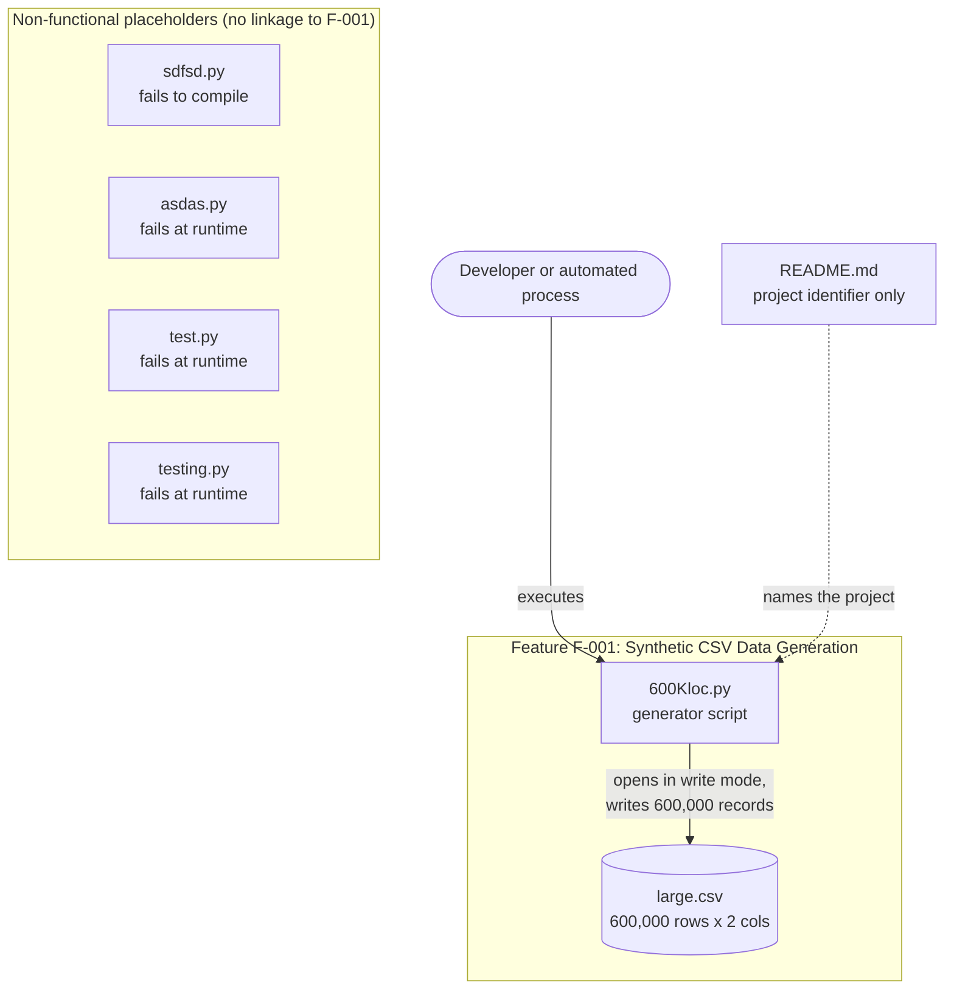
```mermaid
flowchart TD
    Actor([Developer or automated process])
    Readme["README.md<br/>project identifier only"]

    subgraph FeatureF001["Feature F-001: Synthetic CSV Data Generation"]
        Script["600Kloc.py<br/>generator script"]
        Artifact[("large.csv<br/>600,000 rows x 2 cols")]
    end

    subgraph NonFeatures["Non-functional placeholders (no linkage to F-001)"]
        P1["sdfsd.py<br/>fails to compile"]
        P2["asdas.py<br/>fails at runtime"]
        P3["test.py<br/>fails at runtime"]
        P4["testing.py<br/>fails at runtime"]
    end

    Actor -->|"executes"| Script
    Script -->|"opens in write mode,<br/>writes 600,000 records"| Artifact
    Readme -.->|"names the project"| Script
```

### 2.3.2 Integration Points

| Integration Point | Type | Detail (grounded in code) |
|---|---|---|
| Local filesystem (`large.csv`) | Outbound write | `600Kloc.py` opens `large.csv` in the current working directory in text write mode (`"w"`) and writes 600,000 records |
| Network / Database / API / Message queue / Cloud SDK | None | No such integration exists; the script uses only the Python standard library and performs no network or service I/O |
| Configuration / Environment | None | No environment variables, CLI arguments, or configuration files are read |

### 2.3.3 Shared Components and Common Services

There are **no shared components** and **no common services** in this repository. Evidence:

- `600Kloc.py` is a single top-level script with no functions, classes, modules, imports, or exports, so there is no reusable component that another feature could share.
- No service, server, daemon, or background process exists (consistent with Section 1.2 and Section 1.3.1); therefore there are no common services to enumerate.
- `sdfsd.py`, `asdas.py`, `test.py`, and `testing.py` define no names and are never imported, so they share nothing with F-001 and cannot be common utilities.

The sole cross-artifact coupling in the repository is the runtime producer/consumer relationship between `600Kloc.py` (writer) and `large.csv` (output), which is internal to feature F-001. This corresponds to the end-to-end data-flow diagram in Section 1.2.2.

## 2.4 Implementation Considerations

The implementation considerations below apply to feature F-001, the only feature in the repository. Each entry is grounded in the observed behavior of `600Kloc.py`; where the repository declares nothing (for example, performance targets), that absence is stated explicitly rather than inferred.

### 2.4.1 F-001 Implementation Considerations

| Consideration | Detail (grounded in code) |
|---|---|
| Technical constraints | Requires a Python 3 interpreter and uses the standard library only. Execution is single-threaded and in-process. All parameters are hardcoded — output filename (`"large.csv"`), record count (`600000`), and label template (`"Sample Data {i}"`) — so there is no runtime configurability. The output path is relative, making behavior dependent on the current working directory. |
| Performance requirements | None declared in the repository. The algorithm is a single linear pass — O(n) with n = 600,000 — writing records sequentially. Records are written one at a time inside the loop (streaming) rather than buffered in memory, so peak memory usage is bounded and small. Wall-clock runtime is governed by host disk I/O; no latency, throughput, or runtime target is specified. |
| Scalability considerations | The row count is fixed in source; changing the volume requires editing `range(600000)`. There is no parameterization, chunked/streaming interface, parallelism, or append mode (see Section 1.3.2, unsupported use cases). The only practical ceiling is available disk space for `large.csv`; there is no horizontal-scaling surface because the system is a one-shot local script, not a service. |
| Security implications | No authentication, authorization, secrets, or network exposure exist. The script accepts no input, so there is no injection or untrusted-parsing attack surface. The principal risk is that writing to a relative path silently truncates and overwrites any existing `large.csv` in the working directory (a data-loss consideration). The generated data is synthetic and contains no sensitive information. |
| Maintenance requirements | At three lines, the script is trivial to read and modify. However, there is no test suite, no logging, and no explicit error handling: operational failures (for example, permission denied or a full disk) surface as unhandled Python exceptions with a non-zero exit. No packaging, dependency pinning, or CI exists to guard against regressions (consistent with Section 1.3.2). |

**Constraints summary.** F-001 is intentionally minimal: correctness is easy to verify (see the acceptance criteria in Section 2.2.1.2), but the same minimalism means any change to volume, format, destination, or robustness must be made directly in `600Kloc.py`, and no automated safety net will detect a resulting regression.

## 2.5 Traceability Matrix

This matrix provides bidirectional traceability from feature F-001 through each of its requirements to the exact source evidence in `600Kloc.py`, to the objective acceptance criteria that verify them (Section 2.2.1.2), and to the related specification sections. Every requirement traces to a concrete line of the single source file.

### 2.5.1 Requirement-to-Source-and-Acceptance Traceability

| Requirement ID | Source Evidence (`600Kloc.py`) | Acceptance Verification (per 2.2.1.2) |
|---|---|---|
| F-001-RQ-001 | Line 1: `with open("large.csv", "w") as f:` | `large.csv` exists in the working directory; prior content is fully replaced |
| F-001-RQ-002 | Line 2: `for i in range(600000):` | `wc -l large.csv` = 600,000; no blank lines |
| F-001-RQ-003 | Line 3: `f.write(f"{i},Sample Data {i}\n")` | First line `0,Sample Data 0`; last line `599999,Sample Data 599999`; two columns; no header |
| F-001-RQ-004 | Whole script (no randomness, timestamp, locale, or env input) → `large.csv` | Two runs produce identical size (15,977,780 bytes) and identical checksum |
| F-001-RQ-005 | Line 1: `with` context manager | File handle closed on exit; all 600,000 records flushed to disk |

### 2.5.2 Feature-to-Specification Traceability

| Feature ID | Requirements Covered | Related Specification Sections |
|---|---|---|
| F-001 | F-001-RQ-001 through F-001-RQ-005 | 1.1 (identity and observed value); 1.2.2 (end-to-end data-flow flowchart); 1.2.3 (success criteria); 1.3.1 (in-scope capability); 2.1–2.4 (catalog, requirements, relationships, implementation) |

**Coverage notes.** All five requirements trace to specific lines of the single source file, and each aligns with a measurable success criterion in Section 1.2.3 (successful generation, row count, record structure, and record format). The non-functional placeholder files `sdfsd.py`, `asdas.py`, `test.py`, and `testing.py` intentionally carry **no** requirement coverage, consistent with their classification in Section 2.1.3 and the Out-of-Scope declaration in Section 1.3.2. Requirement versions are tracked implicitly via Git history; this matrix reflects branch `2107_01`.

## 2.6 References

The following repository files, locations, and cross-referenced specification sections were inspected as direct evidence for this Product Requirements section.

**Repository files**

- `600Kloc.py` — Established feature F-001: the sole functional capability. Confirmed the three lines that open `large.csv` in write mode, iterate `range(600000)`, and write records of the form `<i>,Sample Data <i>` — the basis for requirements F-001-RQ-001 through F-001-RQ-005.
- `large.csv` — Established the generated artifact's verifiable characteristics used in acceptance criteria: 15,977,780 bytes, exactly 600,000 rows, zero blank lines, headerless two columns, first row `0,Sample Data 0`, last row `599999,Sample Data 599999`.
- `README.md` — Established project identity (`# check_status_2107_01`) and the absence of any product/requirements documentation.
- `sdfsd.py` — Established a non-functional placeholder (11 bare identifier tokens) that fails at compile time; documented as a non-feature in Section 2.1.3.
- `asdas.py` — Established a non-functional placeholder (two bare `asd` expressions) that fails at runtime; documented as a non-feature in Section 2.1.3.
- `test.py` — Established a non-functional placeholder (two bare identifier tokens, `askjdnasd` and `asda`) that fails at runtime with a `NameError`; documented as a non-feature in Section 2.1.3.
- `testing.py` — Established a non-functional placeholder (five bare identifier tokens beginning with `sada`) that fails at runtime with a `NameError`; documented as a non-feature in Section 2.1.3.
- Repository root (`.`) — Established the overall structure (seven files, no subfolders) and the absence of dependency manifests, configuration, tests, packaging, and CI, confirming F-001 has no external or prerequisite-feature dependencies.
- Repository Git metadata — Established the active branch `2107_01` used for implicit requirement version tracking (the embedded remote credential was intentionally not reproduced).

**Cross-referenced specification sections**

- Section 1.1 (Executive Summary) — Confirmed observed value framing and that no SLAs/KPIs/business objectives are declared.
- Section 1.2 (System Overview) — Reused the data-flow process flowchart (1.2.2) and the code-derived success criteria (1.2.3) that back the acceptance criteria.
- Section 1.3 (Scope) — Aligned in-scope capability (1.3.1) and out-of-scope/unsupported use cases (1.3.2), including the non-functional placeholder classification.
- Section 1.4 (References) — Confirmed the evidentiary file inventory used across the specification.

# 3. Technology Stack

## 3.1 Programming Languages

This section documents the technology stack exactly as it exists in the repository. The stack is deliberately minimal: the entire system is a single-language, dependency-free project whose one functional artifact is a three-line Python script (`600Kloc.py`) that generates a synthetic dataset (`large.csv`). No manifests, build files, container definitions, CI configuration, or infrastructure-as-code files exist anywhere in the checkout, so every subsection below reports what is present and, where a category is genuinely absent, records that absence explicitly rather than inventing components.

### 3.1.1 Language Inventory

**Python is the only programming language in the repository.** All five `.py` files are Python source; there is no other language present (no shell, SQL, HTML/CSS, JavaScript/TypeScript, or configuration DSL). Of the five Python files, only `600Kloc.py` is functional; the other four are non-functional placeholders retained for completeness.

| Language | Files / Component | Status & Role | Version Constraint |
|---|---|---|---|
| Python 3 (CPython) | `600Kloc.py` | Functional — sole entry point; generates `large.csv` | CPython 3.6+ (see 3.1.2) |
| Python 3 (CPython) | `sdfsd.py` | Non-functional placeholder — fails to compile (`SyntaxError` on reserved keyword `as`) | n/a |
| Python 3 (CPython) | `asdas.py` | Non-functional placeholder — fails at runtime (`NameError`) | n/a |
| Python 3 (CPython) | `test.py` | Non-functional placeholder — fails at runtime (`NameError` on undefined name `askjdnasd`) | n/a |
| Python 3 (CPython) | `testing.py` | Non-functional placeholder — fails at runtime (`NameError` on undefined name `sada`) | n/a |

The `README.md` file is Markdown and contains only the project identifier `# check_status_2107_01`; `large.csv` is a generated data artifact rather than source code. Neither is a programming language component.

### 3.1.2 Version Requirements and Constraints

The repository **pins no language version anywhere** — there is no `.python-version`, `runtime.txt`, `pyproject.toml`, `setup.py`, or any other manifest that would declare a target interpreter. The only version floor that can be derived from evidence is the syntax used by `600Kloc.py`:

- The generator formats each record with an **f-string** (`f"{i},Sample Data {i}\n"`). f-strings were introduced in Python 3.6 (PEP 498), which establishes a hard minimum of **CPython 3.6+**.
- The remaining constructs — the `with` context manager, the `for` loop over `range(...)`, and `open(...)` in text mode — are available in every Python 3 release, so they impose no tighter constraint.

For reference, the interpreter available in the analysis environment was **CPython 3.12.3** at `/usr/bin/python3`; this is ambient environment context only and is neither declared nor required by the repository. Any CPython interpreter from 3.6 through the 3.12 series will execute `600Kloc.py` correctly.

### 3.1.3 Selection Rationale and Dependencies

No design document or README records a language-selection decision, so the rationale below is inferred strictly from the observable properties of the code rather than asserted as a stated business choice:

- **Fitness for a trivial generation task.** Python's built-in file I/O (`open`), integer sequence generation (`range`), and f-string interpolation allow the complete synthetic-data-generation capability to be expressed in three lines with no external tooling.
- **Zero build/toolchain overhead.** As an interpreted language, Python requires no compilation step, no packaging, and no dependency resolution to run this script, which is consistent with the repository's complete absence of build and dependency files.
- **Cross-referenced constraints.** As established in Section 1.3 (Scope) and Section 2.4 (Implementation Considerations), the only runtime prerequisites are a Python 3 interpreter and write access to the current working directory. Execution is single-threaded and in-process.

From a **security** standpoint, the language footprint is inherently low-risk for this workload: `600Kloc.py` accepts no input and performs no parsing, so there is no injection or untrusted-deserialization surface at the language level (consistent with Section 2.4). Python's automatic memory management removes the manual memory-safety concerns associated with lower-level languages. The one language-adjacent operational risk — noted in Section 2.4 — is that opening a relative path in write mode (`"w"`) truncates and overwrites any pre-existing `large.csv`.

## 3.2 Frameworks & Libraries

The repository uses **no application, web, data, or utility framework of any kind**, and it declares **no third-party libraries**. The single functional script depends only on facilities that are part of the CPython language and its built-in namespace. This is corroborated by Section 1.2, which states the system "relies solely on Python standard-library primitives (`open`, `range`, and f-string formatting)."

### 3.2.1 Frameworks

There are no frameworks in the stack. Specifically, none of the following are present or referenced anywhere in the code: web/API frameworks (e.g., Flask, FastAPI, Django), CLI frameworks (e.g., Click, argparse-based scaffolding), data/ETL frameworks (e.g., pandas, PySpark), asynchronous runtimes, task schedulers, or AI/LLM frameworks. The generation task is small enough that it is implemented directly against language primitives, so no framework layer exists to document.

### 3.2.2 Libraries and Standard-Library Facilities

`600Kloc.py` contains **no `import` statement**. It therefore uses neither third-party packages nor even any importable modules from the Python standard library (for example, the `csv`, `os`, or `sys` modules are deliberately *not* used, despite the output being CSV-shaped). The only building blocks are core language features and built-in functions that are always available without an import:

| Facility | Category | Where Used (`600Kloc.py`) | Purpose |
|---|---|---|---|
| `open()` | Built-in function | Line 1 | Opens `large.csv` in text write mode (`"w"`) |
| `with` statement | Language construct | Line 1 | Context manager; guarantees the file handle is closed on exit |
| `range()` | Built-in type/function | Line 2 | Produces the 0–599,999 iteration sequence |
| `for` loop | Language construct | Line 2 | Iterates over the range |
| f-string | Language construct | Line 3 | Formats each record as `<i>,Sample Data <i>` |
| file object `.write()` | Built-in I/O method | Line 3 | Writes each record line to the file |

Illustrative usage (the complete functional body of the program):

```python
with open("large.csv", "w") as f:
    for i in range(600000):
        f.write(f"{i},Sample Data {i}\n")
```

### 3.2.3 Compatibility Requirements

Because the script uses only built-in language facilities, its compatibility surface is defined entirely by the interpreter, not by any library:

- **Runtime compatibility:** any CPython interpreter meeting the 3.6+ floor established in Section 3.1.2 will run the code without modification. There are no library version pins, no minimum/maximum dependency bounds, and therefore no dependency-compatibility matrix to maintain.
- **No compatibility risk from third parties:** since there are zero external libraries, there is no risk of transitive version conflicts, deprecated APIs, or breaking upgrades from a package ecosystem. The only compatibility consideration is the Python 3.6+ f-string requirement itself.

## 3.3 Open Source Dependencies

The repository has **zero open-source or third-party dependencies**. A comprehensive scan of the checkout found no dependency manifest, lockfile, or vendored package of any kind. This is the defining characteristic of the stack and is consistent with Section 1.2 ("no ... third-party dependencies") and Section 2.4 ("No packaging, dependency pinning, or CI exists").

### 3.3.1 Dependency Manifests and Registries

No package manager is used, and no package registry is referenced. The following manifest and lockfile types were searched for and are **absent**:

| Ecosystem / Tool | Manifest / Lockfile Searched | Present? |
|---|---|---|
| Python (pip) | `requirements*.txt` | No |
| Python (PEP 517/518) | `pyproject.toml`, `setup.py`, `setup.cfg` | No |
| Python (Pipenv) | `Pipfile`, `Pipfile.lock` | No |
| Python (Poetry) | `poetry.lock` | No |
| Node.js (npm/yarn) | `package.json`, `package-lock.json`, `yarn.lock` | No |
| Other (Go / Java / Ruby / Rust) | `go.mod`, `pom.xml`, `build.gradle`, `Gemfile`, `Cargo.toml` | No |

Because there is no manifest, there are **no dependency version numbers to enumerate** — the set of declared dependencies is empty. No PyPI, npm, Maven Central, or other registry is contacted at build time or runtime, and there are no vendored/bundled third-party sources committed to the repository.

### 3.3.2 Security Implications

A dependency-free codebase has a distinct security posture that is worth recording explicitly:

- **No supply-chain surface.** With no external packages and no transitive dependencies, there are no third-party CVEs to track, no packages to audit or patch, and no dependency-confusion or typosquatting exposure.
- **Trade-off — no pinning mechanism.** The flip side, already noted in Section 2.4, is that the project has no dependency-pinning or lock mechanism and no automated tooling; reproducibility depends solely on the presence of a compatible Python 3 interpreter rather than on a pinned dependency set.

## 3.4 Third-Party Services

The system integrates with **no third-party or external services**. `600Kloc.py` performs only local filesystem I/O and makes no network calls. This is directly supported by Section 1.2, which records "no network calls, databases, APIs, message brokers, cloud SDKs, authentication mechanisms, environment variables, or third-party dependencies," and by Section 1.3, which places "databases, APIs, queues, cloud services, auth, or network I/O" out of scope.

### 3.4.1 External Integration Inventory

Every standard category of third-party service is absent. The table below records each category and the evidence for its absence so stakeholders have an unambiguous negative inventory:

| Service Category | Status | Evidence |
|---|---|---|
| External APIs / integrations | None | No HTTP clients, SDKs, or network code; no `import` of any network module |
| Authentication / identity providers | None | No auth libraries, tokens, OAuth/OIDC flows, or credential handling |
| Monitoring / logging / telemetry | None | No logging framework, metrics, tracing, or APM instrumentation |
| Cloud services (compute/storage/queue) | None | No cloud SDKs, no IaC (`*.tf`), no cloud configuration files |
| Message brokers / streaming | None | No broker clients or queue configuration |
| Secrets / configuration services | None | No environment variables, `.env` files, or secret references |

### 3.4.2 Security Implications

The absence of external integrations minimizes the system's security exposure: there is **no external attack surface** (no listening ports, no inbound requests), **no outbound data egress** (the program neither sends nor receives data over a network), and **no credentials to manage or leak** (no API keys, tokens, or connection secrets exist in the repository). The system's only interface to the outside world is the single local file it writes, as described in Section 3.5.

## 3.5 Databases & Storage

The system uses **no database management system**. Its sole persistence mechanism is a single flat file on the **local filesystem**: the generated CSV artifact `large.csv`. There is no relational or NoSQL database, no ORM or database driver, no connection string, no caching layer, and no object/cloud storage.

### 3.5.1 Persistence Model

Storage is realized entirely through Python's built-in file I/O against the local working directory:

| Storage Aspect | Detail (grounded in code) |
|---|---|
| Storage medium | Local filesystem (current working directory) |
| Persistence artifact | `large.csv` — a single flat file |
| Access mode | Text write mode `"w"` via `open("large.csv", "w")` — truncates then writes |
| Write strategy | Streaming: one record written per loop iteration (600,000 total), not buffered in memory |
| Resource handling | `with` context manager closes the file handle on exit |
| Path resolution | Relative path — the destination depends on the current working directory |

The artifact itself is a **headerless, two-column, comma-separated dataset** of exactly **600,000 rows** occupying **15,977,780 bytes (~16 MB)**. Each record follows the deterministic rule `<i>,Sample Data <i>` for `i` from 0 through 599,999 — the first row is `0,Sample Data 0` and the last is `599999,Sample Data 599999`. Notably, `large.csv` is itself committed to version control (it is a Git-tracked file), so the repository ships both the generator and a materialized copy of its output.

### 3.5.2 Absent Storage Technologies

To give an unambiguous boundary, the following storage/persistence technologies were checked for and are **not** present:

- **Databases:** no relational engines (PostgreSQL, MySQL, SQLite), no NoSQL stores (MongoDB, DynamoDB, Redis-as-datastore), and no embedded database files.
- **Caching:** no in-memory or distributed cache (e.g., Redis, Memcached) and no application-level caching logic.
- **Object / cloud storage:** no S3 or equivalent bucket usage, and no cloud storage SDKs or configuration.

### 3.5.3 Storage Data Flow

The end-to-end persistence path is a single one-shot write from the interpreter to one file, as shown below:

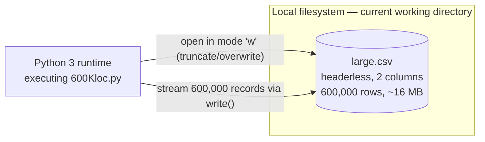
```mermaid
flowchart LR
    Runtime["Python 3 runtime<br/>executing 600Kloc.py"]
    subgraph FS["Local filesystem — current working directory"]
        CSV[("large.csv<br/>headerless, 2 columns<br/>600,000 rows, ~16 MB")]
    end
    Runtime -->|"open in mode 'w' (truncate/overwrite)"| CSV
    Runtime -->|"stream 600,000 records via write()"| CSV
```

### 3.5.4 Integration and Security Considerations

The storage integration is intentionally simple and has one notable operational consideration carried over from Section 2.4: because the file is opened in write mode on a **relative path**, running `600Kloc.py` **silently truncates and overwrites** any pre-existing `large.csv` in the working directory, which is a data-loss risk if the directory already contains a file of that name. The stored data is fully **synthetic** — an integer index paired with a templated label — and carries no personal, sensitive, or business-confidential content, so there are no data-at-rest confidentiality requirements associated with it.

## 3.6 Development & Deployment

The project has **no build system, no containerization, and no CI/CD pipeline**. Development and execution consist of editing a plain Python file and running it directly with an interpreter. This aligns with Section 1.3 and Section 2.4, which place packaging, tests, and CI/CD out of scope and confirm that "No packaging, dependency pinning, or CI exists."

### 3.6.1 Development Tools

The only tool strictly required to develop and run the system is a **CPython 3.6+ interpreter** (see Section 3.1.2). The repository is under **Git** version control (branch `2107_01`), which is the one development tool whose presence is directly evidenced by the checkout. No editor/IDE configuration, linter, formatter, type checker, or test framework is committed to the repository — there is no `tox.ini`, no `.flake8`/`ruff`/`black` configuration, and no test directory or configured test files. Note that the file named `test.py`, despite its name, is a non-functional placeholder (it raises `NameError` at runtime) and is not a test.

| Concern | Tooling in Repository | Status / Evidence |
|---|---|---|
| Language runtime | CPython 3.6+ | Required to execute `600Kloc.py` |
| Version control | Git | `.git` present; branch `2107_01`, HEAD commit `6468afa` |
| Linting / formatting / typing | None | No linter/formatter/type-checker configuration files |
| Testing | None | No test framework and no coverage config; the file named `test.py` contains no tests (non-functional placeholder that raises `NameError`) |

### 3.6.2 Build System and Packaging

There is **no build system**. Python is interpreted, and this project ships no packaging metadata (`setup.py`, `pyproject.toml`, or wheel/sdist configuration), so there is nothing to compile, package, or publish. Execution is a direct script invocation, for example:

```bash
python3 600Kloc.py
```

One packaging-relevant constraint follows from the filename: because `600Kloc.py` begins with a digit, it is a valid script to run directly but is **not importable as a module** (`import 600Kloc` is a syntax error). The script is therefore designed to be executed, not imported.

### 3.6.3 Containerization and CI/CD

Neither containerization nor continuous integration/delivery is present:

- **Containerization:** none. There is no `Dockerfile`, no `docker-compose.yml`, and no container or orchestration manifest of any kind.
- **CI/CD:** none. There is no `.github/workflows/` directory, no `.circleci/`, and no pipeline configuration file. No automated build, test, or deployment stage exists to guard against regressions (consistent with Section 2.4).
- **Infrastructure as Code:** none. No Terraform (`*.tf`), CloudFormation, or other IaC files are present.

### 3.6.4 Deployment / Execution Model

There is no deployment in the conventional sense; the system is a **one-shot local script**, not a long-running service (Section 1.3). The complete "deployment" is: obtain the repository, ensure a Python 3 interpreter is available, and run `600Kloc.py` from a directory in which the process has write permission. From a **security** perspective this model requires no elevated privileges, no network access, and no secrets — only local filesystem write access in the working directory — and it introduces no CI credentials or deployment tokens because no automated pipeline exists.

## 3.7 References

The following repository artifacts and previously authored specification sections were examined as evidence for Section 3.

**Files examined**

- `600Kloc.py` — Established the sole functional source and language footprint: Python built-ins only (`open`, `range`, `with`, f-string, file `.write()`), no `import` statements, the CPython 3.6+ version floor (f-string usage), the streaming write strategy, and the write-mode (`"w"`) truncate/overwrite behavior.
- `large.csv` — Established the storage artifact facts: single flat, headerless, two-column CSV; 15,977,780 bytes (~16 MB); exactly 600,000 rows; deterministic record format (`0,Sample Data 0` … `599999,Sample Data 599999`); Git-tracked.
- `README.md` — Established the project identifier (`# check_status_2107_01`) and confirmed the absence of any usage, dependency, build, or architecture documentation.
- `sdfsd.py` — Confirmed a non-functional Python placeholder (fails to compile — `SyntaxError` on the reserved keyword `as`); not part of the functional stack.
- `asdas.py` — Confirmed a non-functional Python placeholder (fails at runtime — `NameError`); not part of the functional stack.
- `test.py` — Confirmed a non-functional Python placeholder (fails at runtime — `NameError` on the undefined name `askjdnasd`); not part of the functional stack.
- `testing.py` — Confirmed a non-functional Python placeholder (fails at runtime — `NameError` on the undefined name `sada`); not part of the functional stack.

**Folders examined**

- Repository root (`/`) — Confirmed exactly seven tracked files and no subdirectories, and confirmed the complete absence of dependency/build/config/CI/IaC manifests (no `requirements.txt`, `pyproject.toml`, `setup.py`, `Pipfile`, `package.json`, `go.mod`, `pom.xml`, `Gemfile`, `Cargo.toml`, `Dockerfile`, `docker-compose.yml`, `Makefile`, `*.yml`/`*.yaml`, `*.tf`, `.env`, or hidden CI directories such as `.github`/`.circleci`).

**Specification sections cross-referenced**

- Section 1.2 System Overview — Confirmed the standard-library-only implementation and the "no databases/APIs/cloud SDKs/auth/third-party dependencies" characterization.
- Section 1.3 Scope — Confirmed the Python 3 runtime + working-directory write-access requirement and the out-of-scope status of packaging, tests, CI/CD, databases, and external integrations.
- Section 2.4 Implementation Considerations — Confirmed the standard-library-only, single-threaded execution model; the "no packaging, dependency pinning, or CI" finding; and the relative-path overwrite (data-loss) security consideration.

# 4. Process Flowchart

## 4.1 System Workflows

This section documents the process flows that actually exist in the `check_status_2107_01` repository. Because the repository is a minimal, single-purpose fixture (see Section 1.2 *System Overview* and Section 2.1 *Feature Catalog*), it contains exactly **one** functional workflow — the deterministic batch generation of a synthetic CSV dataset by `600Kloc.py`, catalogued as feature **F-001** (*Deterministic Synthetic CSV Data Generation*). The repository exposes no HTTP service, no user interface, no scheduler, and no external integrations; consequently there are no multi-actor business transactions, no request/response cycles, and no event-driven flows.

The four remaining Python files, `sdfsd.py`, `asdas.py`, `test.py`, and `testing.py`, are non-functional placeholders (Section 2.1.3). Their only observable "process" is an immediate interpreter failure; they are represented in the diagrams below solely so that every code path in the repository — including failure paths — is fully documented. Every workflow step, decision point, and error transition shown in this section is grounded directly in the three executable lines of `600Kloc.py` and in the verified runtime behavior of the four placeholder scripts.

### 4.1.1 Core Business Processes

The repository declares no business domain, monetary objective, or business ruleset (Section 1.1 and Section 2.2.3). The single end-to-end process is therefore best characterized as a **developer- or automation-triggered batch data-generation job** rather than a business transaction. It has exactly one *user touchpoint* — a command-line invocation of the Python interpreter — and one *system output* — the local file `large.csv`. No interactive input, authentication, or approval step exists at any point in the flow (Section 2.2.2, Section 2.2.3).

#### 4.1.1.1 End-to-End User Journey, System Interactions, and Decision Points

The actors, boundaries, and decision points that make up the end-to-end journey are enumerated below, each traced to observed code:

| Workflow Element | Observed Detail | Evidence |
|---|---|---|
| Actor / user touchpoint | A developer or an automated process invokes `python3 600Kloc.py` from a shell; there is no UI, prompt, flag, or argument | `600Kloc.py`; Section 2.2.2 (no input parameters) |
| System boundary 1 | The **Python 3 runtime** (process boundary): compiles the module, then executes its top-level statements | `600Kloc.py` (top-level script, no functions) |
| System boundary 2 | The **local filesystem**: receives the write of `large.csv` in the current working directory | `600Kloc.py` line 1 (`open("large.csv", "w")`) |
| Network boundary | None crossed — no sockets, HTTP, DNS, or cloud calls occur | Section 2.3.2 (no network integration) |
| Decision point D1 | *Which script is executed?* — determines whether the functional generator or a placeholder runs | Five Python entry files in repo root |
| Decision point D2 | *Does the module compile?* — `sdfsd.py` fails here (`SyntaxError` on reserved word `as`) | Verified compile-time failure of `sdfsd.py` |
| Decision point D3 | *Is a runtime error raised?* — `asdas.py` (bare `asd`), `test.py` (bare `askjdnasd`), and `testing.py` (bare `sada`) fail here (`NameError`) | Verified runtime failure of `asdas.py`, `test.py`, and `testing.py` |
| Decision point D4 | *Loop-continuation test* `i < 600000` inside the generator | `600Kloc.py` line 2 (`for i in range(600000)`) |
| Terminal outcome | Exit code `0` and a fully written `large.csv` (600,000 rows) on the success path | Section 2.2.2 (default exit code 0); Section 1.2.3 |

The high-level system workflow below places these actors and decision points on three swim lanes — the invoking **Actor**, the **Python 3 Runtime**, and the **Local Filesystem** — and traces all five entry points (the functional generator and the four failing placeholders) to their terminal states.

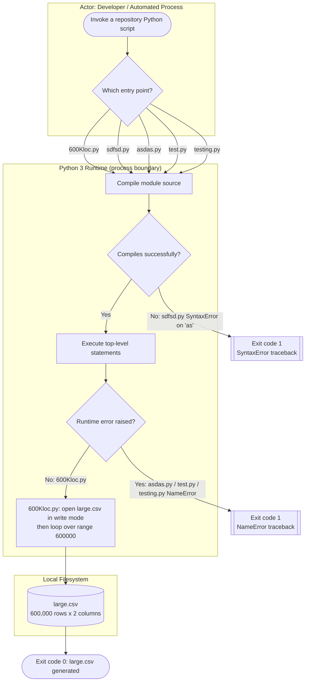
```mermaid
flowchart TD
    subgraph ActorLane["Actor: Developer / Automated Process"]
        A1([Invoke a repository Python script])
        A2{Which entry point?}
    end
    subgraph RuntimeLane["Python 3 Runtime (process boundary)"]
        R1[Compile module source]
        R2{Compiles successfully?}
        R3[Execute top-level statements]
        R4{Runtime error raised?}
        R5["600Kloc.py: open large.csv in write mode<br/>then loop over range 600000"]
    end
    subgraph FSLane["Local Filesystem"]
        F1[("large.csv<br/>600,000 rows x 2 columns")]
    end
    A1 --> A2
    A2 -->|600Kloc.py| R1
    A2 -->|sdfsd.py| R1
    A2 -->|asdas.py| R1
    A2 -->|test.py| R1
    A2 -->|testing.py| R1
    R1 --> R2
    R2 -->|"No: sdfsd.py SyntaxError on 'as'"| E1[["Exit code 1<br/>SyntaxError traceback"]]
    R2 -->|Yes| R3
    R3 --> R4
    R4 -->|"Yes: asdas.py / test.py / testing.py NameError"| E2[["Exit code 1<br/>NameError traceback"]]
    R4 -->|"No: 600Kloc.py"| R5
    R5 --> F1
    F1 --> DONE([Exit code 0: large.csv generated])
```

#### 4.1.1.2 Detailed Process Flow — F-001 Deterministic CSV Generation

The success path of the sole functional workflow is a single, linear pass over a fixed range. The steps below map one-to-one onto the functional requirements defined in Section 2.2.1:

1. **Start / touchpoint.** The caller runs `python3 600Kloc.py`.
2. **Open output (persistence begins).** `with open("large.csv", "w")` creates the file if absent or truncates it if present, and binds the write-mode handle `f` (requirement **F-001-RQ-001**).
3. **Enter loop.** Iteration proceeds over `range(600000)` (requirement **F-001-RQ-002**).
4. **Decision `i < 600000?`** While true, the process formats a record `f"{i},Sample Data {i}\n"` — two comma-separated columns terminated by a newline (requirement **F-001-RQ-003**) — and writes it to the buffered handle.
5. **Advance.** The index advances and control returns to the loop-continuation test.
6. **Close (persistence commit).** When the range is exhausted, exiting the `with` block flushes the buffer and closes the handle (requirement **F-001-RQ-005**).
7. **End.** `large.csv` is finalized at 600,000 rows / 15,977,780 bytes and the process exits with code `0`. Because no randomness or environment input is involved, repeated runs are byte-identical (requirement **F-001-RQ-004**).

The detailed flow is shown with swim lanes for the **Caller**, the **`600Kloc.py` with-context scope**, and the **Local Filesystem**:

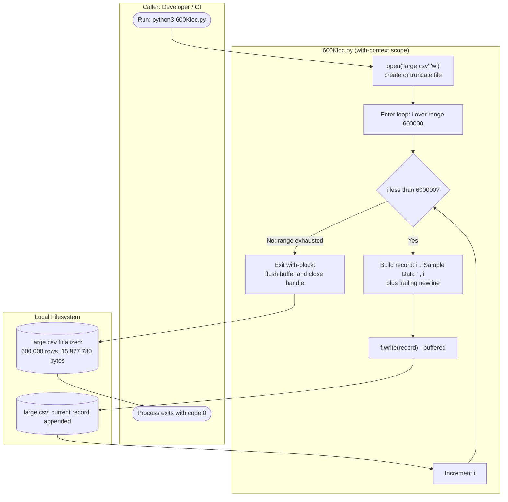
```mermaid
flowchart TD
    subgraph CallerLane["Caller: Developer / CI"]
        C1([Run: python3 600Kloc.py])
        C2([Process exits with code 0])
    end
    subgraph ScriptLane["600Kloc.py (with-context scope)"]
        S1["open('large.csv','w')<br/>create or truncate file"]
        S2["Enter loop: i over range 600000"]
        S3{"i less than 600000?"}
        S4["Build record: i , 'Sample Data ' , i<br/>plus trailing newline"]
        S5["f.write(record) - buffered"]
        S6[Increment i]
        S7["Exit with-block:<br/>flush buffer and close handle"]
    end
    subgraph DiskLane["Local Filesystem"]
        D1[("large.csv: current record appended")]
        D2[("large.csv finalized:<br/>600,000 rows, 15,977,780 bytes")]
    end
    C1 --> S1
    S1 --> S2
    S2 --> S3
    S3 -->|Yes| S4
    S4 --> S5
    S5 --> D1
    D1 --> S6
    S6 --> S3
    S3 -->|"No: range exhausted"| S7
    S7 --> D2
    D2 --> C2
```

Error states and recovery paths for this flow (disk/permission failures, and the placeholder-script failures) are documented in full in Section 4.3.2 *Error Handling*.

### 4.1.2 Integration Workflows

Per Section 2.3.2 *Integration Points*, the repository has exactly one integration point: an **outbound write to the local filesystem**. There are no inbound interfaces and no service-to-service calls. The subsections below first enumerate the integration surface (making the many absences explicit, since ruling them out is defining for this system) and then present the single batch sequence that constitutes the entire "integration" of the system.

#### 4.1.2.1 Data Flow Between Systems and API Interactions

| Integration Category | Status in Repository | Evidence |
|---|---|---|
| Local filesystem write (`large.csv`) | **Present** — outbound; `600Kloc.py` opens `large.csv` in text write mode and writes 600,000 records | `600Kloc.py`; Section 2.3.2 |
| HTTP / REST / RPC APIs | **None** — no client or server, no sockets | Section 2.3.2; Section 3.4 |
| Databases / persistent stores | **None** — no SQL/NoSQL driver or ORM | Section 2.3.2; Section 3.5 |
| Message queues / event streams | **None** — no broker, no publish/subscribe, no event loop | Section 2.3.2 |
| Cloud SDKs / third-party services | **None** — standard library only | Section 2.3.2; Section 3.3, Section 3.4 |
| Configuration / environment / CLI inputs | **None** — all values hardcoded; no env vars or arguments read | Section 2.2.2 |

Because there is no network client or server, **no API interactions and no event-processing flows exist**. The only cross-boundary data flow in the entire system is from the Python process to the local filesystem, expressed as a one-way producer relationship (`600Kloc.py` → `large.csv`) that is internal to feature F-001 (Section 2.3.3).

#### 4.1.2.2 Batch Processing Sequence

The single "batch" job in the repository is the in-process generation loop of `600Kloc.py`. It is **not** externally scheduled (there is no cron entry, scheduler, or trigger), **not** chunked or parallelized, and holds no queue, worker pool, checkpoint, or resume capability. It processes records in one continuous, single-threaded pass whose cost is linear in the record count — O(n) with n = 600,000 (Section 2.2.2). The interaction sequence between the actor, the interpreter, the script, and the filesystem is shown below.

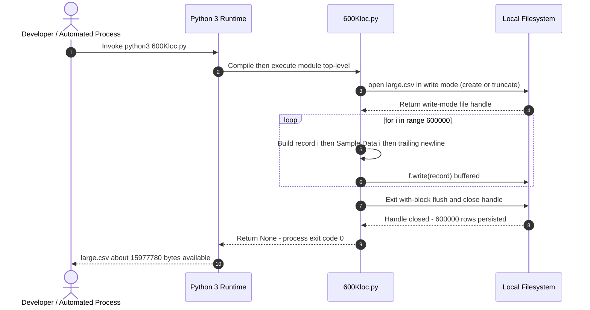
```mermaid
sequenceDiagram
    autonumber
    actor Dev as Developer / Automated Process
    participant PY as Python 3 Runtime
    participant SC as 600Kloc.py
    participant FS as Local Filesystem
    Dev->>PY: Invoke python3 600Kloc.py
    PY->>SC: Compile then execute module top-level
    SC->>FS: open large.csv in write mode (create or truncate)
    FS-->>SC: Return write-mode file handle
    loop for i in range 600000
        SC->>SC: Build record i then Sample Data i then trailing newline
        SC->>FS: f.write(record) buffered
    end
    SC->>FS: Exit with-block flush and close handle
    FS-->>SC: Handle closed - 600000 rows persisted
    SC-->>PY: Return None - process exit code 0
    PY-->>Dev: large.csv about 15977780 bytes available
```

No timing or throughput service-level agreement is defined anywhere in the repository (Section 2.2.2); timing and SLA considerations are examined further in Section 4.2.1.

## 4.2 Flowchart Requirements and Validation Rules

This section provides the element-level reference for the flowcharts in Section 4.1 and Section 4.3, and then documents the validation, authorization, and compliance checkpoints that apply along the workflow. Because the repository contains a single functional workflow (F-001) and no business, security, or regulatory logic (Section 2.2.3), the material below is deliberately explicit about which standard flowchart elements are present and which are absent by design.

### 4.2.1 Workflow Diagram Element Reference

The table below maps each required flowchart element to its concrete instance in the F-001 batch-generation workflow, with a pointer to the diagram in which it appears. All entries are grounded in the three lines of `600Kloc.py` and the verified behavior of the placeholder scripts.

| Flowchart Element | Instance in the F-001 / Repository Workflow | Diagram Reference |
|---|---|---|
| Start point | CLI invocation `python3 600Kloc.py` (or a placeholder script) | 4.1.1.1, 4.1.1.2 |
| End point (success) | Process exit code `0` after `large.csv` is finalized | 4.1.1.2, 4.3.1 |
| End point (failure) | Process exit code `1` with a traceback on `stderr` | 4.1.1.1, 4.3.2 |
| Process steps | Open file → format record → buffered `write` → flush/close | 4.1.1.2 |
| Decision diamonds | *Which entry point?*, *Compiles?*, *Runtime error?*, *`i < 600000`?*, *OS write error?* | 4.1.1.1, 4.1.1.2, 4.3.2 |
| System boundaries (swim lanes) | Actor lane, Python 3 Runtime lane, Local Filesystem lane | 4.1.1.1, 4.1.1.2 |
| User touchpoints | The single command-line invocation; no UI or interactive prompt | 4.1.1.1 |
| Error states | `SyntaxError` (compile), `NameError` (runtime), `OSError` (write) | 4.3.2 |
| Recovery paths | Manual, idempotent re-execution (no automated retry) | 4.3.2 |
| Timing / SLA annotations | None declared; only the observed O(n) linear characteristic | 4.2.1 (below) |

#### 4.2.1.1 Timing and SLA Considerations

No timing constraint, latency target, throughput requirement, or service-level agreement is declared anywhere in the repository (Section 2.2.2 *Technical Specifications*). The only timing-related property that can be stated from evidence is a **structural characteristic**, not a target: the generator performs a single linear pass whose work is proportional to the record count — O(n) with n = 600,000 — writing records sequentially on a single thread (Section 2.2.2). Likewise, the ~15,977,780-byte size of `large.csv` and its fixed 600,000-row count are **static properties of the output artifact** (Section 1.2.3), not performance KPIs. No step in any workflow has an associated deadline, timeout, or time-boxed retry, because none is implemented in the code.

### 4.2.2 Validation Rules, Authorization, and Compliance Checkpoints

The validation posture of the workflow is transcribed directly from Section 2.2.3 *Validation Rules*. The workflow contains **one** business rule and **no** data-validation, authorization, or compliance checkpoints. These are not omissions in this document — they are absent from the code itself.

#### 4.2.2.1 Business Rules at Each Step

The sole governing business rule is the **deterministic record formula**: for a 1-based row `n`, the content is exactly `n-1,Sample Data n-1` (equivalently, for loop index `i`, the record is `i,Sample Data i`). This rule is applied uniformly at the record-formatting step of every loop iteration (Section 4.1.1.2, step 4) and carries no domain semantics — the data is synthetic (Section 2.2.3, Section 1.3.1). There are no conditional business branches: every iteration executes the identical formatting and write logic.

#### 4.2.2.2 Data Validation Requirements

**None are implemented.** The script validates neither inputs (there are none) nor outputs; specifically, before writing it does **not** check for a pre-existing `large.csv`, available disk space, or write permission, and it performs no post-write verification of the row count or record format (Section 2.2.3). The only implicit "validation" is Python's own runtime enforcement: an unwritable path or a full disk surfaces as an `OSError` at the failing `write`/`open` call rather than as an application-level validation error (see Section 4.3.2).

#### 4.2.2.3 Authorization Checkpoints

**None exist.** The workflow has no authentication, authorization, role, credential, secret, or approval step at any point (Section 2.2.3 *Security Requirements*). The only access-control factor is the ambient operating-system file permission on the current working directory, which is external to the code. A relevant *data-loss consideration* (not an implemented control) is that the write mode `"w"` will silently truncate and overwrite any existing `large.csv` without confirmation (Section 2.2.3).

#### 4.2.2.4 Regulatory Compliance Checks

**None apply and none are implemented.** The generated data is synthetic and contains no personal, sensitive, or regulated information; consequently no compliance regime (for example, PII handling or GDPR) is engaged, and the code contains no compliance, auditing, redaction, or retention logic (Section 2.2.3 *Compliance Requirements*).

## 4.3 Technical Implementation Flows

This section documents the technical mechanics behind the workflow: how state advances through the short-lived generation process, where data becomes durable, what buffering exists, where the effective transaction boundary lies, and how the code behaves when things go wrong. All statements are grounded in `600Kloc.py`, in the verified failure behavior of the placeholder scripts, and in an empirically confirmed test of the context manager's cleanup-on-exception behavior.

### 4.3.1 State Management

The functional workflow is a single, short-lived, in-process job. It holds no long-lived, shared, or distributed state — there is no database, session store, or in-memory cache (Section 2.3, Section 3.5). The only durable state produced is the output file `large.csv`; all other state is the transient control state of the running process (the open file handle and the loop index).

#### 4.3.1.1 Process and File State Transitions

The generator advances through a small, well-defined set of states. On the success path it moves *Compiling → Opening → Writing → Closing → Completed*; on failure it diverts to *Aborting*. The compile-time and runtime failures of the placeholder scripts terminate before or at the *Compiling*/*Opening* boundary. The state machine below is derived directly from the control flow of `600Kloc.py`.

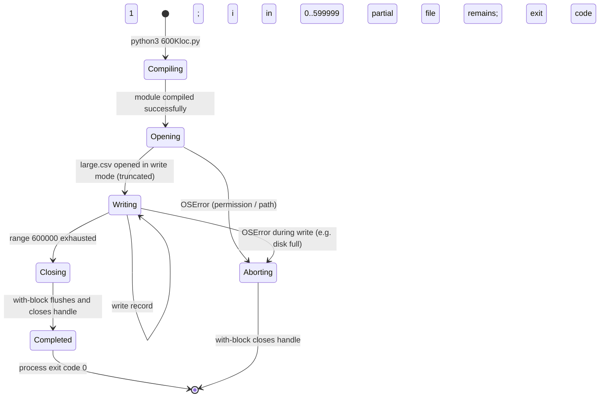
```mermaid
stateDiagram-v2
    [*] --> Compiling: python3 600Kloc.py
    Compiling --> Opening: module compiled successfully
    Opening --> Writing: large.csv opened in write mode (truncated)
    Writing --> Writing: write record; i in 0..599999
    Writing --> Closing: range 600000 exhausted
    Closing --> Completed: with-block flushes and closes handle
    Completed --> [*]: process exit code 0
    Opening --> Aborting: OSError (permission / path)
    Writing --> Aborting: OSError during write (e.g. disk full)
    Aborting --> [*]: with-block closes handle; partial file remains; exit code 1
```

#### 4.3.1.2 Data Persistence Points

There is exactly **one** persistence target: the local file `large.csv`, written in the current working directory (Section 2.3.2). Within the workflow, two persistence-relevant moments exist:

- **Per-record write.** Each `f.write(record)` call appends a record to the file object's buffer; individual records are not guaranteed to be on disk at this point.
- **Flush and close.** Exiting the `with` block flushes the buffer and closes the handle, at which moment all 600,000 records are durably persisted (requirement **F-001-RQ-005**). This is the point at which `large.csv` becomes complete and consistent on disk.

No intermediate, staging, or temporary store is used, and nothing is persisted anywhere other than `large.csv`.

#### 4.3.1.3 Caching and Buffering Requirements

The repository defines **no application-level caching** — there is no cache library, no memoization, and no cache store (Section 3.5). The only buffering present is the **standard I/O buffering** inherent to Python's text-mode file object returned by `open(..., "w")`: written records accumulate in that buffer and are flushed when the buffer fills or when the handle is closed at the end of the `with` block. This is interpreter/operating-system behavior rather than a designed caching layer, and it requires no configuration in the code.

#### 4.3.1.4 Transaction Boundaries

The effective "transaction" boundary of the workflow is the scope of the `with open(...) as f:` context manager: it deterministically brackets resource acquisition (open) and release (flush + close), including on the exception path. However, this is a **resource-cleanup boundary, not an ACID transaction** — there is **no atomicity and no rollback**. This was verified empirically: when an exception is raised partway through the loop, the context manager still closes the handle *and the records written up to that point remain flushed on disk*, leaving `large.csv` partially written. Consequently, a failed run does not restore the prior file contents; the workflow's durability guarantee is limited to "the handle is always closed," not "the file is all-or-nothing." Recovery from a partial file is addressed in Section 4.3.2.5.

### 4.3.2 Error Handling

The repository implements **no explicit error handling**: there is no `try`/`except`, no error class, no logging framework, and no alerting (Section 2.2.3, Section 2.4). Any failure therefore surfaces as an uncaught Python exception that aborts the process with a traceback on `stderr` and a non-zero exit code. The flowchart below consolidates every failure path observed across the three scripts.

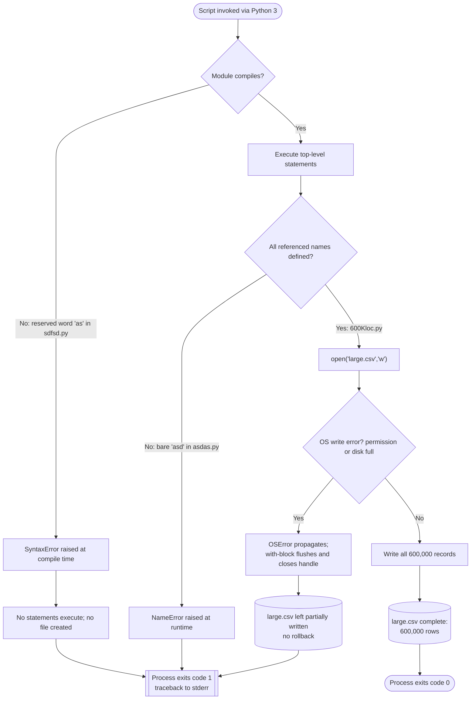
```mermaid
flowchart TD
    Start([Script invoked via Python 3]) --> Comp{Module compiles?}
    Comp -->|"No: reserved word 'as' in sdfsd.py"| SynErr[SyntaxError raised at compile time]
    SynErr --> NoRun[No statements execute; no file created]
    NoRun --> Exit1[["Process exits code 1<br/>traceback to stderr"]]
    Comp -->|Yes| Run[Execute top-level statements]
    Run --> NameChk{All referenced names defined?}
    NameChk -->|"No: bare 'asd' in asdas.py"| NameErr[NameError raised at runtime]
    NameErr --> Exit1
    NameChk -->|"Yes: 600Kloc.py"| OpenF["open('large.csv','w')"]
    OpenF --> IOChk{"OS write error? permission or disk full"}
    IOChk -->|Yes| IOErr["OSError propagates;<br/>with-block flushes and closes handle"]
    IOErr --> Partial[("large.csv left partially written<br/>no rollback")]
    Partial --> Exit1
    IOChk -->|No| Loop[Write all 600,000 records]
    Loop --> Success[("large.csv complete:<br/>600,000 rows")]
    Success --> Exit0([Process exits code 0])
```

#### 4.3.2.1 Retry Mechanisms

**None.** The code contains no retry loop, no exponential backoff, and no attempt counter. A failing `open` or `write` is not retried; the exception immediately terminates the process.

#### 4.3.2.2 Fallback Processes

**None.** There is no alternate code path, degraded mode, default output, or secondary destination. If the single write path fails, no substitute behavior is invoked.

#### 4.3.2.3 Error Notification Flows

The only notification mechanism is the **Python interpreter's default uncaught-exception reporting**: a traceback printed to `stderr` together with a process exit code of `1`. There is no application logging, metrics emission, email, webhook, or monitoring integration (Section 2.2.3, Section 3.4). On the success path the process is silent — it emits nothing to `stdout` or `stderr` and exits with code `0` (Section 2.2.2).

#### 4.3.2.4 Recovery Procedures

The sole recovery procedure is **manual, idempotent re-execution**. Because the output is opened in truncate mode `"w"` (requirement **F-001-RQ-001**) and generation is fully deterministic (requirement **F-001-RQ-004**), simply re-running `python3 600Kloc.py` after fixing the underlying condition (for example, freeing disk space or correcting directory permissions) regenerates byte-identical, complete output and overwrites any partial file left by a prior aborted run. There is **no checkpoint, resume, or partial-continuation mechanism**; recovery always restarts generation from the first record. For the placeholder scripts (`sdfsd.py`, `asdas.py`, `test.py`, `testing.py`), no recovery is possible or meaningful because they contain no functional logic to complete.

## 4.4 References

The following repository artifacts, repository structure, and previously authored Technical Specification sections were examined and cited as evidence for the workflows, diagrams, and validation posture documented in Section 4. No external web sources were used.

### 4.4.1 Repository Files Examined

- `600Kloc.py` — The only functional process; source of every F-001 workflow step, decision point (`i < 600000`), persistence point, buffering behavior, and the `with`-context transaction boundary. Verified to open `large.csv` in write mode and write 600,000 records.
- `large.csv` — The workflow's single durable output artifact; confirmed 600,000 rows, headerless two columns, 15,977,780 bytes, first row `0,Sample Data 0` and last row `599999,Sample Data 599999`.
- `sdfsd.py` — Non-functional placeholder; established the compile-time `SyntaxError` failure path (reserved keyword `as`) shown in the high-level and error-handling flowcharts.
- `asdas.py` — Non-functional placeholder; established the runtime `NameError` failure path shown in the high-level and error-handling flowcharts.
- `test.py` — Non-functional placeholder; established the runtime `NameError` failure path (undefined name `askjdnasd`) shown in the high-level flowchart and consolidated in the error-handling flowchart.
- `testing.py` — Non-functional placeholder; established the runtime `NameError` failure path (undefined name `sada`) shown in the high-level flowchart and consolidated in the error-handling flowchart.
- `README.md` — Confirmed the project identifier (`check_status_2107_01`) and the absence of any documented business process, workflow, or operational procedure.

### 4.4.2 Repository Structure Examined

- `` (repository root) — Confirmed the complete inventory of seven files and the absence of any subfolders, service code, scheduler, configuration, or integration modules, establishing that a single batch-generation workflow is the entire process surface.

### 4.4.3 Verification Performed

- Empirical context-manager test — Confirmed that a mid-write exception still causes the `with` block to flush and close the handle while leaving a partially written file (no atomicity/rollback), grounding Section 4.3.1.4 and Section 4.3.2.

### 4.4.4 Cross-Referenced Technical Specification Sections

- Section 1.2 *System Overview* (incl. 1.2.2 High-Level Description, 1.2.3 Success Criteria) — End-to-end data flow, single-purpose characterization, and critical success factors.
- Section 2.1 *Feature Catalog* (incl. 2.1.3) — Feature F-001 definition and the classification of the four placeholder files as non-features.
- Section 2.2 *Functional Requirements* (incl. 2.2.1 requirements F-001-RQ-001…005, 2.2.2 Technical Specifications, 2.2.3 Validation Rules) — Requirement traceability, O(n) linear/single-threaded characteristic, exit-code behavior, and the business/validation/security/compliance posture cited throughout Sections 4.1–4.3.
- Section 2.3 *Feature Relationships* (incl. 2.3.2 Integration Points, 2.3.3 Shared Components) — The single filesystem integration point and the absence of shared services.
- Section 2.4 *Implementation Considerations* — Absence of error handling and the single-threaded, in-process execution model.
- Section 3.3 *Open Source Dependencies*, Section 3.4 *Third-Party Services*, Section 3.5 *Databases & Storage* — Confirmation that no external dependency, service, database, or cache participates in any workflow.

# 5. System Architecture

## 5.1 High-Level Architecture

This section describes the architecture of the `check_status_2107_01` repository exactly as implemented across its seven files. The system is not a service, distributed application, or library; it is a single-purpose, single-process batch utility whose only functional capability is the deterministic generation of a synthetic CSV dataset (feature **F-001**, per Section 2.1). Accordingly, the architecture below is documented at the level of granularity the codebase actually exhibits — one generator script, one output artifact, and a supporting name-only document plus four non-functional placeholder files — and inapplicable enterprise concerns are explicitly identified as absent rather than fabricated.

### 5.1.1 System Overview

**Architecture style and rationale.** The system follows a **monolithic, single-process, synchronous, procedural batch-script** style. The entire executable system is `600Kloc.py` — a three-line, top-level Python script with no functions, classes, imports, or exports — which runs to completion in a single pass and exits. This style is the minimal sufficient architecture for the sole requirement: producing a fixed, deterministic synthetic dataset. Because there is no interactive, concurrent, or long-lived workload, no service framework, module decomposition, message bus, or orchestration layer is present, and none is warranted by the observed requirements.

**Key architectural principles and patterns (as observed in code).**

- **Minimalism / dependency-free self-containment.** The generator uses only Python standard-library primitives (`open`, `range`, f-string formatting) and declares no third-party dependencies, configuration, or environment variables.
- **Procedural, top-to-bottom execution.** Control flow is a single `with` block enclosing a `for` loop; there is no abstraction, indirection, or branching.
- **Streaming write.** Records are written one per loop iteration directly to a single file handle rather than accumulated in memory, so the process memory footprint is flat and independent of the ~16 MB output size.
- **Deterministic generation.** Output depends solely on in-code constants (`range(600000)` and the record template `f"{i},Sample Data {i}"`), so each run produces byte-identical output and the artifact is fully regenerable.
- **Context-managed resource safety.** The `with open(...)` context manager guarantees the file handle is flushed and closed on both the normal and the exceptional exit path (requirement F-001-RQ-005, per Section 4.3).

**System boundaries and major interfaces.** The system boundary encloses the generator `600Kloc.py` and the artifact it produces, `large.csv`. The `README.md` (project-name heading only) and the four non-functional placeholder files (`sdfsd.py`, `asdas.py`, `test.py`, `testing.py`) reside inside the repository but outside the executable system. Only two interfaces cross the boundary:

- **Invocation interface (inbound).** An operator or automated process starts the job by invoking `python3 600Kloc.py` through the CPython runtime. There are no command-line arguments, configuration files, or environment inputs.
- **Output interface (outbound).** A local filesystem write of `large.csv` into the current working directory via the operating system's file API.

No network, HTTP/API, database, message-broker, cache, or authentication interface exists at the boundary. The system's only contact with the outside world is the CPython runtime that hosts it and the local filesystem it writes to.

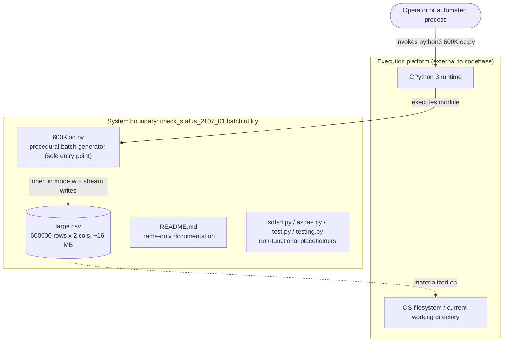
```mermaid
flowchart TD
    Operator([Operator or automated process])
    subgraph Platform["Execution platform (external to codebase)"]
        Runtime["CPython 3 runtime"]
        FS["OS filesystem / current working directory"]
    end
    subgraph SystemBoundary["System boundary: check_status_2107_01 batch utility"]
        Script["600Kloc.py<br/>procedural batch generator (sole entry point)"]
        CSV[("large.csv<br/>600000 rows x 2 cols, ~16 MB")]
        Readme["README.md<br/>name-only documentation"]
        Placeholders["sdfsd.py / asdas.py / test.py / testing.py<br/>non-functional placeholders"]
    end
    Operator -->|"invokes python3 600Kloc.py"| Runtime
    Runtime -->|"executes module"| Script
    Script -->|"open in mode w + stream writes"| CSV
    CSV -.->|"materialized on"| FS
```

### 5.1.2 Core Components

The repository contains seven files. Only `600Kloc.py` and `large.csv` participate in the runtime; the remaining five are documentation or non-functional placeholders, included here for completeness and to establish an unambiguous component inventory. Because the output-format standard limits tables to four columns, the component attributes are split across the two tables below.

**Table 5.1.2-A — Component responsibilities and dependencies**

| Component | Primary Responsibility | Key Dependencies |
|---|---|---|
| `600Kloc.py` | Sole functional component and entry point: opens `large.csv` in write mode and streams 600,000 deterministic records | CPython 3 built-ins only (`open`, `range`, f-string, `with`); write permission in the working directory |
| `large.csv` | Sole persistence artifact: the generated headerless, two-column dataset (~16 MB) | Produced by `600Kloc.py`; local filesystem capacity (~16 MB) |
| `README.md` | Project identification (contains only the heading `# check_status_2107_01`) | None |
| `sdfsd.py` | Non-functional placeholder (bare identifier tokens) | None |
| `asdas.py` | Non-functional placeholder (bare `asd` tokens) | None |
| `test.py` | Non-functional placeholder (bare identifier tokens) | None |
| `testing.py` | Non-functional placeholder (bare identifier tokens) | None |

**Table 5.1.2-B — Component integration points and critical considerations**

| Component | Integration Points | Critical Considerations |
|---|---|---|
| `600Kloc.py` | Outbound: local filesystem write of `large.csv` | Hardcoded output name and record count; no error handling or logging; single-threaded O(n) loop |
| `large.csv` | Consumed by downstream/external tooling (not present in this repository) | Git-tracked (~16 MB committed); truncated and overwritten on every run (data-loss risk on a relative path) |
| `README.md` | None | No usage, setup, dependency, or architecture documentation |
| `sdfsd.py` | None | Fails at compile time (`SyntaxError` on the reserved keyword `as`); never executes |
| `asdas.py` | None | Fails at run time (`NameError`); not part of the executable system |
| `test.py` | None | Fails at run time (`NameError` on the undefined name `askjdnasd`); not part of the executable system |
| `testing.py` | None | Fails at run time (`NameError` on the undefined name `sada`); not part of the executable system |

### 5.1.3 Data Flow Description

**Primary data flow.** The system implements a single, unidirectional, in-process pipeline with no fan-out or branching. On invocation, the CPython runtime executes `600Kloc.py`; the `with` statement opens `large.csv` in text write mode (`"w"`), truncating any existing file; the `for` loop iterates the integer index `i` from 0 through 599,999; each index is formatted by an f-string into a record of the form `<i>,Sample Data <i>` terminated by a newline; and each record is written to the buffered file object. When the loop completes, exiting the `with` block flushes the buffer and closes the handle, at which point `large.csv` is complete and consistent on disk.

**Integration patterns and protocols.** There is no inter-service or network protocol. The only "protocol" involved is the operating system's file I/O interface, accessed through Python's text-mode file object; no HTTP, gRPC, AMQP, JDBC/SQL, or serialization framework is used. Data crosses the system boundary exactly once, as a stream of newline-terminated text records written to a local file.

**Data transformation points.** The pipeline contains exactly one transformation: the f-string templating that converts an in-memory integer index into a two-field, comma-separated text line. There is no parsing, validation, enrichment, aggregation, encoding negotiation, or schema mapping — the index is both the first column and the numeric suffix of the second column's label.

**Key data stores and caches.** The system has a single data store — the flat file `large.csv` on the local filesystem — and no database, object store, or cloud storage. There is **no application-level cache**; the only buffering is the standard I/O buffer of the text-mode file object provided by the interpreter and operating system, which accumulates written records and flushes them when the buffer fills or when the handle is closed at the end of the `with` block (see Section 4.3.1.3). This buffering is ambient runtime behavior, not a designed caching layer, and requires no configuration.

### 5.1.4 External Integration Points

The system has **no external system integrations**. Direct inspection of `600Kloc.py` confirms there are no network calls, remote APIs, third-party services, databases, message brokers, cloud SDKs, authentication providers, monitoring/telemetry endpoints, or environment-variable inputs (consistent with Sections 3.4 and 3.5). The only interfaces the system depends on are two elements of its execution environment — the language runtime that hosts the script and the local filesystem it writes to. These are platform dependencies rather than integrations with external systems, and no service-level agreement (SLA) is defined anywhere in the repository. They are documented below (columns condensed to satisfy the four-column limit; the requested "System Name / Integration Type / Data Exchange Pattern / Protocol-Format / SLA" attributes are folded into these four columns).

**Table 5.1.4-A — Environmental touchpoints (no external systems integrated)**

| Environmental Touchpoint | Integration Type & Exchange Pattern | Protocol / Format | SLA / Availability |
|---|---|---|---|
| CPython 3 runtime | Host runtime; synchronous in-process execution of the script | Python bytecode execution (no wire protocol) | None declared; relies on a locally available interpreter |
| OS local filesystem (current working directory) | Outbound one-shot batch write of the output artifact | OS file I/O API; UTF-8/ASCII text, headerless CSV | None declared; relies on write permission and ~16 MB free space |

No other external endpoints, credentials, or exchange formats are present. Any consumer of `large.csv` is outside this repository's boundary and interacts with the system only indirectly, by reading the generated file from the filesystem.

## 5.2 Component Details

This section details each component identified in Section 5.1.2. Only two components participate in the runtime — the generator `600Kloc.py` and the artifact `large.csv` — so they receive full treatment across the five required dimensions (purpose, technologies, interfaces, persistence, scaling). The remaining five files are documented briefly in Section 5.2.3. The component-interaction, lifecycle, and sequence diagrams follow in Section 5.2.4.

### 5.2.1 600Kloc.py — Batch Data Generator (Primary Component)

`600Kloc.py` is the only functional component and the system's sole entry point. It is a three-line, top-level script that opens `large.csv` in write mode and streams 600,000 deterministic records to it, then closes the handle via its `with` context manager.

| Aspect | Detail (grounded in `600Kloc.py`) |
|---|---|
| Purpose & responsibilities | Deterministically generate the `large.csv` dataset; own the full lifecycle of the output file (create/truncate → stream-write → flush/close) in a single pass |
| Technologies & frameworks | CPython 3 (f-string usage implies interpreter ≥ 3.6); Python standard library only — built-in `open()`, `range()`, f-string formatting, and the `with` statement; **no** frameworks and **no** third-party libraries |
| Key interfaces & APIs | No public/importable API (no functions, classes, or exports). The only interface is the implicit command-line entry point `python3 600Kloc.py` (no arguments, no config, no environment inputs); internally it invokes the file object's `write()` method once per record |
| Data persistence | Writes `large.csv` to the current working directory via `open("large.csv", "w")` (truncate/overwrite); performs a streaming write of one record per iteration; the `with` block flushes and closes the handle on exit |
| Scaling considerations | Single-threaded, in-process, `O(n)` over `range(600000)`; memory-flat because records are streamed rather than accumulated; runtime and output size scale linearly with the record count |

**Scaling elaboration.** Because the record count (`600000`) and the output filename are hardcoded literals, changing the workload size requires editing the source — there is no parameterization, CLI flag, or configuration hook. The design contains no parallelism, sharding, chunking, or backpressure mechanism; horizontal scaling is neither implemented nor required by the observed use case. The streaming write keeps resident memory effectively constant regardless of output size, so the practical scaling limits are single-core CPU time and available disk space rather than memory.

### 5.2.2 large.csv — Generated Data Artifact

`large.csv` is the system's only persisted output and its single data store. It is produced by `600Kloc.py` and is also committed to version control, so the repository ships both the generator and a materialized copy of its output.

| Aspect | Detail (grounded in `large.csv`) |
|---|---|
| Purpose & responsibilities | Serve as the fixed synthetic dataset (fixture/sample data) produced by F-001; hold 600,000 rows in a stable, positional two-column layout |
| Technologies & frameworks | Plain-text, headerless CSV (comma-separated), ASCII/UTF-8 encoded; not managed by any database engine, ORM, or storage service |
| Key interfaces & APIs | No API; the file is consumed by any external process that reads it. The implicit schema is positional: column 1 = index (`0`…`599999`), column 2 = the label `Sample Data <index>` |
| Data persistence | A single flat file on the local filesystem; 15,977,780 bytes (~16 MB); Git-tracked; fully rewritten (overwritten) on each generation run |
| Scaling considerations | File size grows linearly with the record count; no partitioning, compression, or indexing is applied, and the entire file is regenerated from scratch on each run |

### 5.2.3 Supporting and Non-Functional Files

The remaining five files carry no runtime behavior and are included only to complete the component inventory.

| File | Role | Runtime Behavior |
|---|---|---|
| `README.md` | Documentation stub containing only the heading `# check_status_2107_01` | Not executed; provides project identity only, with no usage or architecture content |
| `sdfsd.py` | Non-functional placeholder (11 bare identifier tokens) | Fails at compile time with `SyntaxError` on the reserved keyword `as`; never begins execution and touches no files |
| `asdas.py` | Non-functional placeholder (2 bare `asd` tokens) | Fails at run time with `NameError`; performs no I/O and produces no artifact |
| `test.py` | Non-functional placeholder (2 bare identifier tokens) | Fails at run time with `NameError` on the undefined name `askjdnasd`; performs no I/O and produces no artifact (despite its name, it is not a test) |
| `testing.py` | Non-functional placeholder (5 bare identifier tokens) | Fails at run time with `NameError` on the undefined name `sada`; performs no I/O and produces no artifact (despite its name, it is not a test) |

These files are not part of the executable system and have no interfaces, dependencies, persistence, or scaling characteristics.

### 5.2.4 Component Interaction and Runtime Behavior

This subsection presents the architectural views of how the components interact, how the running system transitions through its lifecycle, and the ordered sequence of the primary generation flow. The lifecycle and sequence views are the architectural complements of the process-level state machine and workflow documented in Section 4.3.1 and Section 4.1; they are framed here around component boundaries rather than repeating that process detail.

#### 5.2.4.1 Component Interaction Diagram

The diagram below shows the layered interaction path from invocation through the language runtime and the script's internal elements (context manager, loop, formatter) to the OS I/O layer and the filesystem data store.


```mermaid
flowchart LR
    subgraph Invocation["Invocation"]
        Shell["Shell / scheduler<br/>python3 600Kloc.py"]
    end
    subgraph Runtime["Language runtime"]
        CPython["CPython 3 interpreter"]
    end
    subgraph App["Application logic: 600Kloc.py"]
        CtxMgr["with open(...) context manager"]
        Loop["for i in range(600000)"]
        Fmt["f-string record formatter"]
    end
    subgraph OSIO["OS I/O layer"]
        FileAPI["Buffered text file object (mode w)"]
    end
    subgraph Storage["Local filesystem"]
        CSV[("large.csv")]
    end
    Shell --> CPython
    CPython --> CtxMgr
    CtxMgr --> Loop
    Loop --> Fmt
    Fmt -->|"f.write(record)"| FileAPI
    FileAPI -->|"buffered write, flush on close"| CSV
```

#### 5.2.4.2 Component Lifecycle and State Transitions

The generator is a short-lived job with a small, well-defined lifecycle. From an architectural standpoint the system moves from *Idle* (repository at rest) through *Initializing* and *Generating* to *Finalized*, diverting to *Aborted* on an I/O error. This is the component-oriented view of the process-level state machine in Section 4.3.1.1; the two are consistent, with the labels here emphasizing the component lifecycle.

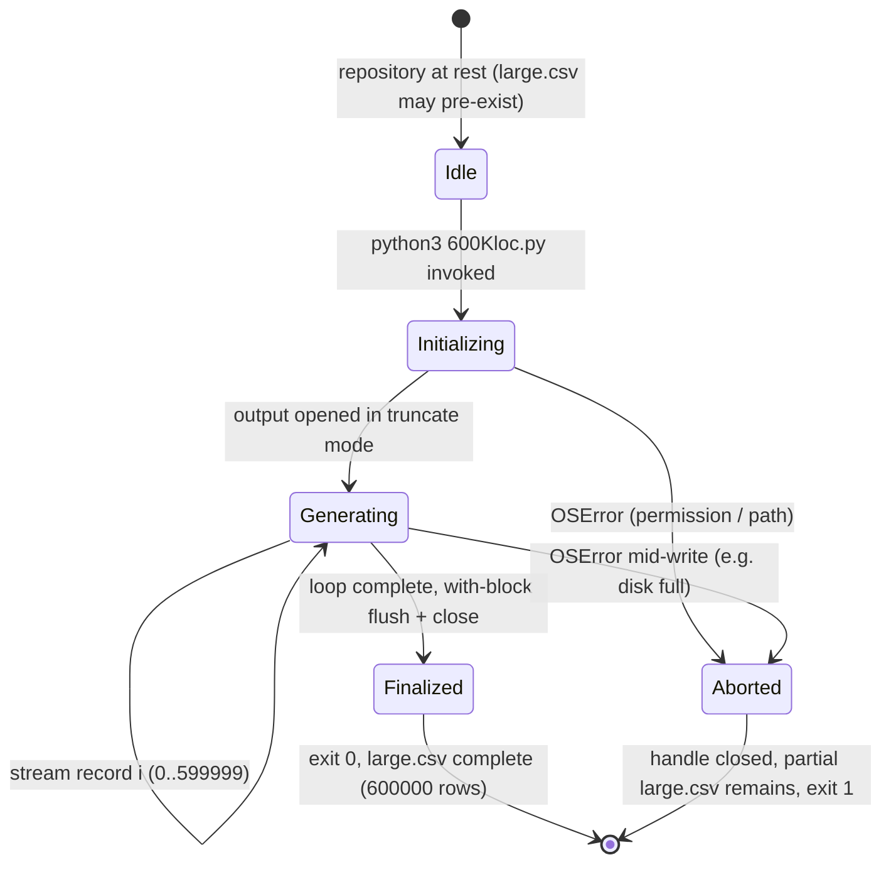
```mermaid
stateDiagram-v2
    [*] --> Idle: repository at rest (large.csv may pre-exist)
    Idle --> Initializing: python3 600Kloc.py invoked
    Initializing --> Generating: output opened in truncate mode
    Generating --> Generating: stream record i (0..599999)
    Generating --> Finalized: loop complete, with-block flush + close
    Finalized --> [*]: exit 0, large.csv complete (600000 rows)
    Initializing --> Aborted: OSError (permission / path)
    Generating --> Aborted: OSError mid-write (e.g. disk full)
    Aborted --> [*]: handle closed, partial large.csv remains, exit 1
```

#### 5.2.4.3 Generation Sequence for the Key Flow

The sequence below traces the single key flow — bulk CSV generation — across the interacting participants: the operator/scheduler, the CPython runtime, the script logic, the buffered file object, and the `large.csv` file on disk.

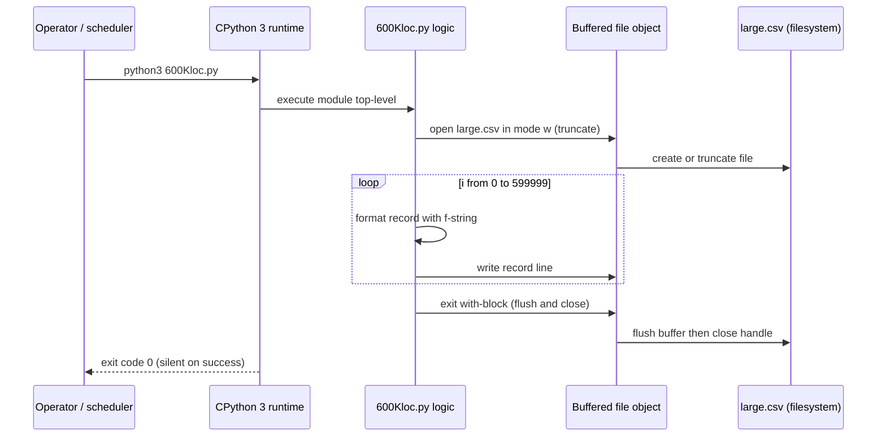
```mermaid
sequenceDiagram
    participant Op as Operator / scheduler
    participant Py as CPython 3 runtime
    participant App as 600Kloc.py logic
    participant IO as Buffered file object
    participant FS as large.csv (filesystem)
    Op->>Py: python3 600Kloc.py
    Py->>App: execute module top-level
    App->>IO: open large.csv in mode w (truncate)
    IO->>FS: create or truncate file
    loop i from 0 to 599999
        App->>App: format record with f-string
        App->>IO: write record line
    end
    App->>IO: exit with-block (flush and close)
    IO->>FS: flush buffer then close handle
    Py-->>Op: exit code 0 (silent on success)
```

## 5.3 Technical Decisions

This section documents the architectural decisions that shaped the system and the rationale behind them. Because the repository contains no design documents, the decisions below are inferred from the as-built code and are presented as the reasoning that the implementation embodies. Every decision reflects a consistent theme: choose the minimal sufficient mechanism for a one-shot, deterministic, dependency-free data-generation job, and add nothing the observed requirements do not demand.

### 5.3.1 Key Decisions and Tradeoffs

The following table summarizes the five decision areas requested by this specification. Each is elaborated in prose beneath the table.

**Table 5.3.1-A — Decision summary**

| Decision Area | Chosen Approach | Rationale | Tradeoff / Consequence |
|---|---|---|---|
| Architecture style | Monolithic, single-file procedural batch script | Minimal sufficient design for a one-shot deterministic job | No modularity, unit-test seams, or reuse; not extensible without rewriting |
| Communication pattern | In-process only; file-based handoff of the artifact | No remote consumer or concurrency exists to justify IPC/network | Consumers must read `large.csv` directly; no streaming/eventing to remote parties |
| Data storage | Flat, headerless CSV on the local filesystem | Output is static and sequentially written with no query/transaction needs | No indexing, querying, or ACID; whole-file truncate/overwrite each run |
| Caching strategy | No application cache; rely only on ambient I/O buffering | Single sequential pass with no re-reads; a cache would add cost for no benefit | None beyond dependence on OS/interpreter buffer flush at close |
| Security mechanism | None (no authN/authZ, encryption, or input validation) | No untrusted input, no network exposure, no secrets, synthetic data | Relative-path write silently overwrites any existing `large.csv` (data-loss risk) |

**Architecture style decisions and tradeoffs.** The system is implemented as a single three-line procedural script rather than a modular package, a service, or a framework-based application. The benefit is extreme simplicity: the entire behavior is readable at a glance, requires no build or install step, and has no dependency surface to maintain. The cost is that the code has no separation of concerns, no test seams, and no extension points; any change to workload size, output format, or destination requires editing the source. Given the single, stable requirement (F-001) and the absence of any evolution pressure in the repository, this tradeoff favors simplicity.

**Communication pattern choices.** There is no inter-process, network, or event-driven communication. All interaction is in-process — the script calls Python's built-in file API directly — and the only "hand-off" to any other party is the produced file `large.csv`, which acts as the de facto interface. This avoids all coupling, serialization, and availability concerns associated with remote communication, at the cost of requiring consumers to read the artifact from the filesystem rather than receive it over a channel.

**Data storage solution rationale.** Persistence is a single flat CSV file rather than a relational or NoSQL database. The output is a static, write-once, sequentially generated dataset with no requirement for querying, concurrent access, partial updates, transactions, or referential integrity, so a file is the simplest store that fully satisfies the need — it is portable, human-inspectable, and requires no server, driver, schema, or connection management. The tradeoff is the absence of indexing/query capability and the whole-file overwrite semantics (Section 3.5).

**Caching strategy justification.** No application-level caching is implemented, and none is warranted: the workload is a single forward pass that writes each record exactly once and never re-reads data, so there is nothing a cache could accelerate. The only buffering present is the standard I/O buffer of the text-mode file object, which the runtime flushes when the buffer fills or when the `with` block closes the handle (Section 4.3.1.3). Introducing a cache would add complexity and memory pressure with no performance benefit.

**Security mechanism selection.** The system implements no authentication, authorization, encryption, secret management, or input validation, because it has no attack surface of that kind: it accepts no external input, opens no network connection, handles no credentials, and writes only synthetic, non-sensitive data (Sections 3.4 and 3.5). The one residual safety consideration is that the output is written to a **relative path in truncate mode**, so an existing `large.csv` in the working directory is silently overwritten. This is an accepted consequence rather than a mitigated control; its practical impact is bounded by the fact that the output is fully deterministic and therefore regenerable.

### 5.3.2 Architecture-Selection Decision Tree

The decision tree below traces how the observed requirements lead to the chosen architecture, and shows the alternatives that were implicitly rejected at each branch.

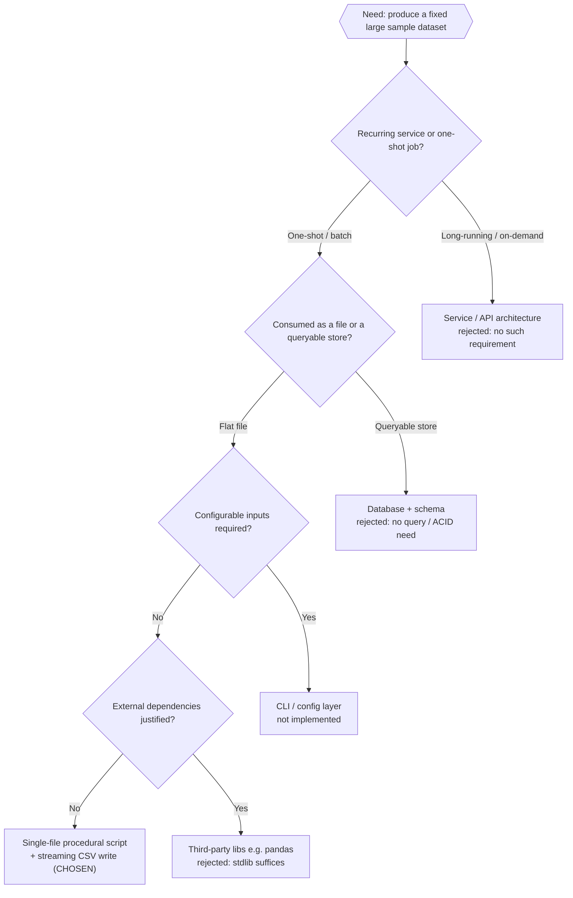
```mermaid
flowchart TD
    Start{{"Need: produce a fixed large sample dataset"}}
    Q1{"Recurring service or one-shot job?"}
    Start --> Q1
    Q1 -->|"One-shot / batch"| Q2{"Consumed as a file or a queryable store?"}
    Q1 -->|"Long-running / on-demand"| SvcRej["Service / API architecture<br/>rejected: no such requirement"]
    Q2 -->|"Flat file"| Q3{"Configurable inputs required?"}
    Q2 -->|"Queryable store"| DbRej["Database + schema<br/>rejected: no query / ACID need"]
    Q3 -->|"No"| Q4{"External dependencies justified?"}
    Q3 -->|"Yes"| CliRej["CLI / config layer<br/>not implemented"]
    Q4 -->|"No"| Chosen["Single-file procedural script<br/>+ streaming CSV write (CHOSEN)"]
    Q4 -->|"Yes"| LibRej["Third-party libs e.g. pandas<br/>rejected: stdlib suffices"]
```

### 5.3.3 Architecture Decision Records (ADRs)

The decisions above are formalized as the following ADRs. All are recorded with status **Accepted**, reflecting the system as built; there are no superseded or proposed alternatives in the repository.

**ADR-001 — Monolithic single-file procedural batch script**

- **Status:** Accepted (as-built).
- **Context:** The sole requirement is to generate one fixed, deterministic dataset; there is no interactive, concurrent, or long-running workload.
- **Decision:** Implement the capability as a single top-level Python script with no functions, classes, modules, or service scaffolding.
- **Consequences:** Minimal complexity and zero setup, but no modularity, test seams, or reuse; behavioral changes require editing the source.

**ADR-002 — Flat headerless CSV on the local filesystem for persistence**

- **Status:** Accepted.
- **Context:** The output is a static, sequentially written dataset with no query, transaction, or concurrency needs.
- **Decision:** Persist to a single flat file (`large.csv`) via built-in file I/O rather than a database or object/cloud store.
- **Consequences:** Portable and inspectable with no server or driver, but no indexing/querying/ACID, and the whole file is truncated and rewritten on each run.

**ADR-003 — Streaming per-record write within a `with` context manager**

- **Status:** Accepted.
- **Context:** The output (~16 MB) must be written reliably without holding the whole dataset in memory.
- **Decision:** Write one record per loop iteration to a buffered file object opened by a `with` statement that guarantees flush and close.
- **Consequences:** Flat memory footprint and guaranteed handle cleanup on both normal and exceptional exit, but the resource-cleanup boundary provides no atomicity — a mid-run failure leaves a partial file (Section 4.3.1.4).

**ADR-004 — Standard-library-only, zero third-party dependencies**

- **Status:** Accepted.
- **Context:** Record formatting and file writing are fully served by Python built-ins.
- **Decision:** Use only `open`, `range`, f-strings, and `with`; introduce no external packages (no `pandas`, no `csv` module) and no dependency manifest.
- **Consequences:** No install step, no version/security maintenance of dependencies, and trivial portability, at the cost of no library-provided conveniences (e.g., CSV quoting/escaping).

**ADR-005 — No configuration layer; parameters are hardcoded**

- **Status:** Accepted.
- **Context:** The record count (`600000`) and output filename (`large.csv`) are fixed for the intended use.
- **Decision:** Embed these as literals in the source rather than exposing CLI arguments, environment variables, or a config file.
- **Consequences:** Nothing to misconfigure and fully reproducible runs, but changing workload size or destination requires a code edit, and the fixed relative path carries the overwrite/data-loss consideration noted in Section 5.3.1.

## 5.4 Cross-Cutting Concerns

This section addresses the standard cross-cutting concerns of a production system. For this repository most of them are **not implemented**, which is itself an important architectural fact: the system is a single-shot local batch script with no operational tooling. Each concern below states plainly what exists and what does not, grounded in the code, and no capability, metric, or SLA is asserted that the repository does not contain. The table summarizes the posture; the subsections provide detail.

**Table 5.4-A — Cross-cutting concern posture**

| Concern | Implementation Status | Observed Mechanism / Note |
|---|---|---|
| Monitoring & observability | Not implemented | Process exit code only; silent on success |
| Logging & tracing | Not implemented | No logging framework; default traceback to `stderr` on failure |
| Error handling | No explicit handling | Uncaught exceptions; `with` block guarantees handle close but no rollback |
| Authentication & authorization | Not applicable | Governed solely by OS filesystem permissions |
| Performance requirements & SLAs | None declared | Only observed characteristics exist (no targets) |
| Disaster recovery | Not implemented (output is regenerable) | Deterministic re-run; `large.csv` is also Git-tracked |

### 5.4.1 Monitoring and Observability

The system has no monitoring or observability instrumentation: there are no metrics, health checks, dashboards, heartbeats, or telemetry exporters. The only observable signal is the **process exit code** — `0` on success and `1` on an uncaught exception (Section 4.3.2) — together with the on-disk presence and size of `large.csv`. On the success path the process is entirely silent, emitting nothing to `stdout` or `stderr`. Any external observation of the job's outcome must therefore rely on the exit status and inspection of the output file, which is the appropriate granularity for a one-shot batch utility of this size.

### 5.4.2 Logging and Tracing

No logging or tracing strategy is implemented. The script does not import or configure Python's `logging` module, emits no application log lines, and contains no trace instrumentation, correlation IDs, or spans. The sole diagnostic output arises on failure, where the CPython interpreter's default uncaught-exception handling prints a traceback to `stderr`. There is no log file, no structured/JSON logging, no log level configuration, and no distributed tracing — consistent with the absence of any network or service topology.

### 5.4.3 Error Handling Patterns

The repository implements **no explicit error handling**: there is no `try`/`except`, no custom exception type, no retry, and no fallback path. Any failure surfaces as an uncaught exception that terminates the process with a traceback on `stderr` and a non-zero exit code. The single resilience guarantee comes from the `with` context manager, which flushes and closes the file handle on both the normal and the exceptional path — a resource-cleanup boundary, not an atomic transaction, so a mid-write failure leaves a partially written `large.csv` with no rollback (Section 4.3.1.4). The architectural error-handling view below consolidates the observed failure origins (compile-time `SyntaxError`, runtime `NameError`, and I/O `OSError`) and the default propagation-and-recovery path; the process-level failure flowchart is in Section 4.3.2.

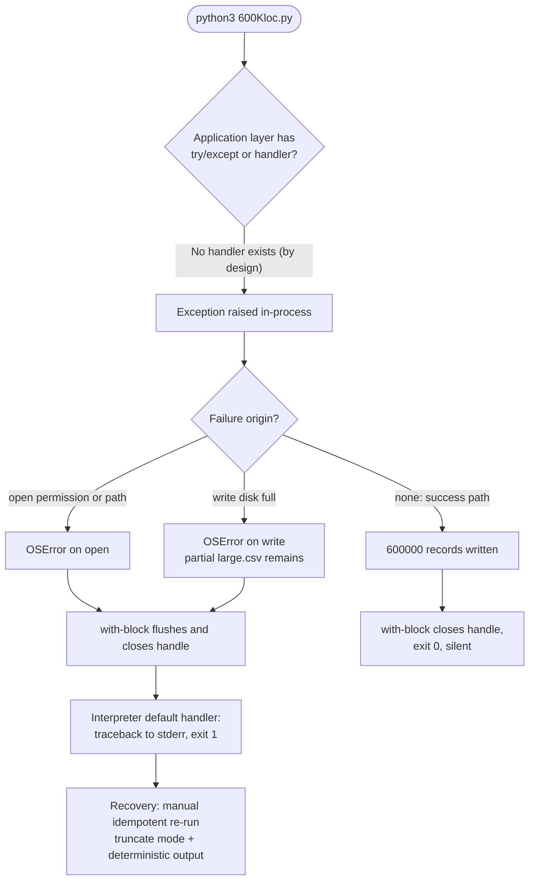
```mermaid
flowchart TD
    Invoke([python3 600Kloc.py]) --> AppLayer{Application layer has<br/>try/except or handler?}
    AppLayer -->|"No handler exists (by design)"| Raise[Exception raised in-process]
    Raise --> Kind{Failure origin?}
    Kind -->|"open permission or path"| OSopen[OSError on open]
    Kind -->|"write disk full"| OSwrite[OSError on write<br/>partial large.csv remains]
    Kind -->|"none: success path"| OK[600000 records written]
    OSopen --> Cleanup[with-block flushes and closes handle]
    OSwrite --> Cleanup
    Cleanup --> Default[Interpreter default handler:<br/>traceback to stderr, exit 1]
    OK --> Done[with-block closes handle,<br/>exit 0, silent]
    Default --> Recover[Recovery: manual idempotent re-run<br/>truncate mode + deterministic output]
```

### 5.4.4 Authentication and Authorization

Authentication and authorization are **not applicable** to this system. It exposes no network endpoint, defines no users, sessions, roles, tokens, or API keys, and protects no multi-tenant resource. The only access control in effect is the ambient **operating-system filesystem permission** that determines whether the invoking process may create or overwrite `large.csv` in the current working directory; a lack of write permission manifests as an `OSError` on `open` (Section 5.4.3). No authentication framework, identity provider, or authorization policy is present or required.

### 5.4.5 Performance Requirements and SLAs

The repository declares **no performance requirements, latency or throughput targets, availability objectives, or service-level agreements** anywhere in its files (consistent with Sections 1.2.3 and 2.2.2). To avoid fabricating targets, only the *observed* performance characteristics of the implementation are recorded below; these are properties of the code and artifact, not commitments.

**Table 5.4.5-A — Observed performance characteristics (not declared requirements)**

| Observed Characteristic | Detail |
|---|---|
| Algorithmic complexity | `O(n)`, single-threaded, `n = 600,000` iterations |
| Memory profile | Effectively constant — records are streamed, not accumulated |
| Output size | 15,977,780 bytes (~16 MB); exactly 600,000 rows |
| Success signaling | Exit code `0`, no `stdout`/`stderr` output |
| Failure signaling | Traceback to `stderr`, exit code `1` |

Because the record count is a hardcoded constant, both runtime and output size are fixed for a given interpreter/host; there is no configuration that would allow tuning throughput or scaling the workload without editing the source.

### 5.4.6 Disaster Recovery

No disaster-recovery infrastructure is implemented: there is no backup schedule, replication, failover target, checkpointing, or resume capability. The system's recovery posture rests entirely on **reproducibility**. Because generation is fully deterministic and the output is opened in truncate mode, the sole recovery procedure is manual, idempotent re-execution — re-running `python3 600Kloc.py` after correcting any underlying condition (for example, freeing disk space or fixing directory permissions) regenerates byte-identical, complete output and overwrites any partial file left by an aborted run (Section 4.3.2.4). As an additional safeguard, `large.csv` is itself committed to version control, so a materialized copy of the expected output is retrievable from Git history independent of regeneration. Recovery always restarts from the first record; there is no partial-continuation mechanism, and none is needed given the short, deterministic runtime.

## 5.5 References

The following repository files, folders, and specification sections were examined as the evidence base for Section 5. No web sources were used; all architectural claims are grounded in direct inspection of the repository.

**Repository files and folders inspected**

- `600Kloc.py` — the sole functional component and entry point; established the architecture style (monolithic single-process procedural batch script), the deterministic generation logic, the streaming per-record write, the `with`-context resource handling, and the hardcoded parameters (`range(600000)`, output filename `large.csv`).
- `large.csv` — the generated data artifact; established the persistence model (single flat file on the local filesystem), the exact size (15,977,780 bytes / ~16 MB) and record count (600,000), and the headerless two-column record format (`0,Sample Data 0` … `599999,Sample Data 599999`).
- `README.md` — established project identity only (`# check_status_2107_01`); confirmed the absence of usage, dependency, or architecture documentation.
- `sdfsd.py` — established a non-functional placeholder that fails at compile time (`SyntaxError` on the reserved keyword `as`); not part of the executable system.
- `asdas.py` — established a non-functional placeholder that fails at run time (`NameError`); not part of the executable system.
- `test.py` — established a non-functional placeholder that fails at run time (`NameError` on the undefined name `askjdnasd`); despite its name it is not a test and is not part of the executable system.
- `testing.py` — established a non-functional placeholder that fails at run time (`NameError` on the undefined name `sada`); despite its name it is not a test and is not part of the executable system.
- Repository root (the single top-level folder containing the seven files above) — established the overall structure: seven files, no subfolders, and no dependency manifests, configuration, tests, containerization, or CI/CD.

**Cross-referenced Technical Specification sections**

- `1.2 System Overview` — high-level description, the end-to-end data-flow diagram, and the statement that no SLAs/KPIs are declared.
- `2.1 Feature Catalog` — canonical feature identity F-001 ("Deterministic Synthetic CSV Data Generation") and the non-functional classification of the placeholder files.
- `2.2 Functional Requirements` — the observed absence of performance criteria and the silent success / exit-code behavior.
- `3.4 Third-Party Services` — confirmation that no external services, APIs, or integrations exist.
- `3.5 Databases & Storage` — the storage model (local filesystem, truncate/overwrite, streaming write) and the absence of databases and caching.
- `4.1 System Workflows` — the process-level workflow that the architectural sequence view complements.
- `4.3 Technical Implementation Flows` — the process-level state machine, transaction-boundary/cleanup behavior, and error-handling flow that the architectural lifecycle and error-handling views in this section complement.

# 6. SYSTEM COMPONENTS DESIGN

## 6.1 Core Services Architecture

### 6.1.1 Applicability Assessment

**Core Services Architecture is not applicable for this system.**

The `check_status_2107_01` repository does not implement microservices, a distributed architecture, or any set of independently deployable service components. As established in Section 5.1, the entire executable system is a single Python script, `600Kloc.py`, that runs to completion in one synchronous pass and exits — a monolithic, single-process, single-threaded, procedural batch utility. There are consequently no services to delimit, no inter-service communication to coordinate, and no service topology to scale or make resilient.

This determination is grounded in direct inspection of every file in the repository. The root contains exactly seven files and no subdirectories: the generator `600Kloc.py`, its output artifact `large.csv`, a name-only `README.md`, and four non-functional placeholder files (`sdfsd.py`, `asdas.py`, `test.py`, `testing.py`). A search across all Python files for service, networking, server, or concurrency constructs — `import` statements, sockets, HTTP/RPC frameworks (Flask, FastAPI, Django, gRPC), message brokers (Kafka, RabbitMQ, Redis), threads, subprocesses, and server bindings — returns zero matches. `600Kloc.py` contains no `import` statement at all and uses only the Python built-ins `open`, `range`, and f-string formatting.

Table 6.1.1-A evaluates the system against the defining criteria of a service-oriented or distributed architecture. None of the criteria are satisfied.

**Table 6.1.1-A — Core Services Architecture applicability criteria**

| Distributed / Service Criterion | Present? | Basis (Evidence) |
|---|---|---|
| Independently deployable services / process boundaries | No | Single script `600Kloc.py`; one OS process; no service decomposition (Section 5.1.1) |
| Inter-process / network communication (HTTP, gRPC, queues) | No | No imports, sockets, or network I/O in any `.py` file; only local file writes (Section 5.1.3) |
| Service discovery / registry | No | No registry or discovery mechanism; a single hardcoded entry point |
| Load balancer / API gateway | No | No server, listeners, or ingress; the script is invoked directly (Section 3.6.4) |
| Runtime orchestration (containers, Kubernetes, serverless) | No | No Dockerfile, compose file, Kubernetes manifest, or IaC (Section 3.6.3) |
| Multiple cooperating components at runtime | No | Only `600Kloc.py` (logic) and `large.csv` (artifact) participate at runtime (Section 5.1.2) |

**Why the concept does not apply.** A Core Services Architecture presupposes two or more separately owned, independently deployable units that communicate at runtime and must therefore be discovered, load-balanced, scaled, and protected against partial failure. This system has exactly one unit of execution and one output file. Its only runtime relationships are with its execution environment — the CPython runtime that hosts it and the local filesystem it writes to — which are platform dependencies rather than services (Section 5.1.4). No service-level agreements, availability targets, or scaling thresholds are declared anywhere in the repository (Section 5.4.5).

Because none of the applicability criteria are met, the subsections that follow do not describe an as-built service architecture. Instead, for each area required by this specification, they document the specific reason the concern is not applicable and, where a limited analog genuinely exists (for example, the single-process execution model and the deterministic-regeneration recovery posture), they describe that analog precisely and without overstatement. The three required architecture diagrams are included and are explicitly labeled to depict the system's actual single-process reality, which by construction contains no service, scaling, or resilience tier.

### 6.1.2 Service Components

Because the system is a single process, the six service-component concerns enumerated by this specification have no corresponding implementation. There is exactly one unit of execution (`600Kloc.py`) and one output artifact (`large.csv`); the only meaningful "boundary" is the OS process boundary of the script, not a service boundary. Table 6.1.2-A maps each required concern to its applicability and the evidence behind it.

**Table 6.1.2-A — Service component concerns**

| Required Concern | Applicability | Basis (Evidence) |
|---|---|---|
| Service boundaries & responsibilities | Not applicable | One process with a single responsibility — generate `large.csv`; no separately owned services (Section 5.1.1) |
| Inter-service communication patterns | Not applicable | No second service exists; the only outbound interaction is a local file write via the OS file API (Section 5.1.3) |
| Service discovery mechanisms | Not applicable | Nothing to register or discover; one hardcoded entry point invoked as `python3 600Kloc.py` (Section 3.6.4) |
| Load balancing strategy | Not applicable | No server, listeners, or concurrent replicas across which to balance work |
| Circuit breaker patterns | Not applicable | No remote or downstream dependency to protect; the code contains no `try`/`except` (Section 5.4.3) |
| Retry & fallback mechanisms | Not applicable | No retry or fallback logic; failures propagate as uncaught exceptions to the interpreter (Section 5.4.3) |

The only runtime interaction is the one-shot invocation of the script by an operator or scheduler through the CPython runtime, followed by streamed writes to the local filesystem. This is a host-runtime-and-filesystem interaction, not inter-service communication. Diagram 6.1.2-1 depicts this execution/interaction model; note the complete absence of inter-service edges and the isolated annotation node listing the service constructs that do not exist.

**Diagram 6.1.2-1 — Execution and interaction model (single process; no inter-service communication)**

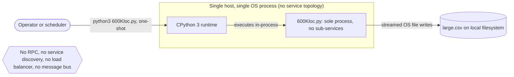
```mermaid
flowchart LR
    Operator([Operator or scheduler])
    subgraph Host["Single host, single OS process (no service topology)"]
        Runtime["CPython 3 runtime"]
        Script["600Kloc.py: sole process, no sub-services"]
    end
    FS[("large.csv on local filesystem")]
    Note{{"No RPC, no service discovery, no load balancer, no message bus"}}
    Operator -->|"python3 600Kloc.py, one-shot"| Runtime
    Runtime -->|"executes in-process"| Script
    Script -->|"streamed OS file writes"| FS
```

As shown, the system's boundary encloses only the script and its output; the operator and CPython runtime sit outside that boundary and are consumed as platform capabilities rather than services (consistent with the system boundary described in Section 5.1.2). There is no path along which a service-oriented concern — discovery, balancing, circuit breaking, or retry — could arise.

### 6.1.3 Scalability Design

The system has no scalability design because it is a fixed-size, one-shot batch job with a hardcoded workload. As documented in Section 5.4.5, the record count is the literal constant `range(600000)` embedded in `600Kloc.py`, so both the execution time (a single-threaded O(n) loop) and the output size (a fixed ~16 MB `large.csv`) are determined at author time. No command-line arguments, environment variables, or configuration files exist to tune throughput or resize the workload without editing the source (Section 5.1.3). Table 6.1.3-A addresses each required scalability concern.

**Table 6.1.3-A — Scalability design concerns**

| Required Concern | Applicability | Basis (Evidence) |
|---|---|---|
| Horizontal / vertical scaling approach | Not applicable | Single-threaded, single process; no replicas or cluster; O(n) loop, n=600000 (Section 5.4.5) |
| Auto-scaling triggers & rules | Not applicable | No orchestrator or autoscaler; no metrics, thresholds, or scaling policies (Section 3.6.3) |
| Resource allocation strategy | Not applicable | No resource requests/limits; runs with whatever the host provides; flat memory footprint via streaming write (Section 5.1.1) |
| Performance optimization techniques | Not applicable | No declared performance targets; only the observed O(n) time and constant-memory profile (Section 5.4.5) |
| Capacity planning guidelines | Not applicable | Fixed iteration count and fixed ~16 MB output; the sole prerequisite is enough free disk plus write permission (Section 5.1.4) |

Diagram 6.1.3-1 depicts the "scalability architecture," which is a single deployment unit with a fixed workload and no scaling tier. The isolated annotation node enumerates the scaling constructs that are absent.

**Diagram 6.1.3-1 — Scalability architecture (single-node, fixed-batch; no scaling tier)**

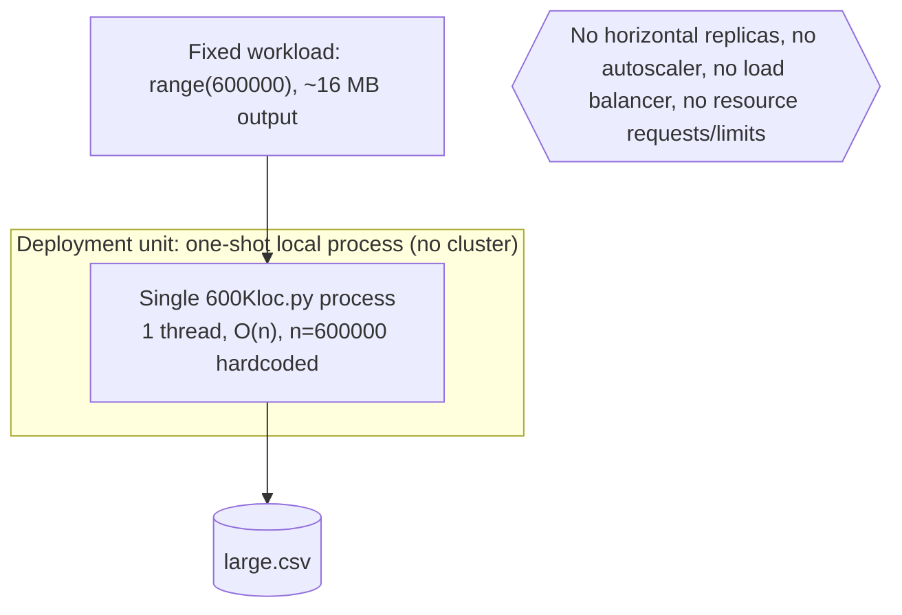
```mermaid
flowchart TD
    Workload["Fixed workload: range(600000), ~16 MB output"]
    subgraph Unit["Deployment unit: one-shot local process (no cluster)"]
        Proc["Single 600Kloc.py process<br/>1 thread, O(n), n=600000 hardcoded"]
    end
    Out[("large.csv")]
    Knobs{{"No horizontal replicas, no autoscaler, no load balancer, no resource requests/limits"}}
    Workload --> Proc
    Proc --> Out
```

The only lever that changes the amount of work performed is editing the hardcoded `range(600000)` constant in `600Kloc.py` and re-running the script; this is a source-code change, not a runtime scaling mechanism. Vertical scaling (running on a faster CPU or disk) would reduce wall-clock time but is a property of the host, not a design feature of the system.

### 6.1.4 Resilience Patterns

The system implements no resilience patterns. As documented in Section 5.4, there is no monitoring, no explicit error handling, no retry or fallback, and no failover. The `with open(...)` context manager guarantees the file handle is flushed and closed on both the normal and the exceptional exit paths (requirement F-001-RQ-005), but this is a resource-cleanup boundary rather than a transaction: a mid-write failure such as a disk-full `OSError` leaves a partially written `large.csv` with no rollback (Sections 5.4.3 and 4.3). The system's only recovery posture is reproducibility. Table 6.1.4-A addresses each required resilience concern.

**Table 6.1.4-A — Resilience pattern concerns**

| Required Concern | Applicability | Basis (Evidence) |
|---|---|---|
| Fault tolerance mechanisms | Not applicable | No `try`/`except`, retry, or redundancy; uncaught exceptions terminate the process (Section 5.4.3) |
| Disaster recovery procedures | Limited analog only | No DR infrastructure; recovery is a manual idempotent re-run, and `large.csv` is also Git-tracked (Section 5.4.6) |
| Data redundancy approach | Not applicable | Single flat file on the local filesystem; no replication or scheduled backup (Sections 3.5, 5.4.6) |
| Failover configurations | Not applicable | Single process on a single host; no standby or failover target (Section 5.4.6) |
| Service degradation policies | Not applicable | No degraded mode; the job either completes (exit 0) or aborts (exit 1) with a stderr traceback (Section 5.4.1) |

Diagram 6.1.4-1 depicts the system's resilience posture: the absence of built-in resilience layers, the two terminal outcomes, and the single recovery loop that relies on deterministic regeneration. The isolated annotation node enumerates the resilience constructs that are absent.

**Diagram 6.1.4-1 — Resilience pattern implementation (no built-in resilience; recovery by idempotent re-run)**

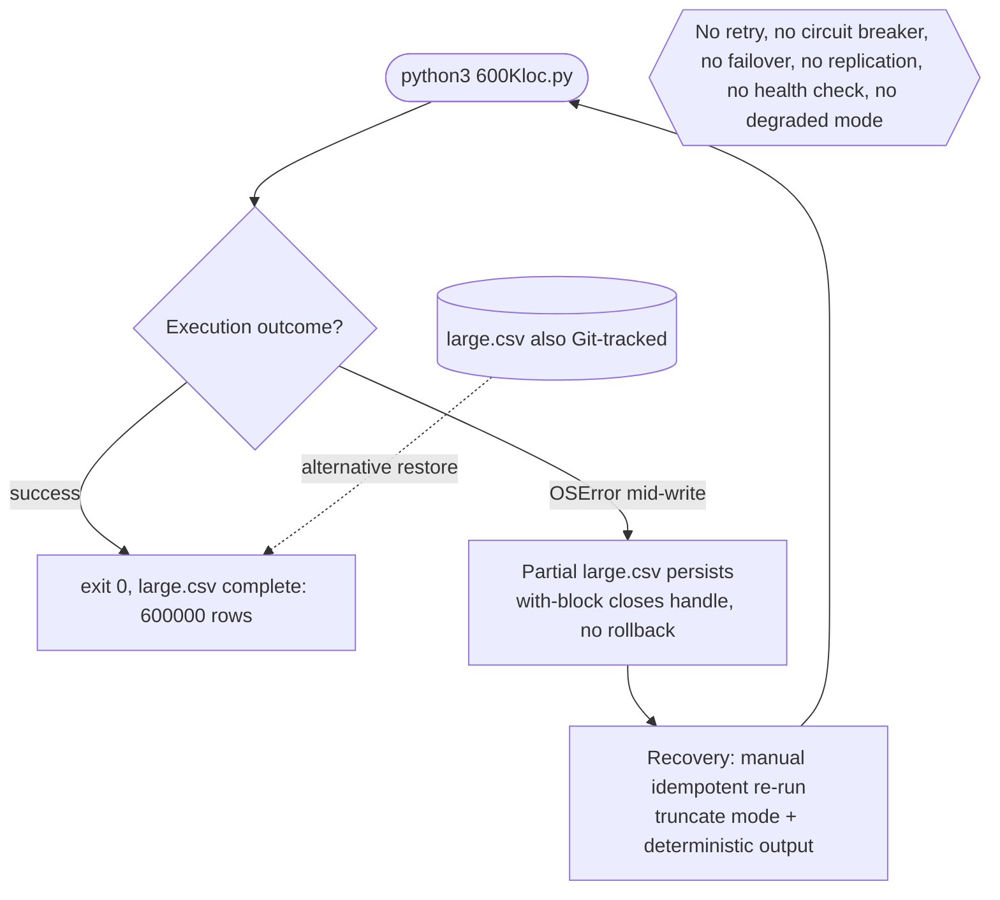
```mermaid
flowchart TD
    Run([python3 600Kloc.py]) --> Outcome{Execution outcome?}
    Outcome -->|"success"| OK["exit 0, large.csv complete: 600000 rows"]
    Outcome -->|"OSError mid-write"| Partial["Partial large.csv persists<br/>with-block closes handle, no rollback"]
    Partial --> Recover["Recovery: manual idempotent re-run<br/>truncate mode + deterministic output"]
    Recover --> Run
    Git[("large.csv also Git-tracked")] -.->|"alternative restore"| OK
    Absent{{"No retry, no circuit breaker, no failover, no replication, no health check, no degraded mode"}}
```

Because generation is fully deterministic and `large.csv` is opened in write/truncate mode, re-running `python3 600Kloc.py` after correcting the underlying condition (for example, freeing disk space) overwrites any partial file and regenerates byte-identical output (Section 5.4.6). Additionally, `large.csv` is committed to version control, providing a retrievable materialized copy that is independent of regeneration. These two mechanisms — deterministic re-run and a version-controlled artifact — constitute the entirety of the system's fault-recovery capability; there is no automated detection, retry, or failover.

### 6.1.5 References

**Files examined**

- `600Kloc.py` - The sole executable component; confirmed a single-process, single-threaded, dependency-free batch script with no `import`, network, server, or concurrency constructs, establishing that no service architecture exists.
- `large.csv` - The generated output artifact (~16 MB, 600,000 rows); the single data store written by the script and the version-controlled copy underpinning the recovery posture.
- `README.md` - Name-only repository readme (`# check_status_2107_01`); confirmed the absence of any documented service, deployment, or scaling design.
- `sdfsd.py` - Non-functional placeholder file (bare identifiers); confirmed it defines no service, module, or runtime component.
- `asdas.py` - Non-functional placeholder file (bare identifiers); confirmed it defines no service, module, or runtime component.
- `test.py` - Non-functional placeholder file (bare identifiers; `NameError` at runtime); confirmed it defines no service, module, or runtime component.
- `testing.py` - Non-functional placeholder file (bare identifiers; `NameError` at runtime); confirmed it defines no service, module, or runtime component.

**Repository areas explored**

- Repository root (7 files, no subdirectories) - Established the complete file inventory and the absence of Dockerfiles, orchestration manifests, IaC, CI configuration, dependency manifests, and any service or deployment artifacts.

**Cross-referenced technical specification sections**

- Section 1.2 System Overview - Confirmed the single-utility framing of the system.
- Section 1.3 Scope - Confirmed the bounded, single-purpose scope with no service commitments.
- Section 2.1 Feature Catalog - Confirmed the sole feature F-001 (Deterministic Synthetic CSV Data Generation).
- Section 2.2 Functional Requirements - Confirmed requirement F-001-RQ-005 (context-managed resource cleanup) referenced in the resilience analysis.
- Section 3.4 Third-Party Services - Confirmed no third-party or external services are integrated.
- Section 3.5 Databases & Storage - Confirmed the single flat-file local data store with no database or replication.
- Section 3.6 Development & Deployment - Confirmed the absence of build systems, containerization, CI/CD, and IaC, and the one-shot local execution model.
- Section 4.3 Technical Implementation Flows - Confirmed the streamed-write execution flow and the no-rollback failure behavior.
- Section 5.1 High-Level Architecture - Confirmed the monolithic single-process architecture style, system boundary, and platform touchpoints.
- Section 5.4 Cross-Cutting Concerns - Confirmed the monitoring, error-handling, performance, and disaster-recovery posture reused throughout this section.

## 6.2 Database Design

### 6.2.1 Applicability Assessment

**Database Design is not applicable to this system.**

The `check_status_2107_01` repository implements no database of any kind. As established in Section 3.5 (Databases & Storage), the system's only persistence mechanism is a single flat file on the local filesystem — the generated CSV artifact `large.csv`. There is no relational engine, no NoSQL store, no embedded database, no object or cloud storage, and no caching tier. Consequently there is no schema to normalize, no entity-relationship graph, no indexing or partitioning strategy, and no replication, connection-pooling, or read/write-splitting topology to design.

This determination is grounded in direct inspection of every file in the repository, which contains exactly seven files and no subdirectories: the generator `600Kloc.py`, its output artifact `large.csv`, a name-only `README.md`, and four non-functional placeholder files (`sdfsd.py`, `asdas.py`, `test.py`, `testing.py`). A case-insensitive search across all files for database drivers, ORMs, connection strings, and migration tooling (for example `sqlite`, `psycopg`, `sqlalchemy`, `pymongo`, `redis`, `boto3`, `CREATE TABLE`, `alembic`, `migration`) returns zero matches, and `600Kloc.py` contains no `import` statement at all — it uses only the Python built-ins `open`, `range`, and f-string formatting.

**Table 6.2.1-A — Database design applicability criteria**

| Criterion | Present? | Basis (Evidence) |
|---|---|---|
| Database management system (relational or NoSQL) | No | `600Kloc.py` uses only built-ins; no engine and no `import` (Section 3.5.2) |
| ORM, database driver, or connection string | No | Keyword scan for drivers/ORMs returns zero matches; no connection configuration |
| Schema, DDL, or migration files | No | No `*.sql`, no migrations directory, no `alembic`/`flyway` artifacts |
| Index or constraint engine | No | Persistence is a plain-text file with no keys, indexes, or engine-enforced constraints |
| Caching layer (Redis, Memcached) | No | No cache library or store; only standard I/O buffering (Sections 3.5.2, 4.3.1.3) |
| Object or cloud storage (e.g., S3) | No | No cloud SDK, bucket usage, or configuration (Section 3.5.2) |

**The single persistence analog.** The one artifact that is persisted is `large.csv`: a headerless, two-column, comma-separated file of exactly 600,000 rows (15,977,780 bytes, ~16 MB) written to the current working directory in truncate mode (Section 3.5.1). Because this specification enumerates a set of database-design concerns, the subsections that follow do not invent an as-built database. Instead, for each required area — schema design, data management, compliance, and performance — they document the precise status against this flat-file persistence model, describe the limited analogs (such as deterministic regeneration and the version-controlled copy) without overstatement, and explicitly mark the database-specific concerns as not applicable with the supporting evidence. The three required diagrams (schema/ERD, data flow, and replication architecture) are included and are labeled to depict the system's actual flat-file reality.

### 6.2.2 Schema Design

Because there is no database, there is no database schema in the conventional sense — no `CREATE TABLE` statements, no collections, and no data-definition language anywhere in the repository. The closest analog is the fixed, positional record layout of `large.csv`, which is enforced entirely by the generator code in `600Kloc.py` (the f-string `f"{i},Sample Data {i}\n"`) rather than by any storage engine. This subsection documents that logical structure and explains why each formal schema-design concern has no implementation.

#### 6.2.2.1 Entity Relationships

The dataset comprises a single implicit record type repeated across all rows; there are therefore no entity relationships. `large.csv` holds one flat record shape 600,000 times, with no additional tables or collections, no primary or foreign keys, no joins, and no referential integrity to model or enforce.

**Table 6.2.2-A — Logical entity inventory**

| Logical Entity | Cardinality | Relationships |
|---|---|---|
| `LARGE_CSV_RECORD` (one CSV row) | 600,000 rows | None — standalone flat record; no foreign keys or joins |

#### 6.2.2.2 Data Models and Structures

The data model is a positional, two-column layout. The first column is a zero-based integer row index and the second is a templated label; the two are separated by a single comma, each record is terminated by a newline, there is no header row, and the content is plain ASCII/UTF-8 text (Sections 3.5.1, 5.2.2).

**Table 6.2.2-B — `large.csv` record structure**

| Column | Field | Type & Format | Example |
|---|---|---|---|
| 1 | `row_index` | Integer, 0-based, decimal text | `0` … `599999` |
| 2 | `sample_label` | Text — literal `Sample Data ` + `row_index` | `Sample Data 0` |

The entity-relationship view below depicts the single record type. It is a logical representation of the file's positional layout, not an engine-managed schema; the types and keys shown are conventions produced by the generator, not declarations enforced by any database.

**Diagram 6.2.2-1 — Entity-Relationship Diagram (single flat record type; no relationships or enforced keys)**

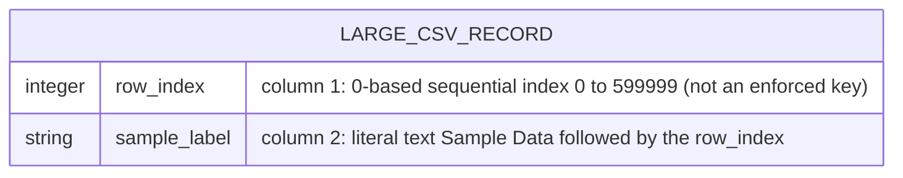
```mermaid
erDiagram
    LARGE_CSV_RECORD {
        integer row_index "column 1: 0-based sequential index 0 to 599999 (not an enforced key)"
        string sample_label "column 2: literal text Sample Data followed by the row_index"
    }
```

**Documented constraints.** No constraints are enforced by any storage engine. The structural regularities of the file are guaranteed only by the deterministic generator code, so the table below records them as code-level conventions rather than database constraints.

**Table 6.2.2-C — Structural rules (code-enforced conventions, not engine constraints)**

| Structural Rule | Enforced By | Engine-Enforced? |
|---|---|---|
| Exactly two comma-separated columns per row | `600Kloc.py` f-string template | No |
| `row_index` unique and sequential (0…599999) | `range(600000)` loop | No |
| No null/empty fields and no header row | Generator output format | No |

#### 6.2.2.3 Indexing Strategy

No indexing strategy exists and no index structures are present. A flat text file supports no B-tree, hash, or secondary indexes, and the repository defines none; external access to `large.csv` is a full sequential scan. The `row_index` column is a naturally ordered, monotonic sequence that could serve as a positional locator, but it is a value in the data rather than an index structure that accelerates lookups.

**Table 6.2.2-D — Index inventory**

| Index | Type | Status |
|---|---|---|
| (none) | — | Zero indexes exist; access is sequential scan only |

#### 6.2.2.4 Partitioning Approach

No partitioning, sharding, or chunking is applied. The entire dataset is a single monolithic ~16 MB file that is regenerated in full on every run (Section 5.2.2). There is no range, hash, list, or time-based partitioning, and no separation of the data across files, directories, or nodes.

#### 6.2.2.5 Replication Configuration

No replication is configured. `large.csv` exists as a single authoritative copy on one local filesystem; there is no primary/replica pair, no streaming or logical replication, no standby, and no multi-node distribution. The only redundancy analog is that `large.csv` is itself committed to version control, so a materialized copy travels with the Git repository (Sections 3.5.1, 5.2.2). The diagram below depicts this posture and enumerates the replication constructs that are absent.

**Diagram 6.2.2-2 — Replication architecture (single authoritative copy; no replicas)**

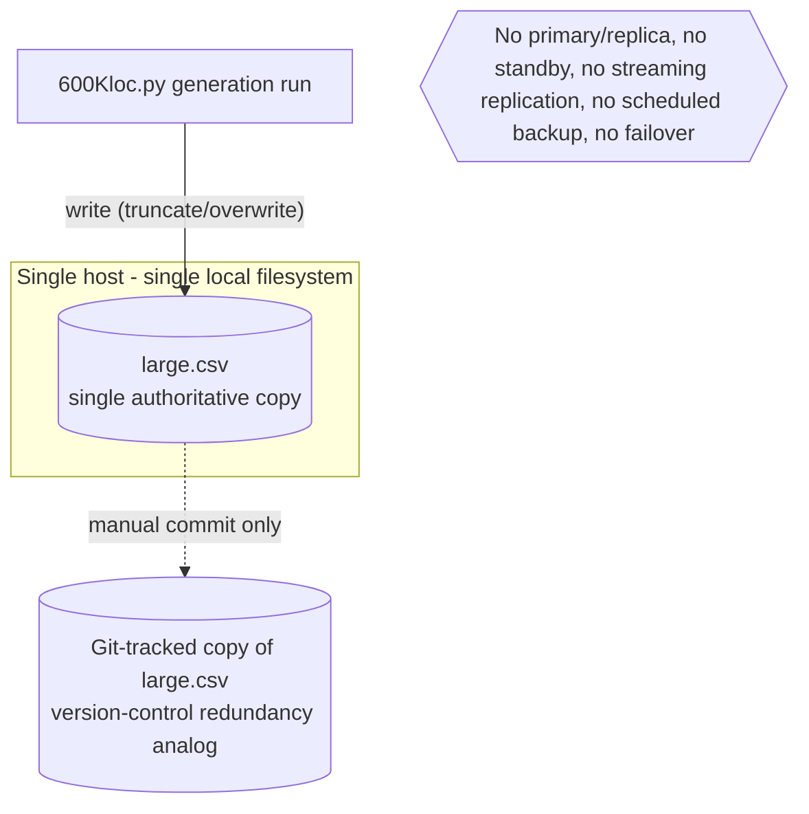
```mermaid
flowchart TD
    Gen["600Kloc.py generation run"]
    subgraph Host["Single host - single local filesystem"]
        CSV[("large.csv<br/>single authoritative copy")]
    end
    Git[("Git-tracked copy of large.csv<br/>version-control redundancy analog")]
    Absent{{"No primary/replica, no standby, no streaming replication, no scheduled backup, no failover"}}
    Gen -->|"write (truncate/overwrite)"| CSV
    CSV -.->|"manual commit only"| Git
```

#### 6.2.2.6 Backup Architecture

There is no backup system, schedule, or retention rotation — no snapshots, no point-in-time recovery, and no offsite backup. Two limited recovery analogs exist and are described honestly: (1) deterministic regeneration — because the output is opened in truncate mode (requirement F-001-RQ-001) and generation is fully deterministic (requirement F-001-RQ-004), re-running `python3 600Kloc.py` reproduces byte-identical output; and (2) the version-controlled copy — the committed `large.csv` provides a retrievable materialized snapshot that is independent of regeneration (Section 6.1.4). Neither constitutes a designed backup architecture.

### 6.2.3 Data Management

With no database and a single flat-file artifact, the conventional data-management disciplines (migration, schema/data versioning, archival, and caching) have no implementation; the only concrete mechanism is the file write-and-overwrite path. Each concern is addressed below.

#### 6.2.3.1 Migration Procedures

No migration procedures exist. There is no schema to evolve and therefore no migration framework (no Alembic, Flyway, Django migrations, or equivalent) and no migration history. The only transformation applied to the data is wholesale regeneration: each run truncates `large.csv` and rewrites all 600,000 records from scratch (Sections 3.5.1, 5.2.2).

#### 6.2.3.2 Versioning Strategy

The system defines no data or schema versioning mechanism — there is no schema-version field, no version column in the records, and no migration/version table. The artifact is versioned only incidentally by Git at the file level (the tracked `large.csv` and `600Kloc.py`), which captures whole-file revisions in commit history rather than any application-managed data version.

#### 6.2.3.3 Archival Policies

No archival policy exists. There is no tiering, cold storage, or archive store, and no retention window. Because the file is opened in write/truncate mode, each run discards the previous contents rather than archiving them (Section 3.5.1); the only incidental historical record of prior content is whatever was committed to Git history.

#### 6.2.3.4 Data Storage and Retrieval Mechanisms

Storage is realized through Python's built-in file I/O: `open("large.csv", "w")` truncates and opens the file, the generator streams one record per loop iteration, and exiting the `with` block flushes the buffer and closes the handle, at which point all 600,000 rows are durable (Sections 3.5.1, 4.3.1.2). Retrieval is not implemented within the repository — from the system's perspective `large.csv` is write-only; any consumption is performed by external tools that read the flat file sequentially (Section 5.2.2). The end-to-end path is shown below.

**Diagram 6.2.3-1 — Data flow (write path from generator to file; external read path)**

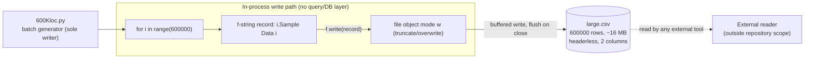
```mermaid
flowchart LR
    Gen["600Kloc.py<br/>batch generator (sole writer)"]
    subgraph Proc["In-process write path (no query/DB layer)"]
        Loop["for i in range(600000)"]
        Fmt["f-string record: i,Sample Data i"]
        FH["file object mode w (truncate/overwrite)"]
    end
    CSV[("large.csv<br/>600000 rows, ~16 MB<br/>headerless, 2 columns")]
    Reader["External reader<br/>(outside repository scope)"]
    Gen --> Loop
    Loop --> Fmt
    Fmt -->|"f.write(record)"| FH
    FH -->|"buffered write, flush on close"| CSV
    CSV -.->|"read by any external tool"| Reader
```

**Table 6.2.3-A — Storage and retrieval summary**

| Operation | Mechanism | In Repository Scope? |
|---|---|---|
| Write / store | `open(..., "w")` and streamed `f.write()` per record | Yes — `600Kloc.py` |
| Durability point | Buffer flush and handle close at `with`-block exit | Yes — `600Kloc.py` |
| Read / retrieve | Sequential scan by an external consumer | No — outside repo |

#### 6.2.3.5 Caching Policies

No caching policy exists. The repository defines no application cache, memoization, or cache store (Section 3.5.2). The only buffering present is the standard I/O buffering of Python's text-mode file object during the write, which flushes on close; this is interpreter/operating-system behavior rather than a designed caching layer (Section 4.3.1.3). There is no read cache because there is no read path.

### 6.2.4 Compliance Considerations

The compliance posture follows directly from the nature of the data and the absence of a database. The stored data is fully synthetic, and there is no authentication, logging, or audit tooling in the repository; each required concern is addressed below and summarized in Table 6.2.4-A.

**Table 6.2.4-A — Compliance concern summary**

| Required Concern | Status | Basis (Evidence) |
|---|---|---|
| Data retention rules | None defined | File persists until overwritten or deleted; no TTL/policy (Section 3.5.1) |
| Backup & fault tolerance | Limited analog only | Handle cleanup, no rollback; re-run + Git copy (Sections 4.3.1.4, 6.1.4) |
| Privacy controls | Not required | Data is fully synthetic; no PII/sensitive content (Section 3.5.4) |
| Audit mechanisms | None | No audit/access log or history table; only Git commit history (Section 4.3.2.3) |
| Access controls | OS-level only | No authN/authZ layer; filesystem permissions only (Section 5.4) |

#### 6.2.4.1 Data Retention Rules

No data-retention rules are defined. There is no time-to-live, expiry, or retention schedule; `large.csv` persists on disk until it is overwritten by the next generation run or manually deleted. Retention is therefore incidental to filesystem state rather than governed by policy.

#### 6.2.4.2 Backup and Fault Tolerance Policies

No formal backup or fault-tolerance policy exists. Fault tolerance is limited to the context manager's guarantee that the file handle is flushed and closed on both the normal and exceptional paths (requirement F-001-RQ-005); this is a resource-cleanup boundary, not a transaction, so a mid-write failure leaves a partially written file with no rollback (Section 4.3.1.4). The recovery posture is deterministic re-run plus the Git-tracked copy (Section 6.1.4).

#### 6.2.4.3 Privacy Controls

No privacy controls are required or implemented, because the data content carries no privacy obligations. The dataset is entirely synthetic — an integer index paired with a templated label — and contains no personal, sensitive, or business-confidential information (Section 3.5.4). There is accordingly no PII handling, encryption-at-rest, masking, anonymization, or data-subject tooling in the repository.

#### 6.2.4.4 Audit Mechanisms

No audit mechanisms exist. There is no audit log, access log, change-data-capture, or history table. A successful run is silent and exits with code 0, while a failure emits a Python traceback to `stderr` and exits with code 1 (Section 4.3.2.3); the only incidental record of change is the Git commit history of the tracked files.

#### 6.2.4.5 Access Controls

No application-level access controls exist. The system has no authentication or authorization layer (Section 5.4). Access to both the generator and the `large.csv` artifact is governed solely by the operating-system filesystem permissions of the user who runs the script and reads the file.

### 6.2.5 Performance Optimization

Because there is no query engine, no database connections, and no replicas, most database performance techniques are not applicable; the one genuinely relevant concept is the batch write itself. Each concern is addressed below.

#### 6.2.5.1 Query Optimization Patterns

Not applicable. There is no query engine, query language, or query planner — no SQL, no execution plans, and no statistics. Any external read is a full sequential scan of the flat file, which offers no query surface for the system to optimize.

#### 6.2.5.2 Caching Strategy

No caching strategy exists (see Section 6.2.3.5). The only buffering is the standard Python/operating-system I/O buffer used during the write; there is no application read or write cache to tune (Section 4.3.1.3).

#### 6.2.5.3 Connection Pooling

Not applicable. There are no database connections, so there is no connection pool. The single filesystem handle is opened once per run and released by the `with` block (Section 4.3.1.2); there is no pool size, connection lifetime, or acquisition strategy to configure.

#### 6.2.5.4 Read/Write Splitting

Not applicable. The system is write-only — it produces `large.csv` and contains no read endpoint — and there are no replicas across which to route reads. With a single writer, a single copy, and no read path in scope, there is nothing to split.

#### 6.2.5.5 Batch Processing Approach

The batch write is the one performance characteristic that genuinely applies. Generation is a single-pass, synchronous batch: an `O(n)` loop over `range(600000)` that streams one record per iteration, keeping resident memory effectively constant because records are not accumulated in memory (Section 5.2.1). There is no micro-batching, parallelism, configurable commit/chunk size, or backpressure; the batch size is the hardcoded literal `600000`, so changing it requires editing the source rather than tuning a runtime parameter (Section 5.2.1).

**Table 6.2.5-A — Batch processing characteristics**

| Characteristic | Value / Behavior |
|---|---|
| Execution model | Single-pass, single-threaded, synchronous |
| Time complexity | `O(n)`, n = 600,000 |
| Memory profile | Constant — one record streamed per iteration |
| Batch / commit sizing | None — hardcoded `range(600000)`, no runtime tuning |

### 6.2.6 References

**Files examined**

- `600Kloc.py` - The sole writer; confirmed the only persistence is a flat-file write with no database, ORM, driver, or `import`, and established the record format and the single-pass batch write model.
- `large.csv` - The generated artifact; established the two-column positional data model (600,000 rows, ~16 MB, headerless), the single authoritative copy, and the Git-tracked redundancy analog.
- `README.md` - Name-only readme (`# check_status_2107_01`); confirmed the absence of any documented schema, storage, or database design.
- `sdfsd.py` - Non-functional placeholder (bare identifiers; `SyntaxError`); confirmed it defines no data model, migration, or persistence logic.
- `asdas.py` - Non-functional placeholder (bare identifiers; `NameError`); confirmed it defines no data model, migration, or persistence logic.
- `test.py` - Non-functional placeholder (bare identifiers; `NameError` at runtime); confirmed it defines no data model, migration, or persistence logic.
- `testing.py` - Non-functional placeholder (bare identifiers; `NameError` at runtime); confirmed it defines no data model, migration, or persistence logic.

**Repository areas explored**

- Repository root (7 files, no subdirectories) - Established the complete file inventory and the absence of any `*.sql`, migration directory, ORM/driver dependency, cache configuration, or cloud-storage artifact.

**Cross-referenced technical specification sections**

- Section 1.2 System Overview - Confirmed the single-utility, dependency-free framing of the system.
- Section 1.3 Scope - Confirmed that databases and any persistence beyond the single local file are out of scope.
- Section 2.2 Functional Requirements - Provided requirements F-001-RQ-001 (truncate write), F-001-RQ-004 (deterministic output), and F-001-RQ-005 (context-managed flush/close).
- Section 3.4 Third-Party Services - Confirmed no external or managed data services are integrated.
- Section 3.5 Databases & Storage - Primary source for the no-DBMS determination, the flat-file persistence model, and the list of absent storage technologies.
- Section 3.6 Development & Deployment - Confirmed no containerization, CI/CD, or IaC that could provision a datastore.
- Section 4.3 Technical Implementation Flows - Confirmed the persistence points, standard I/O buffering, and the non-ACID (no-rollback) transaction boundary.
- Section 5.1 High-Level Architecture - Confirmed the monolithic single-process architecture and single data store.
- Section 5.2 Component Details - Confirmed the positional implicit schema and the no-indexing/no-partitioning characterization of `large.csv`.
- Section 5.4 Cross-Cutting Concerns - Confirmed the absence of authentication/authorization, monitoring, and any formal backup or disaster-recovery mechanism.
- Section 6.1 Core Services Architecture - Confirmed the not-applicable documentation pattern and the deterministic-regeneration and Git-tracked recovery posture.

## 6.3 Integration Architecture

### 6.3.1 Applicability Assessment

**Integration Architecture is not applicable for this system.**

The `check_status_2107_01` repository neither exposes nor consumes any external interface. As established in Section 5.1, the entire executable system is a single Python script, `600Kloc.py`, that runs to completion in one synchronous, in-process pass and exits. Its only interaction with anything outside its own process is a write of the local file `large.csv` to the current working directory through the operating system's file API. There is therefore no integration surface to design: no API to specify, no messages to route, and no external system to contract with.

This determination is grounded in direct inspection of every file in the repository. The root contains exactly seven files and no subdirectories: the generator `600Kloc.py`, its output artifact `large.csv`, a name-only `README.md`, and four non-functional placeholder files (`sdfsd.py`, `asdas.py`, `test.py`, `testing.py`). `600Kloc.py` contains **no `import` statement at all** and uses only the Python built-ins `open`, `range`, and f-string formatting. A search across all source files for networking, API, and messaging constructs — `http`/`https`, `socket`, `requests`/`urllib`, web frameworks (Flask, Django, FastAPI), `grpc`, `rest`/`api`, message/stream systems (Kafka, RabbitMQ, AMQP, MQTT, Celery, Redis, SQS/SNS, Kinesis, pub/sub), `webhook`, `oauth`/`jwt`, `graphql`, `soap`, and cloud SDKs (`boto3`, Azure, GCP) — returns **zero matches**. There are no dependency manifests, no configuration files, no `.proto`/`.graphql`/`.sql` contracts, and no Dockerfile or orchestration manifests. These findings are consistent with Section 1.2 ("The system performs no external integration"), Section 3.4 (the system integrates with **no third-party or external services**), and Section 5.1.4 (the system has **no external system integrations**).

Table 6.3.1-A evaluates the system against the defining criteria of an integration architecture. None of the criteria are satisfied.

**Table 6.3.1-A — Integration architecture applicability criteria**

| Integration Criterion | Present? | Basis (Evidence) |
|---|---|---|
| Exposed API (HTTP/REST/gRPC/GraphQL/SOAP endpoint) | No | No server, listener, route, or web framework in any `.py` file; the script is invoked directly (Section 6.1.2) |
| Consumed external API / third-party service | No | No HTTP client, SDK, or `import` of any network module; no third-party services integrated (Section 3.4) |
| Message broker, queue, event bus, or stream processor | No | No broker/queue client or streaming construct; no `import` statements at all (Section 6.1.1) |
| Network I/O of any kind (sockets, clients, servers) | No | No socket or network code; the only I/O is a local filesystem write (Section 5.1.3) |
| API gateway / reverse proxy / ingress | No | No server, listeners, or ingress; nothing to route or front (Section 6.1.2) |
| Authentication / authorization for integration | No | No auth libraries, tokens, or credential handling; no external attack surface (Section 3.4.2) |
| External service contract (OpenAPI, IDL, schema) | No | No `.proto`, `.graphql`, OpenAPI, or schema file exists in the repository |
| Inbound/outbound data exchange beyond a local file | No | Data crosses the boundary exactly once — a local text-file write (Sections 5.1.1, 5.1.4) |

**Why the concept does not apply.** An integration architecture presupposes that the system communicates at runtime with one or more independent parties — clients that call it, services it calls, or brokers that mediate asynchronous messages — and must therefore define protocols, authentication, contracts, and error/retry semantics across those boundaries. This system has exactly one unit of execution and one output file. Its only runtime relationships are with its execution environment — the CPython runtime that hosts it and the local filesystem it writes to — which are platform dependencies rather than integrations (Section 5.1.4). No service-level agreements, protocol specifications, or contract definitions exist anywhere in the repository.

The only external-facing artifact associated with the repository is its Git `origin` remote, which identifies where the source code is hosted; this is a source-control detail of the development workflow, not a runtime integration performed by the software, and it is therefore out of scope for this section.

Because none of the applicability criteria are met, the subsections that follow do not describe an as-built integration. Instead, for each area required by this specification — API Design (Section 6.3.2), Message Processing (Section 6.3.3), and External Systems (Section 6.3.4) — they document the specific reason the concern is not applicable and, where a limited local analog genuinely exists (for example, the single-pass local batch write), they describe that analog precisely and without overstatement. The three required diagrams are included and are explicitly labeled to depict the system's actual single-process reality, which by construction contains no integration tier.

Diagram 6.3.1-1 depicts the system's integration context. The system boundary encloses only `600Kloc.py` and its output `large.csv`; the operator and the execution environment sit outside that boundary and are consumed as platform capabilities. The isolated annotation node enumerates the integration constructs that do not exist, and there is no edge crossing the boundary other than the single local file write.

**Diagram 6.3.1-1 — Integration context (single process; no external integrations)**

```mermaid
flowchart LR
    Operator([Operator or scheduler])
    subgraph Env["Execution environment (external platform, not integrations)"]
        Runtime["CPython 3 runtime"]
        FS["OS local filesystem<br/>current working directory"]
    end
    subgraph Boundary["System boundary: check_status_2107_01 batch utility"]
        Script["600Kloc.py<br/>single-process batch generator (sole entry point)"]
        CSV[("large.csv<br/>600000 rows x 2 cols, ~16 MB")]
    end
    Absent{{"No inbound/outbound API, no message broker/queue/stream, no third-party service, no network I/O, no authentication"}}
    Operator -->|"python3 600Kloc.py (one-shot, no args)"| Runtime
    Runtime -->|"executes in-process"| Script
    Script -->|"local OS file write (mode w)"| CSV
    CSV -.->|"materialized on"| FS
```

As shown, no path along which an integration concern — protocol negotiation, authentication, message routing, or service contracting — could arise exists in the system. The remaining subsections document each required area against this reality.

### 6.3.2 API Design

**API design is not applicable: the system exposes and consumes no API.** `600Kloc.py` defines no functions, classes, or exports and starts no server; it is executed directly as a top-level script and communicates with nothing over any wire protocol. As documented in Section 5.1.1, only two interfaces cross the system boundary, and neither is a programmatic API:

- **Invocation interface (inbound).** An operator or scheduler starts the job by running `python3 600Kloc.py` through the CPython runtime. There are no command-line arguments, environment variables, configuration inputs, or request payloads — the invocation is a plain operating-system process start, not an API call.
- **Output interface (outbound).** A one-shot local filesystem write of `large.csv` into the current working directory via the operating system's file API. No response is returned to any caller; on success the process is silent and exits with code `0` (Section 4.3.2.3).

Because there is no request/response surface, every conventional API-design concern is vacuous for this system. Table 6.3.2-A records each required concern together with the reason it does not apply and the supporting evidence.

**Table 6.3.2-A — API design concerns**

| API Design Concern | Applicability | Basis (Evidence) |
|---|---|---|
| Protocol specifications | Not applicable | No wire protocol of any kind; the only "protocol" is the OS file I/O interface — no HTTP, gRPC, AMQP, or JDBC/SQL (Section 5.1.3) |
| Authentication methods | Not applicable | No endpoint to authenticate against; no auth libraries, tokens, or credential handling exist (Section 3.4) |
| Authorization framework | Not applicable | No API surface; the only access control is the ambient OS filesystem permission on the working directory (Section 5.4) |
| Rate limiting strategy | Not applicable | No request-serving surface to throttle; the utility is a one-shot batch invocation with a fixed workload (Section 6.1.3) |
| Versioning approach | Not applicable | No API to version; no versioned endpoints, media types, or schemas; no dependency/version manifest exists (Section 3.3) |
| Documentation standards | Not applicable | No API to document; `README.md` contains only the project-name heading; no OpenAPI/Swagger, IDL, or API reference (Section 1.2) |

**Interface framing.** The invocation interface is best understood as a command-line execution contract rather than an API: the "input" is the decision to run the script, and its behavior is fixed in source (the hardcoded output name `large.csv`, the record count `range(600000)`, and the record template). There is no negotiation of content type, no header exchange, no status codes, and no caller identity — the properties that would make protocol specification, authentication, authorization, rate limiting, versioning, and API documentation meaningful. Consequently, no API specification table (endpoints, methods, request/response schemas) can be produced, because no endpoints exist.

Diagram 6.3.2-1 depicts the "API architecture," which consists solely of a direct process invocation and a local file write, with no API tier interposed. The isolated annotation node enumerates the API constructs that are absent.

**Diagram 6.3.2-1 — API architecture (no API tier; direct invocation and local write only)**

```mermaid
flowchart TD
    Invoker([Operator or automated process])
    subgraph Sys["System boundary: single-process batch utility (no API tier)"]
        Entry["600Kloc.py<br/>sole entry point, CLI invocation only"]
        Out[("large.csv on local filesystem")]
    end
    Absent{{"No API gateway, no HTTP/gRPC/REST endpoint, no authentication/authorization, no rate limiting, no API versioning, no OpenAPI/schema documentation"}}
    Invoker -->|"direct process invocation: python3 600Kloc.py"| Entry
    Entry -->|"streamed local file write (mode w)"| Out
```

As the diagram makes explicit, there is no gateway, endpoint, authentication layer, rate limiter, version negotiator, or published contract between the invoker and the script; the only edge that leaves the process is the local file write.

### 6.3.3 Message Processing

**Message processing is not applicable in its distributed sense: the system contains no events, messages, queues, brokers, or stream processors.** `600Kloc.py` imports nothing and uses only the built-ins `open`, `range`, and f-string formatting; there is no event loop, no publisher/subscriber, no producer/consumer topology, and no asynchronous dispatch. The only construct in the repository that resembles "message processing" is the script's single in-process **batch write** — a linear loop that emits 600,000 text records to one local file — and it is documented here precisely as that, without overstatement.

Table 6.3.3-A maps each required concern to its applicability and the supporting evidence. Two concerns (batch processing flows and error-handling strategy) have a genuine local analog and are described in detail below the table; the remainder do not apply.

**Table 6.3.3-A — Message processing concerns**

| Message Processing Concern | Applicability | Basis (Evidence) |
|---|---|---|
| Event processing patterns | Not applicable | No events, handlers, callbacks, or event loop; strictly linear top-to-bottom execution (Section 5.1.1) |
| Message queue architecture | Not applicable | No broker, queue, topic, or messaging client; no `import` of any messaging library (Section 6.1.1) |
| Stream processing design | Not applicable | No stream processor or pipeline; the only "streaming" is the standard I/O buffer of the file object (Section 4.3.1.3) |
| Batch processing flows | Limited analog only | One in-process batch pass writing `range(600000)` records to `large.csv` (Sections 4.3.1, 6.1.3) |
| Error handling strategy | Limited analog only | No `try`/`except`, retry, or fallback; uncaught exceptions abort to `stderr` with exit code 1 (Section 4.3.2) |

**Batch processing flow (the sole analog).** The system's one processing pipeline is a single, unidirectional, in-process batch, not a message pipeline. On invocation, the `with` statement opens `large.csv` in text write mode (`"w"`), truncating any existing file; the `for` loop iterates the integer index `i` from 0 through 599,999; each index is formatted by an f-string into a record of the form `<i>,Sample Data <i>` terminated by a newline; and each record is written to the buffered file object. Records accumulate in the standard I/O buffer and are flushed when the buffer fills or when the handle is closed on exit from the `with` block, at which point all 600,000 records are durably persisted (requirement F-001-RQ-005, Section 4.3.1.2). There is no batching by message, no partitioning, no back-pressure signaling, and no acknowledgement — the "batch" is simply the one-shot generation of the full file. This is a local file-I/O operation, not the transmission or consumption of messages across a boundary.

**Error-handling strategy (the sole analog).** As documented in Section 4.3.2, the repository implements **no explicit error handling**: there is no `try`/`except`, no dead-letter queue, no retry with backoff, no fallback path, and no error-notification channel (email, webhook, or monitoring). Any failure — for example an `OSError` from a permission problem or a full disk during a write — propagates as an uncaught Python exception that prints a traceback to `stderr` and terminates the process with a non-zero exit code. Because there is no transaction (the `with` block is a resource-cleanup boundary, not an atomic commit — Section 4.3.1.4), a mid-write failure leaves a partially written `large.csv` with no rollback. The only recovery mechanism is **manual, idempotent re-execution**: since the file is opened in truncate mode and generation is fully deterministic, re-running `python3 600Kloc.py` after correcting the underlying condition overwrites any partial output and regenerates byte-identical results (Section 4.3.2.4). No message-level retry, redelivery, or dead-letter semantics exist because there are no messages.

Diagram 6.3.3-1 is the message-flow diagram for the system's only key flow, rendered as a sequence diagram. It shows that the entirety of "message movement" is a set of local file writes performed in-process; the annotation makes explicit that no queue, event bus, or stream processor participates.

**Diagram 6.3.3-1 — Message flow (sequence): the sole key flow is an in-process local batch write**

```mermaid
sequenceDiagram
    actor Op as Operator or scheduler
    participant PY as CPython 3 runtime
    participant SC as 600Kloc.py (in-process)
    participant FS as Local filesystem (large.csv)
    Op->>PY: python3 600Kloc.py (one-shot, no broker)
    PY->>SC: execute module in-process
    SC->>FS: open large.csv in mode w (truncate)
    loop i from 0 to 599999
        SC->>FS: write record i,Sample Data i then newline
    end
    SC->>FS: flush and close handle (with-block exit)
    SC-->>PY: return (exit code 0)
    PY-->>Op: process terminates (silent on success)
    Note over Op,FS: No message queue, no event bus, no stream processor - direct local file I/O only
```

As the sequence shows, there is no message broker between the producer and the destination, no consumer that acknowledges delivery, and no stream operator that transforms records in flight — the loop writes directly to a single local file handle, and the flow terminates when that handle is closed.

### 6.3.4 External Systems

**No external systems are integrated.** The system does not connect to, depend on, or exchange data with any third-party service, legacy system, gateway, or contracted external endpoint. This is consistent with Section 3.4 (an unambiguous negative inventory across external APIs, identity providers, monitoring, cloud services, message brokers, and secrets/configuration services) and Section 5.1.4 (no external system integrations). Table 6.3.4-A records each required external-systems concern and the evidence for its absence.

**Table 6.3.4-A — External systems concerns**

| External Systems Concern | Applicability | Basis (Evidence) |
|---|---|---|
| Third-party integration patterns | Not applicable | No third-party service is called; no SDK, HTTP client, or `import` of any external library exists (Section 3.4) |
| Legacy system interfaces | Not applicable | No legacy adapter, connector, or migration path; the repository is a standalone greenfield fixture (Section 1.2.1) |
| API gateway configuration | Not applicable | No gateway, ingress, or reverse proxy; there is no server or listener to front (Section 6.1.2) |
| External service contracts | Not applicable | No OpenAPI/IDL/schema and no SLA; nothing is exposed to or consumed from a counterparty (Sections 5.1.4, 6.3.1) |

**External dependencies.** Per the output-format requirement to document all external dependencies, the complete and exhaustive set is enumerated in Table 6.3.4-B. The system declares **no software dependencies** — there is no dependency manifest (no `requirements.txt`, `pyproject.toml`, `setup.py`, `Pipfile`, or `package.json`) and `600Kloc.py` contains zero `import` statements, so no third-party or open-source package is used (Section 3.3). What remains are two **environmental touchpoints** that the script relies on to run; these are platform capabilities consumed locally, not integrations with external systems, and no service-level agreement is defined for either (Section 5.1.4).

**Table 6.3.4-B — External runtime dependencies (platform touchpoints, not integrations)**

| Dependency | Nature | Interaction / Exchange |
|---|---|---|
| CPython 3 runtime | Host language runtime (platform dependency) | Executes the script in-process; no wire protocol; must be locally available (f-strings imply CPython 3.6+) |
| OS local filesystem (current working directory) | Platform storage (not an external service) | Outbound one-shot write of `large.csv` via the OS file API; requires write permission and ~16 MB free space |

**Source-hosting note.** The repository's Git `origin` remote points at a hosted code repository, which is where the source is stored and versioned by the development workflow. This is a development/source-control touchpoint, not a runtime integration performed by the software, and the running program neither reads from nor writes to it. It is therefore excluded from the external-systems and external-dependency inventories above.

In summary, there are no external service contracts to publish or honor, no legacy interfaces to bridge, no gateway to configure, and no third-party integration patterns to apply. Any consumer of `large.csv` is outside this repository's boundary and interacts with the system only indirectly, by reading the generated file from the filesystem after the batch run completes (Section 5.1.4).

### 6.3.5 References

**Files examined**

- `600Kloc.py` - The sole executable component; confirmed a single-process, dependency-free batch script with no `import`, network, server, client, or messaging constructs — establishing that no API, message pipeline, or external integration exists. Its only outbound action is a local write of `large.csv`.
- `large.csv` - The generated output artifact (~16 MB, 600,000 rows); the single local file the system writes and the only data that crosses the process boundary. Confirmed no external transmission occurs.
- `README.md` - Name-only repository readme (`# check_status_2107_01`); confirmed the absence of any documented API, protocol, contract, or integration.
- `sdfsd.py` - Non-functional placeholder file (bare identifiers); confirmed it defines no client, server, endpoint, or integration component.
- `asdas.py` - Non-functional placeholder file (bare identifiers); confirmed it defines no client, server, endpoint, or integration component.
- `test.py` - Non-functional placeholder file (bare identifiers); confirmed it defines no client, server, endpoint, or integration component.
- `testing.py` - Non-functional placeholder file (bare identifiers); confirmed it defines no client, server, endpoint, or integration component.

**Repository areas explored**

- Repository root (7 files, no subdirectories) - Established the complete file inventory and the absence of dependency manifests, configuration files, `.proto`/`.graphql`/OpenAPI/`.sql` contracts, Dockerfiles, and orchestration manifests — confirming there is no integration surface to document.

**Cross-referenced technical specification sections**

- Section 1.2 System Overview - Confirmed the system performs no external integration and its only outside interface is the local file `large.csv`.
- Section 1.3 Scope - Confirmed all external integration (databases, APIs, queues, cloud services, auth, network I/O) is explicitly out of scope.
- Section 2.2 Functional Requirements - Source of requirement F-001-RQ-005 (context-managed flush/close) referenced in the batch/error-handling analysis.
- Section 3.3 Open Source Dependencies - Confirmed no dependency manifest and no third-party/open-source packages are used.
- Section 3.4 Third-Party Services - Confirmed no third-party or external services are integrated, and the absence of any external attack surface, egress, or credentials.
- Section 4.3 Technical Implementation Flows - Confirmed the streamed batch-write flow, the resource-cleanup (non-transactional) boundary, and the no-retry/no-fallback error-handling and idempotent-re-run recovery posture.
- Section 5.1 High-Level Architecture - Confirmed the monolithic single-process architecture, the two boundary interfaces (invocation and local write), the absence of any network/API/broker protocol, and the environmental touchpoints.
- Section 5.4 Cross-Cutting Concerns - Confirmed the absence of authentication/authorization and monitoring, and the error-handling posture reused in this section.
- Section 6.1 Core Services Architecture - Confirmed the not-applicable framing for service-oriented concerns (no server, ingress, gateway, discovery, or load balancer) reused for the integration analysis.

## 6.4 Security Architecture

### 6.4.1 Applicability Assessment

**Detailed Security Architecture is not applicable for this system.**

The `check_status_2107_01` repository defines no authentication, authorization, or data-protection mechanisms, and it presents no attack surface that would require them. As established in Section 5.1, the entire executable system is a single Python script, `600Kloc.py`, that runs to completion in one synchronous, in-process pass and writes one local file (`large.csv`) to the current working directory. It exposes no network listener, accepts no external input, manages no users or credentials, handles no sensitive data, and pulls in no third-party code. There is therefore no security perimeter to design — only the ambient protections that the host operating system and the development workflow already provide, which are enumerated as the applicable standard security practices in Section 6.4.5.

This determination is grounded in direct inspection of every file in the repository (seven files, no subdirectories: `600Kloc.py`, `large.csv`, `README.md`, `sdfsd.py`, `asdas.py`, `test.py`, `testing.py`) and is consistent with Section 5.4.4, which already records that authentication and authorization are "not applicable" and that the only access control in effect is the ambient operating-system filesystem permission. `600Kloc.py` contains **no `import` statement at all** and uses only the built-ins `open`, `range`, and f-string formatting. A search across all files for security-relevant constructs — web frameworks and HTTP servers/clients, sockets, `oauth`/`jwt`/session/token/password handling, cryptographic modules (`ssl`, `hashlib`, `hmac`, `cryptography`, `secrets`), credential or secret material, and external-input surfaces (`sys.argv`, `os.environ`, `input()`, `subprocess`) — returns **zero matches**.

Table 6.4.1-A evaluates the system against the domains that a security architecture would normally specify. None are present.

**Table 6.4.1-A — Security architecture applicability criteria**

| Security Domain | Present? | Basis (Evidence) |
|---|---|---|
| Authentication (identity, MFA, sessions, tokens, passwords) | No | No users, login, credential store, or token/session code; the script runs under the caller's existing OS identity (Section 5.4.4) |
| Authorization (RBAC, permissions, policy enforcement) | No | No roles, permissions, or policy engine; the only access control is the OS filesystem permission on the working directory (Section 5.4.4) |
| Cryptography and data protection (encryption, key management) | No | No `ssl`, `hashlib`, `hmac`, `cryptography`, or `secrets` usage; no keys, certificates, or encrypted stores exist anywhere |
| Secure communication (TLS, network transport) | No | No network I/O of any kind — no listener, socket, or client; the only I/O is a local file write (Sections 5.1.4, 6.3.1) |
| Secret and credential management | No | No secrets, API keys, passwords, or private keys in any file; no `.env` file or secret store (Section 3.4) |
| Sensitive-data and compliance scope (PII, PHI, PCI) | No | Output is synthetic, non-personal data of the form `<i>,Sample Data <i>`; no regulated data is processed or stored (Section 1.2) |
| Security audit logging | No | No logging framework or audit trail; the process is silent on success (Sections 5.4.1, 5.4.2) |

**Why the concept does not apply.** A security architecture presupposes assets that must be protected from identifiable threats across a trust boundary — authenticated principals, protected resources, sensitive data in transit or at rest, or a network-exposed surface that adversaries can reach. This system has none of these. It has no principals (it runs as whatever OS identity invokes it), no protected resource beyond a single non-sensitive output file, no data in transit (nothing crosses a network), and no reachable surface (it is a one-shot local batch job with no inputs). The only security-relevant control that genuinely governs its behavior is the operating system's **discretionary access control (DAC)** on the filesystem, which decides whether the process may create or overwrite `large.csv` (a lack of write permission manifests as an `OSError` on `open`, per Section 5.4.3).

Accordingly, the subsections that follow do not describe an as-built security design. For each required area — Authentication Framework (Section 6.4.2), Authorization System (Section 6.4.3), and Data Protection (Section 6.4.4) — they document precisely why the concern does not apply and, where a limited real analog exists (the OS session under which the script runs, and the OS filesystem permission check on write), they describe that analog without overstatement. Section 6.4.5 then enumerates the standard security practices that do apply to a system of this shape, together with a security control matrix and the compliance posture. The three required diagrams are included and are explicitly labeled to depict the system's actual single-process, single-trust-zone reality.

Diagram 6.4.1-1 depicts the system's security zone model. The system occupies a single trust zone — the operating-system security context of the invoking user — inside which the CPython runtime executes `600Kloc.py`, which in turn writes to the DAC-protected local filesystem. The isolated annotation node records that no network security zone exists.

**Diagram 6.4.1-1 — Security zone model (single host trust zone; no network zone)**

```mermaid
flowchart TD
    Operator([OS-authenticated user or scheduler])
    NoNet{{"No network security zone: no listener, socket, port, or inbound/outbound connection exists"}}
    subgraph HostZone["Host trust zone - single OS security context"]
        direction TB
        Runtime["CPython 3 runtime"]
        Script["600Kloc.py in-process<br/>no privilege drop or escalation"]
        subgraph FSZone["Local filesystem - DAC protected"]
            direction TB
            CWD["Current working directory"]
            CSV[("large.csv<br/>synthetic non-sensitive data")]
        end
    end
    Operator -->|"OS login and session - outside application scope"| Runtime
    Runtime -->|"executes module in-process"| Script
    Script -->|"open in mode w triggers OS permission check"| CWD
    CWD --> CSV
```

As the diagram makes explicit, there is no network zone, demilitarized zone, or inter-process trust boundary to defend. The only security boundary the software actually crosses is the OS filesystem permission check performed when it opens `large.csv` for writing; everything else executes within one homogeneous OS security context.

### 6.4.2 Authentication Framework

**No authentication framework is applicable: the system authenticates no principals.** `600Kloc.py` defines no users, accounts, login flow, credential store, session, or token, and it performs no identity check before executing. It is invoked directly as `python3 600Kloc.py` and runs immediately under whatever operating-system identity already owns the invoking shell or scheduler. The only "authentication" in the picture happens **entirely outside the application** — the OS login/session that a user or service account established before running the script — and it is a platform capability, not a control this software implements or configures. This is consistent with Section 5.4.4 (authentication "not applicable") and Section 6.3.2 (no endpoint to authenticate against).

Each authentication control required by this specification is mapped to its applicability below. All five are absent from the codebase; the sole real analog is the ambient OS session, which is noted where relevant.

**Table 6.4.2-A — Authentication control matrix**

| Authentication Control | Applicability | Basis (Evidence) |
|---|---|---|
| Identity management | Not applicable | No user model, account registry, directory, or identity provider; the effective identity is the invoking OS user, managed by the operating system (Section 5.4.4) |
| Multi-factor authentication (MFA) | Not applicable | No primary authentication exists, so no second factor is possible; no MFA library, OTP, or challenge flow in any file |
| Session management | Not applicable | No sessions, cookies, session store, timeout, or renewal; the process is a one-shot batch run with no persistent session (Section 6.1.3) |
| Token handling | Not applicable | No `jwt`, `oauth`, bearer token, API key, or refresh-token logic; no token is issued, validated, or stored (Section 6.3.2) |
| Password policies | Not applicable | No passwords are collected, stored, or verified; no hashing (`hashlib`/`bcrypt`), complexity, rotation, or lockout policy exists (Section 6.4.1) |

**Identity management.** The application maintains no notion of identity. There is no sign-up, no user database, no directory or LDAP/SSO integration, and no role or profile. The process simply inherits the OS user context of its caller; any accountability for a run therefore rests with the operating system's own user management and audit facilities, not with the application.

**Multi-factor authentication.** MFA is meaningless here because there is no first authentication factor. No one-time-password generator, authenticator-app integration, hardware-key (WebAuthn/FIDO2) support, or step-up challenge exists in the repository.

**Session and token handling.** Because the program executes as a single synchronous pass and exits, there is no long-lived session to create, track, expire, or revoke, and no token to mint, sign, validate, refresh, or store. No cookie, header, cache, or persistence layer participates in the run (Section 5.1.3).

**Password policies.** No credential of any kind is defined or consumed anywhere in the repository, so password-strength, rotation, reuse, expiry, and lockout policies are all inapplicable. Notably, no secret or password literal appears in any file, which is itself the correct posture (Section 6.4.5).

Diagram 6.4.2-1 depicts the authentication flow. It shows that the only authentication decision — establishing an OS session — occurs outside the application boundary, and that the script itself performs no authentication step before running under the caller's existing identity.

**Diagram 6.4.2-1 — Authentication flow (no application authentication; OS session established externally)**

```mermaid
flowchart TD
    Start([User or scheduler intends to run the job])
    OSAuth{"OS-level login and session established?<br/>handled by the operating system, outside the application"}
    Denied["No OS session: the script cannot be invoked"]
    Invoke["Invoke python3 600Kloc.py"]
    AppAuth{"Application authentication step present?"}
    NoAuth["None: 600Kloc.py performs no identity check,<br/>no login, no credentials, no token, no session"]
    Run["Script runs immediately under the caller existing OS identity"]
    Start --> OSAuth
    OSAuth -->|"No"| Denied
    OSAuth -->|"Yes"| Invoke
    Invoke --> AppAuth
    AppAuth -->|"No such step exists"| NoAuth
    NoAuth --> Run
```

As the flow makes explicit, no credential is ever presented to the application, and no authentication gate exists between invocation and execution — the transition from "invoke" to "run" is unconditional at the application layer.

### 6.4.3 Authorization System

**No application authorization system exists: the system defines no roles, permissions, or policies.** Because there are no authenticated principals (Section 6.4.2) and no protected application resources, there is nothing for an authorization layer to decide. `600Kloc.py` enforces no access rules of its own. The single authorization decision that genuinely affects a run is made by the **operating-system kernel** when the script calls `open("large.csv", "w")`: the kernel applies discretionary access control (DAC), comparing the process's UID/GID against the permission bits (and any ACLs) of the target directory and file. If write access is permitted, the file is created or truncated and the 600,000 records are written; if it is denied, an `OSError` (for example `PermissionError`) is raised and — because there is no exception handling — propagates as an uncaught error that terminates the process with a traceback on `stderr` and exit code `1` (Sections 5.4.3, 4.3.2). This is consistent with Section 5.4.4 (authorization "not applicable"; OS filesystem permission is the only access control) and Section 6.3.2 (no authorization framework).

Each authorization concern required by this specification is mapped below. The OS DAC on the working directory is the only real enforcement point.

**Table 6.4.3-A — Authorization control matrix**

| Authorization Control | Applicability | Basis (Evidence) |
|---|---|---|
| Role-based access control (RBAC) | Not applicable | No roles, groups, scopes, or role assignments; no principal to bind a role to (Section 6.4.2) |
| Permission management | Not applicable (OS analog) | No application permission model; effective permissions are the OS filesystem permission bits/ACLs on the working directory |
| Resource authorization | Not applicable (OS analog) | The one resource is the local file `large.csv`; access to it is authorized solely by the OS DAC check at `open` (Section 5.4.3) |
| Policy enforcement point (PEP) | Not applicable (OS analog) | No application PEP, middleware, or guard; the sole enforcement point is the OS kernel during the `open` syscall |
| Audit logging | Not applicable | No application audit trail; the process is silent on success and emits only a default traceback on failure (Sections 5.4.1, 5.4.2) |

**Role-based access control and permission management.** No RBAC or attribute-based model is implemented: there are no roles, groups, scopes, grants, or policy documents anywhere in the repository, and no library that would evaluate them. The only permissions with any effect are those the operating system already assigns to the invoking user account over the target directory; these are administered through the OS, entirely outside the application.

**Resource authorization and policy enforcement points.** The system has exactly one resource — the output file `large.csv` on the local filesystem — and exactly one enforcement point: the kernel's permission check during the `open` system call. There is no application-level guard, decorator, middleware, or policy engine mediating access; the program neither checks nor is capable of checking authorization before performing its write, delegating that decision implicitly to the OS.

**Audit logging.** No security audit logging exists. The script imports no `logging`, records no actor, timestamp, or outcome, and writes no audit file (Section 5.4.2). The only externally observable evidence that a run occurred is the process exit code and the on-disk presence, size, and modification time of `large.csv` — artifacts of the OS and filesystem rather than an application audit trail.

Diagram 6.4.3-1 depicts the authorization flow. The single decision diamond is the OS kernel's DAC check at `open`; the two outcomes are a permitted write (success path) and a denied write (uncaught `OSError`, failure path).

**Diagram 6.4.3-1 — Authorization flow (sole decision is the OS filesystem permission check at open)**

```mermaid
flowchart TD
    Run([600Kloc.py executes under the caller OS identity])
    Open["Call open large.csv in mode w"]
    Check{"OS kernel discretionary access control check:<br/>does the process UID and GID have write<br/>permission in the working directory?"}
    Grant["Permitted: file created or truncated,<br/>600000 records written"]
    Deny["Denied: OSError such as PermissionError raised"]
    Done["with-block flushes and closes handle, exit code 0"]
    Abort["Uncaught exception: traceback to stderr, exit code 1"]
    Run --> Open
    Open --> Check
    Check -->|"Permitted"| Grant
    Check -->|"Not permitted"| Deny
    Grant --> Done
    Deny --> Abort
```

As the flow shows, authorization is a single, binary, OS-enforced gate with no application logic behind it: the program cannot grant, deny, escalate, or log access itself; it can only proceed when the operating system already permits the write and fail when it does not.

### 6.4.4 Data Protection

**No data-protection controls are implemented, and none are warranted by the data the system handles.** The only data the system produces is `large.csv`, a headerless two-column dataset whose every row has the deterministic form `<i>,Sample Data <i>` — a monotonic integer index paired with a constant label string (Section 1.2). This is **synthetic, non-personal, non-sensitive** content: it contains no personally identifiable information (PII), no protected health information (PHI), no cardholder data (PCI), no credentials, and no proprietary or confidential material. Because the data carries no confidentiality classification, the confidentiality controls a security architecture would normally specify — encryption at rest, encryption in transit, key management, and data masking — are not required. The system uses none of them, which is confirmed by the complete absence of cryptographic code (`600Kloc.py` imports nothing and uses no `ssl`, `hashlib`, `hmac`, `cryptography`, or `secrets`) and the absence of any network transport (the only I/O is a local file write, per Sections 5.1.3 and 6.3.1).

Table 6.4.4-A maps each required data-protection concern to its applicability and evidence.

**Table 6.4.4-A — Data protection control matrix**

| Data Protection Control | Applicability | Basis (Evidence) |
|---|---|---|
| Encryption standards (at rest) | Not applicable | `large.csv` is written as plaintext to the local filesystem; no encryption library or algorithm is used, and the synthetic data needs none (Section 6.4.1) |
| Encryption standards (in transit) | Not applicable | No data ever traverses a network; there is no listener, socket, or client (Sections 5.1.4, 6.3.1) |
| Key management | Not applicable | No cryptographic keys, certificates, keystores, or key-rotation logic exist anywhere in the repository |
| Data masking rules | Not applicable | No sensitive fields to mask; both columns are non-personal (a sequential index and the constant label `Sample Data <i>`) |
| Secure communication (TLS/mTLS) | Not applicable | No communication channel exists to secure; the process exchanges data only with the local filesystem (Section 5.1.3) |
| Compliance controls (PII/PHI/PCI) | Not applicable | No regulated data is processed, transmitted, or stored (Section 6.4.5 documents the compliance posture) |

**Encryption standards and key management.** The system performs no encryption or hashing at any point. `large.csv` is persisted in cleartext in the current working directory, and no encryption-at-rest mechanism (application-level or otherwise) is present; any confidentiality of the file therefore derives entirely from the OS filesystem permissions discussed in Section 6.4.3. There are no keys to generate, store, rotate, escrow, or destroy, so key management is inapplicable. Should the system ever be adapted to emit sensitive data, the standard control would be to rely on OS-level or volume-level encryption and a managed key store rather than to hand-roll cryptography — but no such requirement exists today.

**Data masking rules.** Data masking, tokenization, redaction, and pseudonymization protect sensitive field values; this dataset has none. The first column is the loop index and the second is a fixed template string, so there is nothing to mask, and no masking or de-identification logic exists in the code.

**Secure communication.** Secure-transport concerns (TLS versions, cipher suites, certificate validation, mutual TLS) are inapplicable because the system opens no network connection of any kind. Its sole data movement is an in-process, unidirectional write to a local file through the operating system's file API (Section 5.1.3); no bytes leave the host as a result of running the program.

**Data integrity consideration (not a confidentiality control).** For completeness, the one genuine data-handling risk in the implementation is to **integrity/availability**, not confidentiality: `600Kloc.py` opens a hardcoded relative path in truncate mode (`open("large.csv", "w")`), so a run silently overwrites any pre-existing `large.csv` in the working directory, and an interrupted run leaves a partially written file with no rollback (Sections 5.1.2, 5.4.6). The mitigating factor is that output is fully deterministic and regenerable — re-running the script reproduces byte-identical content — and the artifact is additionally committed to version control (Section 5.4.6). This is a robustness property of the batch job rather than a security data-protection mechanism, and it is documented here only to avoid overstating the system's data-handling guarantees.

### 6.4.5 Standard Security Practices and Compliance Posture

Although a detailed security architecture is not applicable (Section 6.4.1), a system of this shape is still governed by a small set of **standard security practices**. This subsection enumerates them and documents the compliance posture, clearly separating what the repository has been **observed** to satisfy from what is **advisory** operational guidance for anyone who runs or extends the utility. Nothing here asserts a security control that the code implements beyond what direct inspection confirms.

#### 6.4.5.1 Standard Security Practices

The practices below are the appropriate controls for a dependency-free, single-process local batch job. In the matrix, *Satisfied (observed)* denotes a property confirmed by direct inspection of the repository; *Advisory (guidance)* denotes a recommended operational practice that is not itself encoded in the repository.

**Table 6.4.5-A — Standard security control matrix**

| Standard Security Practice | Status | Basis (Evidence) / Guidance |
|---|---|---|
| Minimal supply-chain attack surface | Satisfied (observed) | Zero third-party dependencies and zero `import` statements, so there is no transitive/vulnerable-package exposure (Sections 3.3, 6.3.4) |
| No secrets in source | Satisfied (observed) | No passwords, API keys, tokens, or private keys in any file; no `.env` or secret store (Section 6.4.1) |
| No reachable input attack surface | Satisfied (observed) | No `argv`/`os.environ`/`input()`/network/`subprocess`/`eval`/`exec`/`pickle`, so injection, deserialization, and SSRF classes are unreachable (Section 6.3.2) |
| Deterministic, safe resource handling | Satisfied (observed) | The `with` context manager flushes and closes the file handle on both normal and exceptional exit (requirement F-001-RQ-005, Section 4.3.1) |
| Least-privilege execution | Advisory (guidance) | Runs under the caller's OS identity and needs only write access to the working directory; run it under a low-privilege account scoped to the output directory |
| Patch and dependency management | Advisory (guidance) | Keep the CPython runtime and host OS patched; keep the code dependency-free, and if dependencies are ever added, pin versions and run software-composition scanning |
| Secure source distribution | Advisory (guidance) | Distribute the source over the Git host's transport-secured channels (HTTPS/SSH); this is a development-workflow control, not a runtime behavior of the program (Section 6.3.4) |
| Output-path and artifact hygiene | Advisory (guidance) | The hardcoded relative-path truncate write can clobber an existing `large.csv`; prefer a validated/absolute output path and consider `.gitignore` for the ~16 MB artifact (Sections 5.1.2, 5.4.6) |

**Observed strengths.** The strongest security properties of this system are structural rather than engineered: by having **no dependencies, no secrets, and no external input or network surface**, it eliminates entire vulnerability classes (supply-chain compromise, credential leakage, injection, deserialization, SSRF, and remote exploitation) simply by construction. The `with`-statement's guaranteed resource cleanup is the one deliberate robustness control in the code (Section 4.3.1.4).

**Advisory guidance.** The residual, non-code-level practices are operational: execute the job under a dedicated low-privilege account whose write scope is limited to the intended output directory; keep the interpreter and OS patched under the platform owner's normal patch cycle; preserve the dependency-free posture (and, if that ever changes, adopt version pinning and vulnerability scanning); and, as a hygiene measure, write to a validated path rather than a bare relative name to avoid unintentionally overwriting a file in the current working directory.

#### 6.4.5.2 Compliance Requirements

**No compliance requirements are declared, and none are triggered by the system's data or behavior.** A repository-wide review found no reference to any regulatory or attestation framework — no GDPR/CCPA, HIPAA, PCI-DSS, SOC 2, ISO/IEC 27001, or FedRAMP language, policy document, control mapping, or configuration exists anywhere in the seven files. This is consistent with Section 2.2 (no compliance requirements captured for feature F-001) and with the absence of any declared SLA or security requirement (Sections 1.2.3, 5.4.5). Because the generated dataset is synthetic and non-personal (Section 6.4.4), no data-subject, cardholder, or health-information obligations are engaged by its content, and because the system performs no network communication, no transport-security compliance (for example PCI-DSS transmission requirements) is in scope.

Table 6.4.5-B records the applicability of the common compliance frameworks against the system as built.

**Table 6.4.5-B — Compliance framework applicability**

| Compliance Framework | Applicability | Basis (Evidence) |
|---|---|---|
| GDPR / CCPA (data privacy) | Not applicable | No personal data is collected, processed, or stored; output is synthetic `<i>,Sample Data <i>` (Section 6.4.4) |
| HIPAA (health data) | Not applicable | No protected health information is present or handled anywhere in the repository |
| PCI-DSS (cardholder data) | Not applicable | No payment/cardholder data and no network transmission of any data (Sections 6.3.1, 6.4.4) |
| SOC 2 / ISO 27001 / FedRAMP | Not declared | No control framework, policy, audit-logging, or attestation artifact exists in the repository (Sections 5.4.1, 5.4.2) |

**Forward-looking note.** These determinations describe the system exactly as built. If the utility were ever repurposed to ingest, transmit, or persist real or regulated data, the applicable frameworks would need to be reassessed at that time and the corresponding controls (data classification, encryption, access control, and audit logging) introduced deliberately. As it stands, there is no regulated data, no attack surface, and no declared obligation, so no compliance control is required or implemented.

### 6.4.6 References

**Files examined**

- `600Kloc.py` - The sole executable component; confirmed it contains no `import`, no authentication/authorization logic, no cryptography, no secrets, and no external-input or network surface. Its only security-relevant action is `open("large.csv", "w")`, which delegates the single access decision to the OS filesystem permission check.
- `large.csv` - The generated output artifact (~16 MB, 600,000 rows of `<i>,Sample Data <i>`); confirmed the data is synthetic and non-personal, establishing that no encryption, masking, or compliance control is warranted by its content.
- `README.md` - Name-only repository readme (`# check_status_2107_01`); confirmed the absence of any documented security policy, threat model, or compliance statement.
- `sdfsd.py` - Non-functional placeholder file (bare identifiers); confirmed it defines no authentication, authorization, credential, or cryptographic component.
- `asdas.py` - Non-functional placeholder file (bare identifiers); confirmed it defines no authentication, authorization, credential, or cryptographic component.
- `test.py` - Non-functional placeholder file (bare identifiers); confirmed it defines no authentication, authorization, credential, or cryptographic component.
- `testing.py` - Non-functional placeholder file (bare identifiers); confirmed it defines no authentication, authorization, credential, or cryptographic component.

**Repository areas explored**

- Repository root (7 files, no subdirectories) - Established the complete file inventory and the absence of dependency manifests, `.env`/secret stores, `.gitignore`, configuration files, cryptographic material, and any web/network code — confirming there is no security surface to design. Verified via file inventory and targeted searches for security-relevant constructs (auth/session/token/password, `ssl`/`hashlib`/`hmac`/`cryptography`/`secrets`, and external-input surfaces), all of which returned zero matches.

**Cross-referenced technical specification sections**

- Section 1.2 System Overview - Confirmed the synthetic, non-personal nature of the generated data and the absence of authentication mechanisms, environment variables, and third-party dependencies.
- Section 2.2 Functional Requirements - Confirmed that no security or compliance requirements are captured for feature F-001, and the source of the context-managed flush/close guarantee (F-001-RQ-005).
- Section 3.3 Open Source Dependencies - Confirmed no dependency manifest and no third-party/open-source packages, establishing the minimal supply-chain attack surface.
- Section 3.4 Third-Party Services - Confirmed no external services, identity providers, monitoring, cloud services, or secrets/credentials are integrated.
- Section 4.3 Technical Implementation Flows - Confirmed the resource-cleanup (non-transactional) boundary of the `with` block and the default no-retry failure/exit-code behavior used in the authorization-denial path.
- Section 5.1 High-Level Architecture - Confirmed the single-process architecture, the two boundary interfaces (invocation and local write), and the absence of any network/API/broker protocol.
- Section 5.4 Cross-Cutting Concerns - Confirmed (5.4.4) that authentication and authorization are "not applicable" with OS filesystem permission as the only access control, and (5.4.1/5.4.2) the absence of monitoring, logging, and any audit trail; also the data-integrity/overwrite consideration (5.4.6).
- Section 6.1 Core Services Architecture - Confirmed the one-shot batch execution model reused when framing session/rate-limiting concerns as not applicable.
- Section 6.3 Integration Architecture - Confirmed the absence of any API, network I/O, or integration authentication, and provided the not-applicable documentation pattern mirrored in this section.

## 6.5 Monitoring and Observability

### 6.5.1 Applicability Assessment

**Detailed Monitoring Architecture is not applicable for this system.**

The `check_status_2107_01` repository contains no monitoring or observability infrastructure and requires none beyond the basic execution checks documented in Section 6.5.2. As established in Section 5.1, the entire executable system is a single Python script, `600Kloc.py`, that runs to completion in one synchronous, in-process pass and writes one local file (`large.csv`) to the current working directory. It exposes no network listener or endpoint, runs no long-lived service or daemon, and emits no telemetry. There is therefore no running service to instrument, scrape, trace, or alert on — only a short-lived batch process whose outcome is fully described by three signals that the operating system and interpreter already provide.

This determination is grounded in direct inspection of every file in the repository (seven files, no subdirectories: `600Kloc.py`, `large.csv`, `README.md`, `sdfsd.py`, `asdas.py`, `test.py`, `testing.py`) and is consistent with Section 5.4.1, which already records that the system has "no monitoring or observability instrumentation" and that the only observable signal is the process exit code together with the on-disk presence and size of `large.csv`. `600Kloc.py` contains **no `import` statement at all** — not even Python's standard-library `logging` module — and uses only the built-ins `open`, `range`, and f-string formatting. A repository-wide search for monitoring-relevant constructs — metrics and telemetry libraries (Prometheus, StatsD, OpenTelemetry), logging frameworks and even bare `print()` calls, tracing (Jaeger/Zipkin/spans), health/readiness/liveness endpoints, dashboards (Grafana/Kibana), and alerting integrations (Alertmanager, PagerDuty) — returns zero matches. An empirical run confirmed the process is entirely silent on success: exit code `0`, zero bytes on both `stdout` and `stderr`, and a complete 600,000-row `large.csv`.

Table 6.5.1-A evaluates the system against the capabilities a monitoring and observability architecture would normally specify. None are present.

**Table 6.5.1-A — Monitoring & observability applicability criteria**

| Monitoring Capability | Present? | Basis (Evidence) |
|---|---|---|
| Long-running service / process to monitor | No | One-shot batch script; runs to completion and exits (Section 5.1.1) |
| Metrics collection (counters, gauges, histograms) | No | No metrics/telemetry library or `import`; only built-ins used (Section 5.4.1) |
| Log aggregation | No | No `logging` import, no log lines, no `print()`; silent on success (Section 5.4.2) |
| Distributed tracing | No | No trace instrumentation, spans, or correlation IDs; single in-process pass (Section 5.4.2) |
| Health-check / metrics endpoint | No | No network listener, HTTP server, or `/health` or `/metrics` route (Sections 5.1.4, 6.3.1) |
| Alerting / on-call integration | No | No Alertmanager, PagerDuty, or notification channel in any file (Section 4.3.2) |
| Dashboards / visualization | No | No Grafana/Kibana config or dashboard definition; no UI (Section 3.6) |
| Declared SLA / SLO / availability target | No | No SLA, latency, throughput, or availability target declared anywhere (Sections 1.2.3, 5.4.5) |

**Why the concept does not apply.** A monitoring and observability architecture presupposes a continuously running system whose health can drift over time — where latency, error rates, saturation, and traffic must be measured, correlated across components, visualized on dashboards, and alerted on when they cross thresholds. This system has none of those properties. It has no uptime to track (it is not "up" — it runs briefly and exits), no request traffic (no inputs, no callers, no network), no inter-component calls to trace (a single process), and no capacity to saturate under load (a fixed, hardcoded workload of `range(600000)`, per Section 6.1.3). The only questions an operator can meaningfully ask of a run are "did it succeed?" and "is the output correct?", both of which are answered by the three signals in the observability surface below without any monitoring stack.

Accordingly, the subsections that follow do not describe an as-built monitoring design. Section 6.5.2 documents the basic monitoring practices that genuinely apply to a batch job of this shape. Sections 6.5.3 through 6.5.5 then walk each area required by this specification — Monitoring Infrastructure, Observability Patterns, and Incident Response — and record precisely why each concern is not applicable, together with the limited real analog where one exists. The three required diagrams are included and are explicitly labeled to depict the system's actual single-process reality.

**Observability surface.** The complete set of signals a run of `600Kloc.py` produces is enumerated in Table 6.5.1-B; Diagram 6.5.1-1 shows how they relate to the execution model. All three signals are provided by the operating system and interpreter — none is instrumented by the application.

**Table 6.5.1-B — Complete observability surface (three OS/interpreter-provided signals)**

| Signal | Success Value | Failure Value |
|---|---|---|
| Process exit code | `0` | non-zero (e.g. `1`) |
| `stdout` / `stderr` | empty (silent) | traceback on `stderr` |
| `large.csv` artifact | 600,000 rows, ~16 MB | absent or partial |

Diagram 6.5.1-1 depicts the observability surface. The operator or scheduler invokes the script through the CPython runtime; the process then emits its three observable signals — the exit code, the (normally empty) standard streams, and the `large.csv` artifact — while the isolated annotation node records the monitoring components that do not exist.

**Diagram 6.5.1-1 — Monitoring architecture (observability surface of the batch process)**

```mermaid
flowchart LR
    Operator([Operator or scheduler])
    Absent{{"No metrics collector, no log aggregator, no distributed tracing, no dashboards, no alerting agent, no health or metrics endpoint"}}
    subgraph Host["Single host - one short-lived OS process"]
        direction TB
        Runtime["CPython 3 runtime"]
        Script["600Kloc.py: synchronous batch run"]
    end
    subgraph Signals["Observability surface - OS and interpreter provided, not instrumented"]
        direction TB
        Exit["Process exit code<br/>0 = success, non-zero = failure"]
        Streams["stdout / stderr<br/>empty on success, traceback on failure"]
        Artifact[("large.csv<br/>presence, size ~16 MB, 600000 rows")]
    end
    Operator -->|"python3 600Kloc.py (one-shot)"| Runtime
    Runtime -->|"executes in-process"| Script
    Script -->|"return status"| Exit
    Script -->|"default streams"| Streams
    Script -->|"streamed file writes"| Artifact
```

As the diagram makes explicit, there is no collection, storage, correlation, or visualization tier between the process and the operator; the operator reads the raw signals directly, which is the appropriate granularity for a one-shot batch utility of this size (Section 5.4.1).

### 6.5.2 Basic Monitoring Practices

Because a detailed monitoring architecture is not applicable (Section 6.5.1), this subsection documents the **basic monitoring practices** that genuinely apply to a one-shot, deterministic batch job. These practices require no additional software; they use the three signals of the observability surface (Table 6.5.1-B) and standard shell tooling. As in Section 6.4.5, the practices are separated into those the repository has been **observed** to satisfy and those that are **advisory** operational guidance for whoever runs the utility. Nothing here asserts a monitoring control the code implements beyond what direct inspection confirms.

**Table 6.5.2-A — Basic monitoring practices**

| Practice | Status | Basis (Evidence) / Guidance |
|---|---|---|
| Exit-code check | Satisfied (observed) | Process returns `0` on success and non-zero on any uncaught exception; verified empirically (Section 5.4.1) |
| Silent-success convention | Satisfied (observed) | No `stdout`/`stderr` on success, so any stream output is itself a failure signal (Section 5.4.2) |
| Output-artifact verification | Advisory (guidance) | Confirm `large.csv` exists with exactly 600,000 rows and the expected first/last rows |
| Failure diagnosis via traceback | Advisory (guidance) | On a non-zero exit, read the CPython traceback on `stderr` to locate the fault |
| Scheduler exit-code capture | Advisory (guidance) | If run under `cron`/CI, capture and act on the exit status so a failed run is not silently ignored |

#### 6.5.2.1 Execution Verification

The primary and sufficient health check for a run is its **exit code**. Because `600Kloc.py` implements no error handling (Section 4.3.2), any failure — a `PermissionError`/`OSError` on `open`, or a disk-full error mid-write — propagates as an uncaught exception that terminates the process with a non-zero exit code and a traceback on `stderr`. Conversely, a run that returns `0` with no output on either stream has, by construction, completed all 600,000 write iterations. The minimal verification therefore inspects the exit status immediately after invocation (for example, checking `$?` in a shell or the return code recorded by a scheduler). This single check is the batch-job analog of a health probe and is sufficient to detect every failure mode the program can exhibit.

#### 6.5.2.2 Output Artifact Verification

Because success is silent, the authoritative confirmation of a correct run is inspection of `large.csv` itself. The deterministic contract of feature F-001 (Section 2.2) makes this a simple equality check rather than a statistical one: the file must contain exactly 600,000 lines, the first line must be `0,Sample Data 0`, the last must be `599999,Sample Data 599999`, and the total size must be 15,977,780 bytes. A row count that differs from 600,000, or a missing or empty file, indicates a partial or failed run (Section 5.4.6). These checks use only standard tooling (line count, `head`/`tail`) and require no monitoring infrastructure.

**Table 6.5.2-B — Output verification checks**

| Check | Expected Result |
|---|---|
| File exists and is non-empty | `large.csv` present, approximately 16 MB |
| Row count | exactly 600,000 lines |
| First / last row | `0,Sample Data 0` / `599999,Sample Data 599999` |
| Generator exit code | `0` |

Together, the execution-verification and output-verification checks constitute the complete, appropriate monitoring regimen for this system. They are on-demand, per-run checks — consistent with the on-demand nature of the job — rather than continuous monitoring, and they involve no metrics pipeline, log store, or dashboard.

### 6.5.3 Monitoring Infrastructure Assessment

This subsection addresses each Monitoring Infrastructure concern required by the specification — metrics collection, log aggregation, distributed tracing, alert management, and dashboard design. None is implemented, for the reasons given in Table 6.5.3-A; where a basic, no-infrastructure substitute exists it is named.

**Table 6.5.3-A — Monitoring infrastructure concerns**

| Infrastructure Concern | Applicability | Basis (Evidence) / Basic Substitute |
|---|---|---|
| Metrics collection | Not applicable | No metrics library, exporter, or counters; the only quantity of interest is the output row count, checked post-run (Section 5.4.1) |
| Log aggregation | Not applicable | No `logging` import, log lines, or log files to ship or aggregate; silent on success (Section 5.4.2) |
| Distributed tracing | Not applicable | Single in-process pass; no spans, correlation IDs, or downstream service calls to trace (Section 5.4.2) |
| Alert management | Not applicable | No alert rules, Alertmanager, or notification channel; detection is manual (Section 4.3.2) |
| Dashboard design | Not applicable | No Grafana/Kibana/web dashboard; the operational surface is the shell plus filesystem (Section 3.6) |

#### 6.5.3.1 Metrics Collection

No metrics are collected. The program imports and exposes no metrics client (there is no Prometheus client, StatsD emitter, or OpenTelemetry meter), maintains no counters, gauges, or histograms, and provides no `/metrics` scrape endpoint because it runs no server (Sections 5.1.4, 6.3.1). The single quantitative fact of interest — how many records were written — is not emitted as a metric during the run; it is verified afterward by counting the rows of `large.csv` (Section 6.5.2.2). For a fixed-size, deterministic batch job, this post-hoc count fully substitutes for runtime metric collection.

#### 6.5.3.2 Log Aggregation

No logs are produced, so there is nothing to aggregate. `600Kloc.py` does not configure Python's `logging` module, emits no application log lines, and contains no `print()` statements (Section 5.4.2). There is no log file, no structured or JSON logging, and consequently no log shipper, index, or aggregation backend (no ELK, Loki, or Splunk pipeline). The only text a run can produce is a CPython default traceback on `stderr` in the failure case; capturing that text — for example by redirecting `stderr` in the invoking shell or scheduler — is an ad-hoc redirection concern, not a logging pipeline.

#### 6.5.3.3 Distributed Tracing

Distributed tracing is inapplicable because there is no distribution and no call graph to trace. The system is a single process performing one synchronous loop with exactly one downstream interaction — a local file write through the OS file API (Section 5.1.3). There are no services, network hops, spans, or correlation/trace IDs (Section 5.4.2), and no tracing SDK (Jaeger, Zipkin, or OpenTelemetry) appears in any file. A trace of the run would be a single, unbroken span from process start to process exit, which conveys no more information than the exit code already does.

#### 6.5.3.4 Alert Management

No alert management exists. There are no alert rules, thresholds, silences, or routing configuration, and no alerting system (Alertmanager, PagerDuty, or Opsgenie) is integrated (Section 4.3.2). Failure "management" is entirely manual: an operator or scheduler observes a non-zero exit code and the accompanying `stderr` traceback and acts on it. The manual detection-and-response flow is depicted in Section 6.5.5 (Diagram 6.5.5-1), and a recommended threshold matrix for anyone who chooses to automate these basic checks is provided in Section 6.5.4 (Table 6.5.4-C).

#### 6.5.3.5 Dashboard Design

No dashboards are designed or deployed: there is no Grafana, Kibana, or CloudWatch dashboard, no web UI, and no time-series visualization (Section 3.6). The system's entire operational "surface" is textual and consists of two things an operator inspects directly after a run — the shell/console (the exit status and any `stderr` traceback) and the local filesystem (`large.csv` size, row count, and boundary rows). Diagram 6.5.3-1 depicts this surface in the layout an operator actually uses in place of a graphical dashboard; the isolated annotation node records the dashboard technologies that are absent.

**Diagram 6.5.3-1 — Dashboard layout (text-only operational surface; no graphical dashboard)**

```mermaid
flowchart TD
    Note{{"No Grafana, Kibana, or CloudWatch dashboard, no web UI, no metrics visualization, no time-series panels"}}
    Operator([Operator inspects manually after each run])
    subgraph Terminal["Operational surface 1: shell / console (text only)"]
        direction TB
        Panel1["Exit status<br/>echo status code shows 0 or non-zero"]
        Panel2["Stream output<br/>stdout empty; stderr traceback on failure"]
    end
    subgraph Filesystem["Operational surface 2: local filesystem inspection"]
        direction TB
        Panel3["Artifact check<br/>list large.csv, size ~16 MB"]
        Panel4["Content check<br/>line count shows 600000; head and tail rows"]
    end
    Operator --> Panel1
    Operator --> Panel2
    Operator --> Panel3
    Operator --> Panel4
```

As the layout shows, the "dashboard" is the operator's terminal session and a handful of filesystem checks; there is no persistent panel, gauge, or chart, because there is no metric stream to render and no long-running process whose state would change between inspections.

### 6.5.4 Observability Patterns Assessment

This subsection addresses each Observability Pattern concern required by the specification — health checks, performance metrics, business metrics, SLA monitoring, and capacity tracking — and records the observed reality for this batch job. Table 6.5.4-A maps each concern to its applicability; the SLA posture is documented explicitly in Section 6.5.4.4 (Table 6.5.4-B), and a recommended alert-threshold matrix for the basic checks is provided in Table 6.5.4-C.

**Table 6.5.4-A — Observability pattern concerns**

| Observability Concern | Applicability | Basis (Evidence) |
|---|---|---|
| Health checks | Not applicable (analog: exit code) | No liveness/readiness probe or endpoint; run health = exit code plus output verification (Sections 5.4.1, 6.5.2) |
| Performance metrics | Not applicable (observed only) | No runtime perf metrics emitted; observed profile is `O(n)`, n=600,000, ~16 MB output (Section 5.4.5) |
| Business metrics | Not applicable | No business KPIs; the only domain quantity is the fixed 600,000-row output count (Section 2.2) |
| SLA monitoring | Not applicable | No SLA/SLO or availability target is declared anywhere to monitor against (Sections 1.2.3, 5.4.5) |
| Capacity tracking | Not applicable | Fixed hardcoded workload; no elastic resource to track — only host disk headroom matters (Section 6.1.3) |

#### 6.5.4.1 Health Checks

The system exposes no health-check endpoint — there is no liveness or readiness probe because there is no long-running server to probe (Sections 5.1.4, 6.3.1). The functional analog of a health check for a batch job is the post-run outcome check described in Section 6.5.2: an exit code of `0` combined with a `large.csv` of exactly 600,000 rows constitutes a "healthy" run, while a non-zero exit code or an incorrect/missing file constitutes an "unhealthy" one. This is a discrete, per-run determination made after the process exits, not a continuous health signal polled while it runs.

#### 6.5.4.2 Performance Metrics

No performance metrics are captured at runtime. Consistent with Section 5.4.5, the repository declares no latency or throughput targets, and only the *observed* performance characteristics of the implementation exist: a single-threaded `O(n)` loop over `n = 600,000` iterations, an effectively constant memory footprint (records are streamed to disk rather than accumulated), and a fixed output of 15,977,780 bytes. These are properties of the code and artifact, not instrumented measurements, and they are fixed for a given interpreter and host because the record count is a hardcoded constant.

#### 6.5.4.3 Business Metrics

There are no business metrics. The system implements a single technical feature — deterministic synthetic-data generation (F-001) — with no business domain, transactions, users, or revenue-bearing events to measure (Section 2.2). The only domain-relevant quantity is the count of generated records, which is a fixed constant (600,000) rather than a variable business indicator, so there is no KPI that would change from run to run.

#### 6.5.4.4 SLA Monitoring and SLA Requirements

**No service-level agreement, service-level objective, or availability target is declared for this system, so there is nothing to monitor against.** A repository-wide review found no SLA/SLO language, uptime target, latency budget, or error-budget definition anywhere in the seven files, consistent with Sections 1.2.3, 2.2.2, and 5.4.5. As an on-demand, one-shot batch utility with no availability dimension (it is invoked when needed and then exits), the availability and latency SLAs typical of a running service do not apply. To document the posture explicitly rather than fabricate targets, Table 6.5.4-B records each SLA dimension as *not declared* alongside the corresponding *observed* characteristic; the observed values are properties of the implementation, not commitments.

**Table 6.5.4-B — SLA / SLO posture (none declared; observed characteristics only)**

| SLA Dimension | Declared Target | Observed Characteristic |
|---|---|---|
| Availability / uptime | None (not a service) | On-demand batch run; no continuous availability to measure |
| Latency / runtime | None | Bounded `O(n)`, n=600,000; wall-clock is host-dependent |
| Throughput | None | Fixed 600,000 rows per invocation |
| Output correctness | None (implicit contract) | Deterministic: byte-identical 600,000-row output on every run |

#### 6.5.4.5 Capacity Tracking

No capacity tracking is implemented, and there is no elastic resource to track. The workload is a hardcoded constant (`range(600000)`), so CPU time and output size are fixed at author time and do not vary with load (Section 6.1.3). The one host resource that genuinely bounds a run is available disk space: writing `large.csv` requires roughly 16 MB of free space in the working directory (Section 5.1.4). There is no autoscaler, resource request/limit, or capacity dashboard; capacity "planning" for this system reduces to ensuring the host has that fixed disk headroom before a run.

#### 6.5.4.6 Advisory Alert Threshold Matrix

The specification requires an alert-threshold matrix. Because no alerting is implemented (Section 6.5.3.4), Table 6.5.4-C is **advisory only** — it defines the thresholds an operator or scheduler *could* apply to the three observability signals (Table 6.5.1-B) if the basic checks were ever automated. It is not encoded anywhere in the repository today and asserts no existing control.

**Table 6.5.4-C — Advisory alert threshold matrix (not implemented; recommended if basic checks are automated)**

| Monitored Signal | Warning Threshold | Alert (Critical) Threshold |
|---|---|---|
| Process exit code | (none) | any non-zero exit code |
| `large.csv` row count | not equal to 600,000 | file absent or 0 rows |
| `large.csv` size | differs from ~15,977,780 bytes | well below expected (partial write) |
| `stderr` output | any non-empty `stderr` | Python traceback present |

Each row maps directly to a failure mode already documented in Sections 5.4.3 and 6.5.2: a non-zero exit code or a traceback on `stderr` indicates an aborted run, and a row count or size that departs from the deterministic expectation indicates a partial or corrupted output. Because the correct output is fully specified and invariant, these thresholds are exact equality checks rather than tuned statistical bounds.

### 6.5.5 Incident Response Assessment

This subsection addresses each Incident Response concern required by the specification — alert routing, escalation procedures, runbooks, post-mortem processes, and improvement tracking. No formal incident-response process is implemented in the repository; Table 6.5.5-A records this, and the manual detection-and-recovery flow that does apply is given as a minimal runbook (Section 6.5.5.1) and Diagram 6.5.5-1.

**Table 6.5.5-A — Incident response concerns**

| Incident Response Concern | Applicability | Basis (Evidence) |
|---|---|---|
| Alert routing | Not applicable | No alerts are generated, so there is no routing; detection is manual (Section 6.5.3.4) |
| Escalation procedures | Not applicable | No on-call rotation or severity tiers; a single operator re-runs the job (Section 4.3.2) |
| Runbooks | Limited analog | No formal runbook in-repo; the deterministic re-run recovery is documented in Section 6.5.5.1 |
| Post-mortem processes | Not applicable | No incident record or post-mortem template; failures are transient and self-contained (Section 5.4.6) |
| Improvement tracking | Not applicable (analog: Git) | No issue tracker or action-item process; change history is the Git commit log (Section 3.6) |

#### 6.5.5.1 Manual Detection, Runbook, and Recovery

Because no automated alerting exists (Section 6.5.3.4), incident detection is manual and follows the flow in Diagram 6.5.5-1: after a run, an operator inspects the exit code; a non-zero code — or a `large.csv` that fails the output verification of Section 6.5.2.2 — indicates a failed run whose cause is read from the `stderr` traceback. The runbook is short because the system has exactly one recovery action:

1. **Detect** — observe a non-zero exit code, or an output file that is missing, partial, or not exactly 600,000 rows.
2. **Diagnose** — read the CPython traceback on `stderr` to classify the fault (for example a `PermissionError`/`OSError` on `open`, or a disk-full `OSError` mid-write, per Section 5.4.3).
3. **Correct** — remediate the underlying condition: grant write permission to the working directory, or free sufficient disk space.
4. **Recover** — re-run `python3 600Kloc.py`. Because the output is opened in truncate mode and generation is fully deterministic, the re-run overwrites any partial file and reproduces byte-identical, complete output (requirement F-001-RQ-005; Section 5.4.6). If regeneration is undesirable, the Git-tracked copy of `large.csv` can be restored instead.

There is no partial-continuation or checkpoint/resume mechanism, and none is needed given the short, deterministic runtime; recovery always restarts from the first record. Diagram 6.5.5-1 depicts this manual flow, with the isolated annotation node enumerating the automated alerting and on-call constructs that do not exist.

**Diagram 6.5.5-1 — Alert flow (manual failure detection and recovery)**

```mermaid
flowchart TD
    Start([Run completes or terminates])
    CheckExit{"Operator inspects<br/>process exit code"}
    Success["exit 0: silent success<br/>no alert raised"]
    Verify{"Operator verifies large.csv<br/>exists with 600000 rows?"}
    OK["Outcome accepted"]
    ReadErr["Operator reads stderr traceback<br/>manual detection, no automated alert"]
    Triage["Manual triage: classify failure<br/>SyntaxError, NameError, or OSError"]
    Rerun["Corrective action then idempotent re-run<br/>python3 600Kloc.py"]
    NoAlert{{"No Alertmanager, no PagerDuty or Opsgenie, no on-call rotation, no email/Slack/webhook notification, no alert rules or thresholds"}}
    Start --> CheckExit
    CheckExit -->|"exit 0"| Success
    Success --> Verify
    Verify -->|"Yes"| OK
    Verify -->|"No or partial file"| Triage
    CheckExit -->|"non-zero"| ReadErr
    ReadErr --> Triage
    Triage --> Rerun
    Rerun --> Start
```

As the flow shows, every step is performed by a human operator; there is no automated hand-off, notification, or ticketing between detection and recovery.

#### 6.5.5.2 Escalation, Post-Mortem, and Improvement Tracking

No escalation path, severity classification, or on-call rotation is defined. A failed run is a local, transient condition that the invoking operator resolves with the re-run procedure above, so there is no second tier to escalate to (Section 4.3.2). No post-mortem process or incident record exists, which is consistent with a self-contained batch job whose failures leave no lasting state beyond a possibly-partial output file that the next run overwrites (Section 5.4.6). Improvement tracking likewise has no dedicated tooling: the only record of change to the utility is the repository's Git commit history (Section 3.6). Should the utility ever be operationalized as a scheduled job, the advisory practices of Section 6.5.2 (capturing the exit code in the scheduler) and the advisory threshold matrix of Table 6.5.4-C would be the natural first steps toward automated detection, routing, and — from there — a lightweight post-incident review process.

### 6.5.6 References

**Files examined**

- `600Kloc.py` - The sole executable component; confirmed it contains no `import` (not even `logging`), no metrics/telemetry client, no `print()` or log statements, no health/metrics endpoint, and no alerting integration. Its only observable output is the process exit code and the `large.csv` artifact, establishing the three-signal observability surface.
- `large.csv` - The generated output artifact (~16 MB, exactly 600,000 rows of `<i>,Sample Data <i>`, first `0,Sample Data 0`, last `599999,Sample Data 599999`); confirmed the deterministic contract used as the output-verification and advisory-threshold basis.
- `README.md` - Name-only repository readme (`# check_status_2107_01`); confirmed the absence of any documented monitoring, alerting, dashboard, runbook, or SLA.
- `sdfsd.py` - Non-functional placeholder file (bare identifiers); confirmed it defines no monitoring, logging, or alerting component.
- `asdas.py` - Non-functional placeholder file (bare identifiers); confirmed it defines no monitoring, logging, or alerting component.
- `test.py` - Non-functional placeholder file (bare identifiers); confirmed it defines no monitoring, logging, or alerting component.
- `testing.py` - Non-functional placeholder file (bare identifiers); confirmed it defines no monitoring, logging, or alerting component.

**Repository areas explored**

- Repository root (7 files, no subdirectories) - Established the complete file inventory and the absence of metrics/telemetry libraries, logging configuration, tracing SDKs, dashboard definitions (Grafana/Kibana), alerting configuration (Alertmanager/PagerDuty), health-check endpoints, and any monitoring-related manifest or config. Verified via targeted searches for monitoring-relevant constructs (metrics/logging/tracing/health/alert/dashboard/SLA), all of which returned zero matches, and via an empirical run confirming silent success (exit `0`, empty `stdout`/`stderr`).

**Cross-referenced technical specification sections**

- Section 1.2 System Overview - Confirmed (1.2.3) that no measurable KPIs, SLAs, or availability targets are declared for the system.
- Section 2.2 Functional Requirements - Confirmed feature F-001's deterministic output contract (used for output verification) and requirement F-001-RQ-005 (context-managed flush/close on both normal and exceptional exit), and that no performance or SLA criteria are captured (2.2.2).
- Section 3.4 Third-Party Services - Confirmed no external monitoring, telemetry, or alerting service is integrated.
- Section 3.6 Development & Deployment - Confirmed the one-shot local execution model and the absence of CI/CD, containerization, and any deployment-time monitoring; the Git commit history is the only change record.
- Section 4.3 Technical Implementation Flows - Confirmed the no-error-handling, no-retry failure behavior (uncaught exception, traceback to `stderr`, non-zero exit) and the manual idempotent re-run recovery reused in the runbook.
- Section 5.1 High-Level Architecture - Confirmed the single-process architecture, the two boundary interfaces (invocation and local write), and the absence of any network listener or endpoint to expose health/metrics on.
- Section 5.4 Cross-Cutting Concerns - Confirmed (5.4.1) that the system has no monitoring/observability instrumentation and that the exit code plus `large.csv` are the only observable signals; (5.4.2) the absence of logging and tracing; (5.4.5) the observed performance characteristics and the absence of declared SLAs; and (5.4.6) the deterministic-regeneration recovery posture. This section (6.5) is the detailed treatment of the monitoring concern summarized in 5.4.1.
- Section 6.1 Core Services Architecture - Confirmed the fixed hardcoded workload (`range(600000)`) with no scaling tier, reused when framing capacity tracking as not applicable, and provided the not-applicable documentation pattern mirrored here.
- Section 6.3 Integration Architecture - Confirmed the absence of any network I/O, server, or endpoint, establishing that no `/health` or `/metrics` route could exist.

## 6.6 Testing Strategy

### 6.6.1 Testing Approach

**Detailed Testing Strategy is not applicable for this system.**

The `check_status_2107_01` repository is a minimal, single-purpose data-generation utility rather than an application that warrants a multi-layered test suite. As established in Section 5.1 and Section 6.1, the entire executable system is one three-line script, `600Kloc.py`, that runs to completion in a single synchronous pass and exits. The repository root contains exactly seven files and no subdirectories: the generator `600Kloc.py`, its output artifact `large.csv`, a name-only `README.md`, and four non-functional placeholder files (`sdfsd.py`, `asdas.py`, `test.py`, `testing.py`). Section 3.6 confirms there is **no test framework and no coverage configuration** committed to the repository — and, importantly, that the file named `test.py`, *despite its name*, is a non-functional placeholder (it raises `NameError` at runtime) and is **not** a test — and Section 2.4 records that "No packaging, dependency pinning, or CI exists."

Because there is no service, API, database, message queue, user interface, or external integration anywhere in the codebase (Sections 6.1, 6.2, 6.3, 6.4), the integration-, end-to-end-, UI-, cross-browser-, and performance-testing disciplines that a comprehensive strategy would define have no subject to exercise. What remains — and what this section documents in full — is a **basic unit-testing approach for the single testable artifact, `600Kloc.py`**, whose behavior is fully deterministic and therefore straightforward to assert against. Four of the seven files (`sdfsd.py`, `asdas.py`, `test.py`, and `testing.py`) are non-functional — `sdfsd.py` fails to compile (`SyntaxError`, from the reserved word `as`), while `asdas.py`, `test.py`, and `testing.py` each raise `NameError` at runtime on an undefined bare identifier — and expose no callable behavior to test; they are documented here only to explain their exclusion. In particular, `test.py` shares nothing but its name with a test file: it defines no test case, imports no test framework, and asserts nothing, so the "no functional tests" determination holds despite the filename.

Table 6.6.1-A evaluates the system against the conditions that would justify a comprehensive testing strategy. None are satisfied, which is the basis for the determination above.

**Table 6.6.1-A — Comprehensive-testing applicability criteria**

| Condition that would warrant comprehensive testing | Present? | Basis (Evidence) |
|---|---|---|
| Application/service with runtime behavior beyond a one-shot script | No | Single synchronous batch script `600Kloc.py`; no server or long-running process (Sections 5.1, 6.1) |
| Multiple components/modules that integrate at runtime | No | Only `600Kloc.py` (logic) and `large.csv` (artifact); no imports, no second module (Section 6.1) |
| External interfaces (API, DB, queue, third-party service) | No | No API, database, broker, or third-party service (Sections 6.2, 6.3, 3.4) |
| User interface / client to automate | No | No web, GUI, or CLI-argument surface (Section 5.1) |
| Declared performance, availability, or compliance targets | No | No SLA/latency/throughput/compliance target declared anywhere (Sections 2.2.2, 5.4.5) |

**Convention used in this section.** Because no tests currently exist in the repository, every concrete test artifact described below is an **advisory recommended baseline** for the sole testable script, not an as-built asset. Claims about the system's actual state (what exists or does not) are labeled **Observed**; recommended practices are labeled **Advisory**. All advisory guidance is grounded in the observed behavior of `600Kloc.py` and the objectively testable acceptance criteria already defined for feature F-001 in Section 2.2.

#### 6.6.1.1 Unit Testing

Unit testing is the one testing discipline that genuinely applies to this system, because `600Kloc.py` is a discrete, deterministic unit of behavior. No unit tests exist today (Observed — Section 3.6); the following defines the recommended minimal approach.

**Testing frameworks and tools.** The system has **zero third-party dependencies** (Section 3.3) and requires only a CPython 3.6+ interpreter (Section 3.1). To preserve that dependency-free posture, the recommended framework is the Python standard-library **`unittest`** module, driven with `python3 -m unittest`, combined with the standard-library helpers `subprocess`, `tempfile`, `pathlib`, and (optionally) `hashlib` for determinism checks. Adopting `pytest` or `coverage.py` is possible but would introduce the project's first external dependency and a manifest to manage; it is therefore optional rather than baseline. Table 6.6.1.1-A summarizes the tool posture.

**Table 6.6.1.1-A — Unit-testing tools**

| Tool | Role | Status |
|---|---|---|
| `unittest` (stdlib) | Test framework and runner (`python3 -m unittest`) | Advisory (recommended, no new dependency) |
| `subprocess` / `runpy` (stdlib) | Invoke the non-importable script under test | Advisory |
| `tempfile` / `pathlib` (stdlib) | Isolate the generated `large.csv` per test | Advisory |
| `pytest` / `coverage.py` (third-party) | Optional richer runner / coverage measurement | Advisory (adds a dependency) |

**Test organization structure.** A single test module (for example, `test_generator.py`) placed at the repository root, or under a conventional `tests/` directory, is sufficient. A critical structural constraint governs how the test reaches the code under test: because the filename `600Kloc.py` begins with a digit, it is **not importable as a module** — `import 600Kloc` is a syntax error (Observed — Section 3.6.2), so the script "is therefore designed to be executed, not imported." Consequently the test cannot use ordinary `import`. It must instead either (a) invoke the script as a subprocess (`python3 600Kloc.py`) with its working directory set to a temporary folder, or (b) load and execute it dynamically by path using `runpy.run_path("600Kloc.py")` or `importlib.util`. The subprocess approach is preferred because it exercises the script exactly as it is actually run (Section 3.6.4) and cleanly contains its filesystem side effect.

**Example test pattern.** The following illustrates the subprocess pattern, asserting the F-001 acceptance criteria against a freshly generated file inside a temporary directory:

```python
subprocess.run([sys.executable, "600Kloc.py"], cwd=tmp, check=True)   # F-001-RQ-001/002/005
rows = (tmp / "large.csv").read_text().splitlines()
assert len(rows) == 600000 and rows[0] == "0,Sample Data 0" and rows[-1] == "599999,Sample Data 599999"
```

A dynamic-load variant executes the generator in-process: `runpy.run_path("600Kloc.py")` after `os.chdir(tmp)`, followed by the same assertions on `large.csv`.

**Mocking strategy.** No mocking is required. The unit has **no external dependencies to isolate** — no network, database, clock, randomness, or environment input (Sections 6.3, 2.2.2) — so it is inherently hermetic and deterministic. Its single side effect is a local file write, which is exercised for real against a disposable temporary directory rather than mocked; this keeps the test faithful to production behavior while protecting the working tree. Filesystem mocking (for example, patching `open`) is unnecessary and would reduce fidelity.

**Code coverage requirements.** No coverage tooling is configured (Observed — Section 3.6). The executable body of `600Kloc.py` is three straight-line statements (an `open`, a `for` loop over `range(600000)`, and a formatted `write`); a single successful invocation therefore exercises **100% of the reachable lines and the one loop path**. The recommended baseline is 100% statement coverage of `600Kloc.py`, trivially attainable with one end-to-end invocation test. The non-functional placeholder files are excluded from any coverage scope because they cannot execute (`sdfsd.py` fails to compile; `asdas.py`, `test.py`, and `testing.py` each raise `NameError` on their first line).

**Test naming conventions.** Following the `unittest` discovery convention: a test module named `test_*.py`, a `TestCase` subclass, and methods prefixed `test_` whose names describe the asserted behavior and trace back to a requirement ID from Section 2.2. Table 6.6.1.1-B is the recommended test-strategy matrix mapping each F-001 requirement to a concrete assertion and a suggested method name.

**Table 6.6.1.1-B — Requirement-to-test traceability matrix (Advisory)**

| Requirement (Section 2.2) | Assertion the test verifies | Suggested test method |
|---|---|---|
| F-001-RQ-001 | `large.csv` is created/truncated in the working directory (mode `"w"`) | `test_creates_and_truncates_output` |
| F-001-RQ-002 | Exactly 600000 lines; zero blank lines | `test_row_count_is_600000` |
| F-001-RQ-003 | Two comma-separated columns, no header; first/last rows correct | `test_record_format_and_bounds` |
| F-001-RQ-004 | Same-platform re-run yields byte-identical output (stable checksum) | `test_output_is_deterministic` |
| F-001-RQ-005 | No file descriptor leaks; full 600000 records flushed on exit | `test_handle_closed_and_flushed` |

**Test data management.** The script requires no input data; it generates its own output. Tests must run the generator inside an ephemeral directory created with `tempfile.TemporaryDirectory()` so the real `large.csv` in the working tree is never overwritten, and the directory is deleted on teardown. The committed `large.csv` may serve as an optional "golden" reference, but with an important caveat established during investigation: the **committed artifact uses CRLF line endings (15,977,780 bytes), whereas a fresh run on a POSIX host writes LF-only line endings (15,377,780 bytes)** because Python text-mode writing translates `\n` per platform. A portable determinism assertion must therefore compare **logical content** (row count, per-record format, column count) or normalize newlines before comparison, rather than performing a raw byte-for-byte diff against the committed file. The generated data is entirely synthetic (`Sample Data <i>`) and contains no personal or sensitive information (Section 2.2.3), so no data masking, anonymization, or privacy handling is needed for fixtures.

**Security testing requirements.** The unit has no meaningful attack surface: no network exposure, no external input, no secrets, no deserialization, and no dynamic execution (Section 6.4). Consequently, dependency-vulnerability scanning is moot (zero third-party dependencies — Section 3.3) and secret scanning has nothing to find (no credentials in the repository). The single security-relevant behavior worth a lightweight check is safe file handling: the script writes to a **relative path** and silently truncates/overwrites any pre-existing `large.csv` (Section 2.2.3), so a test should confirm it writes only the intended file within the sandboxed temporary directory and does not touch paths outside it.

**Resource requirements (per unit-test run).** A single test invocation needs a CPython 3.6+ interpreter, one CPU core (the generator is single-threaded, O(n) with n = 600,000 — Section 5.4.5), a few seconds of wall-clock time, and roughly 16 MB of free disk in the temporary directory to hold the generated `large.csv` (Section 2.2.2).

**Diagram 6.6.1.1-1 — Test execution flow (basic unit test for `600Kloc.py`)**

```mermaid
flowchart TD
    Start([Developer or local test runner]) --> Setup["Create isolated temp working directory (per test)"]
    Setup --> Invoke["Execute generator under test<br/>subprocess: python3 600Kloc.py<br/>(or runpy.run_path, since module is not importable)"]
    Invoke --> Exit{"Process exit code == 0?"}
    Exit -->|"no (traceback on stderr)"| Fail["FAIL: record stderr, mark test failed"]
    Exit -->|"yes (silent success)"| Read["Read generated large.csv from temp dir"]
    Read --> Assert{"Logical assertions pass?<br/>600000 rows, 2 cols, no header,<br/>no blank lines, first/last row, i,Sample Data i"}
    Assert -->|"no"| Fail
    Assert -->|"yes"| Determ["Re-run in same temp dir;<br/>assert byte-identical (stable checksum)"]
    Determ --> Pass["PASS"]
    Pass --> Teardown["Teardown: remove temp dir + generated large.csv"]
    Fail --> Teardown
    Teardown --> End([Report result to console])
    Absent{{"No CI runner, no test scheduler, no parallel workers, no coverage gate, no flaky-test quarantine"}}
```

#### 6.6.1.2 Integration Testing

Integration testing is **not applicable to this system**. Integration tests validate the seams between cooperating components or between a component and an external dependency; this system has neither. It is a single in-process script whose only outbound interaction is a local filesystem write, and that interaction is already exercised end-to-end by the unit test in Section 6.6.1.1 (the test runs the real script and reads back the real file). Table 6.6.1.2-A addresses each required integration concern.

**Table 6.6.1.2-A — Integration-testing concerns**

| Required Concern | Applicability | Basis (Evidence) |
|---|---|---|
| Service integration test approach | Not applicable | Single process; no second service to integrate with (Section 6.1) |
| API testing strategy | Not applicable | No API is exposed or consumed (Section 6.3) |
| Database integration testing | Not applicable | No database; sole persistence is a flat `large.csv` file (Sections 6.2, 3.5) |
| External service mocking | Not applicable | No external/third-party service to stand in for (Section 3.4) |
| Test environment management | Limited analog | One local host + CPython + a temporary working directory; no staging/prod tiers |

**Service integration, API, and database testing.** There are no services, endpoints, or database connections anywhere in the codebase (Sections 6.1–6.3); `600Kloc.py` contains no `import` statement and uses only the built-ins `open`, `range`, and f-string formatting. The only "integration" that occurs at runtime is between the script and the operating-system file API. That file-write path is verified for real by the unit test rather than by a separate integration layer, so no additional integration harness is warranted.

**Test environment management.** The complete test environment is a **single local host** (a developer workstation or laptop) providing a CPython 3.6+ interpreter and write access to a temporary directory. There are no build, staging, or production environments to manage (Section 3.6.4), no containers or orchestration (Section 3.6.3), and no environment-specific configuration (the script reads no environment variables or config files — Section 2.2.2). Environment provisioning reduces to "install Python 3 and ensure write permission," and per-test isolation is achieved with a temporary directory rather than a shared environment. Diagram 6.6.1.2-1 depicts this minimal environment and enumerates the infrastructure that is deliberately absent.

**Diagram 6.6.1.2-1 — Test environment architecture (single local host; no CI or external tiers)**

```mermaid
flowchart TD
    Dev([Developer]) -->|"python3 -m unittest"| Runner
    subgraph Host["Single local host (developer workstation or laptop)"]
        direction TB
        Runner["CPython 3.6+ interpreter + stdlib unittest runner"]
        Checkout["Git checkout: 600Kloc.py, committed large.csv (CRLF fixture)"]
        Tmp["Ephemeral temp working directory<br/>holds freshly generated large.csv (LF on POSIX)"]
        Runner -->|"loads test + generator by path"| Checkout
        Runner -->|"chdir / writes into"| Tmp
    end
    Absent{{"No CI server, no container or VM, no browser grid, no database, no external service, no network access, no test data warehouse"}}
```

#### 6.6.1.3 End-to-End Testing

Formal end-to-end (E2E) testing is **not applicable to this system** in the conventional sense, because there is no user-facing workflow, front end, or multi-step business transaction to drive from one boundary to another. A subtle point, however, is that because the *entire system is a single script*, the unit test described in Section 6.6.1.1 is simultaneously the system's only meaningful end-to-end scenario: it invokes the complete program exactly as an operator would (`python3 600Kloc.py`) and verifies the sole observable outcome (`large.csv`). Table 6.6.1.3-A addresses each required E2E concern.

**Table 6.6.1.3-A — End-to-end testing concerns**

| Required Concern | Applicability | Basis (Evidence) |
|---|---|---|
| E2E test scenarios | Limited analog | One scenario: run the script, verify `large.csv`; equivalent to the invocation test (Section 6.6.1.1) |
| UI automation approach | Not applicable | No web, GUI, or CLI-argument interface to automate (Section 5.1) |
| Test data setup/teardown | Limited analog | Setup = empty temp dir; teardown = delete temp dir and generated file |
| Performance testing requirements | Not applicable (no target) | No latency/throughput/runtime target declared (Sections 2.2.2, 5.4.5) |
| Cross-browser testing strategy | Not applicable | No browser or web content is produced or served |

**E2E scenario and UI automation.** The single end-to-end scenario is the full-program invocation already covered in Section 6.6.1.1; no additional E2E tooling (Selenium, Playwright, Cypress, and similar) is relevant because there is no UI, HTTP surface, or command-line argument parsing to exercise (Section 5.1). Cross-browser testing is moot for the same reason — the system neither produces nor serves any browser-renderable content.

**Test data setup and teardown.** Setup consists solely of creating an empty temporary working directory; the script needs no seeded inputs. Teardown deletes that directory (and the ~16 MB `large.csv` it contains). Diagram 6.6.1.3-1 shows this data flow, including the committed CRLF artifact as an optional golden reference that must be newline-normalized before any byte comparison.

**Performance testing requirements.** No performance testing is *required* because the repository declares no performance, latency, throughput, or runtime target (Observed — Sections 2.2.2 and 5.4.5). Only an **observed** performance profile exists, summarized in Table 6.6.1.3-B; any performance check built on it would be an advisory smoke assertion on a generous host-specific bound, not a contractual threshold.

**Table 6.6.1.3-B — Observed performance profile (no declared target)**

| Dimension | Observed characteristic | Status |
|---|---|---|
| Time complexity | Single-threaded, O(n), n = 600,000 sequential writes | Observed (Section 5.4.5) |
| Memory footprint | Constant — one record formatted and streamed per iteration | Observed (Section 5.4.5) |
| Output size | ~15.4 MB LF (POSIX run) / ~16 MB CRLF (committed) | Observed |
| Declared threshold | None | Observed — no target exists |

**Diagram 6.6.1.3-1 — Test data flow (generation, verification, teardown)**

```mermaid
flowchart LR
    Gen["600Kloc.py (unit under test)"] -->|"open large.csv mode w, truncate"| Artifact[("large.csv in temp dir<br/>600000 rows, ~15.4 MB LF")]
    Artifact -->|"test reads back"| Verify["Assertions: row count, column count,<br/>record format, determinism checksum"]
    Committed[("Committed large.csv<br/>CRLF fixture, ~16 MB, git-tracked")] -.->|"optional golden reference<br/>(normalize newlines before compare)"| Verify
    Verify --> Result{"Pass / Fail"}
    Result --> Cleanup["Teardown: delete temp dir + generated artifact"]
    Note{{"Synthetic data only, no PII; no fixtures database, no seed or factory library, no external test-data source"}}
```

### 6.6.2 Test Automation

Test automation is **not implemented and not applicable as an as-built capability** for this system. Section 3.6.3 establishes that the project has "no build system, no containerization, and no CI/CD pipeline" — there is no `.github/workflows/` directory, no `.circleci/`, and no pipeline configuration of any kind, "so no automated build, test, or deployment stage exists to guard against regressions." Because no test suite is committed either, there is nothing for an automation layer to trigger, parallelize, or report on. The content below documents each required automation concern against that reality and, where useful, notes the minimal advisory baseline that could be adopted without contradicting the project's dependency-free, single-script scope.

**Table 6.6.2-A — Test-automation concerns**

| Required Concern | Applicability | Basis (Evidence) |
|---|---|---|
| CI/CD integration | Not applicable | No CI/CD pipeline or workflow files exist (Sections 3.6.3, 2.4) |
| Automated test triggers | Not applicable | No pipeline and no committed tests to trigger; runs are manual (Section 3.6.4) |
| Parallel test execution | Not applicable | At most one deterministic test; single-threaded workload (Section 5.4.5) |
| Test reporting | Limited analog | Only the interpreter's exit code and console output; no report artifacts |
| Failed test handling | Limited analog | Non-zero exit + stderr traceback on failure; no automated notification (Section 4.3.2) |
| Flaky test management | Not applicable | Output is fully deterministic; no flakiness source at runtime (Section 2.2, F-001-RQ-004) |

**CI/CD integration and automated triggers.** No continuous-integration or continuous-delivery system is configured (Observed — Section 3.6.3), and there are no push-, pull-request-, schedule-, or tag-based triggers because there is no pipeline. Execution is entirely manual: an operator runs `python3 600Kloc.py` directly (Section 3.6.4), and — under the advisory baseline of Section 6.6.1.1 — would run `python3 -m unittest` by hand. If automation were ever desired, a single lightweight workflow that runs `python3 -m unittest` on push and pull request against one or more Python 3 versions would be sufficient; this is optional and currently absent.

**Parallel test execution.** Parallelization is not applicable. The recommended baseline is a single deterministic invocation test (Section 6.6.1.1), and the unit under test is itself single-threaded and O(n) (Section 5.4.5); there is no suite large enough to shard and no concurrency to coordinate. Were multiple tests added later, `unittest` supports parallel discovery, but no such need is evidenced today.

**Test reporting requirements.** No test-reporting artifacts (JUnit XML, HTML dashboards, coverage badges) are produced or required. The only reporting surface is the one described for the system generally in Section 6.5: the process **exit code** and **console (stdout/stderr) output**. A successful generator run is silent with exit code 0; the `unittest` runner, if adopted, prints a human-readable pass/fail summary to the console and sets a non-zero exit code on failure. That console summary is the entirety of the recommended reporting output.

**Failed test handling.** Failure detection relies on the same signals documented in Sections 4.3.2 and 6.5. If the generator itself fails (for example, a disk-full `OSError`), it emits a Python traceback to stderr and terminates with exit code 1 — there is "no retry, no fallback, [and] no error notification" built in (Section 4.3.2). If an assertion in the advisory test fails, the `unittest` runner reports the failing test and exits non-zero. In both cases handling is manual: an operator inspects the console output and re-runs after correcting the underlying condition; recovery for the generator is a **manual idempotent re-run** enabled by its deterministic, truncate-mode output (Sections 4.3.2, 6.1.4). There is no automated ticketing, paging, or webhook integration (Section 6.5).

**Flaky-test management.** Flakiness is effectively a non-issue here because the code under test is fully deterministic: F-001-RQ-004 requires that "repeated runs of the unchanged script produce byte-identical output," which was empirically confirmed (identical checksums across consecutive same-platform runs). No quarantine, retry-on-failure, or flaky-test dashboard exists or is needed. The one legitimate source of apparent non-determinism is **cross-platform newline translation** — the committed `large.csv` is CRLF (15,977,780 bytes) while a POSIX run produces LF (15,377,780 bytes) — which is a deliberate test-design consideration addressed in Section 6.6.1.1 (assert logical content or normalize newlines) rather than a runtime flake to be managed by an automation tool.

**Security-testing automation.** No automated security scanning is configured, and none is warranted: dependency-vulnerability scanning has nothing to scan (zero third-party dependencies — Section 3.3), and secret scanning has nothing to find (no credentials, tokens, or keys in the repository — Section 6.4). Should a CI workflow ever be introduced, adding dependency and secret scanning would be inexpensive, but it would provide no coverage benefit given the current codebase.

### 6.6.3 Quality Metrics

The repository declares **no quality metrics, thresholds, or gates** of its own. There is no coverage tooling, no test-success requirement, no performance target, no linter/formatter/type checker, and no CI-enforced gate (Observed — Sections 3.6.1, 3.6.3, 2.2.2, 5.4.5). The metrics below are therefore an **advisory baseline** scaled to the single testable artifact, alongside the objectively verifiable correctness criteria that already exist for feature F-001 (Section 2.2). Each entry is labeled **Observed** (a fact about the current repository) or **Advisory** (a recommended target).

**Table 6.6.3-A — Quality metrics**

| Metric | Target / definition | Status |
|---|---|---|
| Code coverage of `600Kloc.py` | 100% statements (attainable with one invocation test) | Advisory; no coverage tool configured (Observed) |
| Test success rate | 100% pass — the sole test is deterministic (pass/fail is binary) | Advisory; no rate declared (Observed) |
| Determinism | Byte-identical output on same-platform re-run | Observed (verified); basis of F-001-RQ-004 |
| Performance threshold | None — observed O(n), n=600,000, ~16 MB output | Observed; no target declared (Section 5.4.5) |

**Code coverage targets.** No coverage measurement is configured today (Observed — Section 3.6.1). Because the executable body of `600Kloc.py` is three straight-line statements plus one loop, a single successful invocation test reaches every reachable line; the recommended target is therefore **100% statement coverage of `600Kloc.py`**. The four non-functional placeholder files are excluded from the coverage denominator because they cannot execute (`sdfsd.py` fails to compile; `asdas.py`, `test.py`, and `testing.py` raise `NameError`). Coverage would be measured only if the optional `coverage.py` tool were adopted (Section 6.6.1.1), which would add the project's first dependency.

**Test success-rate requirements.** No success-rate target is declared in the repository (Observed). Given that the recommended baseline is a single deterministic test whose subject produces byte-identical output across same-platform runs (F-001-RQ-004, empirically confirmed), the natural target is a **100% pass rate**: the test either verifies the generator's fixed contract or it fails outright. There is no statistical tolerance to define because there is no non-deterministic behavior at runtime.

**Performance-test thresholds.** No performance thresholds exist or are required — the repository declares no latency, throughput, runtime, or availability target anywhere (Observed — Sections 2.2.2, 5.4.5). The only characterization available is the observed profile (single-threaded, O(n) with n = 600,000, constant memory via streamed writes, ~15.4 MB LF / ~16 MB CRLF output), reproduced in Table 6.6.1.3-B. Any timing check would be an advisory, host-specific smoke bound rather than an enforceable threshold.

**Quality gates.** No automated quality gates are in place, consistent with the absence of CI and static-analysis tooling (Observed — Sections 3.6.1, 3.6.3). Table 6.6.3-B records this. The de facto correctness gate is human: verifying the F-001 acceptance criteria in Section 2.2 (file created and truncated, exactly 600,000 rows, correct two-column format, deterministic output, handle closed) before accepting a change.

**Table 6.6.3-B — Quality gates**

| Quality gate | Applicability | Basis (Evidence) |
|---|---|---|
| Automated coverage gate | Not applicable | No CI and no coverage tool configured (Sections 3.6.1, 3.6.3) |
| Lint / format / type-check gate | Not applicable | No linter, formatter, or type checker committed (Section 3.6.1) |
| Passing-tests merge gate | Not applicable | No CI, no branch protection, no committed tests (Section 3.6.3) |
| Functional-correctness check | Limited analog | Manual verification of F-001 acceptance criteria (Section 2.2) |

**Documentation requirements.** Test documentation is currently minimal to non-existent: `README.md` contains only the project name (`# check_status_2107_01`) with "no usage, dependency, setup, or architecture documentation" (Observed — Section 1). The recommended baseline is to document (1) how to run the generator (`python3 600Kloc.py`), (2) how to run the advisory unit test (`python3 -m unittest`), (3) the requirement-to-test traceability from Table 6.6.1.1-B, and (4) the CRLF-versus-LF newline caveat that affects byte-level comparisons (Section 6.6.1.1). No formal test-plan, coverage-report, or sign-off documentation is required at this scope.

**Resource requirements for test execution.** Executing the advisory test set needs only a CPython 3.6+ interpreter, one CPU core, a few seconds of wall-clock time, and roughly 16 MB of free disk in a temporary directory for the generated `large.csv` (Sections 2.2.2, 5.4.5). No dedicated test infrastructure, service dependencies, network access, or elevated privileges are needed (Sections 3.6.4, 6.4).

### 6.6.4 References

**Files examined**

- `600Kloc.py` - The sole testable unit; confirmed (by direct reading and by executing it in an isolated directory) its deterministic behavior, silent exit code 0 on success, three-statement body making 100% coverage attainable in one test, and the digit-leading filename that makes it non-importable — the constraint driving the subprocess/`runpy` test approach.
- `large.csv` - The generated/committed output artifact; established the golden assertion values (600,000 rows, `0,Sample Data 0` … `599999,Sample Data 599999`, two headerless columns) and the CRLF-committed (15,977,780 bytes) versus LF-regenerated (15,377,780 bytes) newline discrepancy central to the determinism and test-data guidance.
- `README.md` - Name-only readme (`# check_status_2107_01`); established the near-absent documentation baseline informing the documentation-requirements guidance.
- `sdfsd.py` - Non-functional placeholder (fails to compile — `SyntaxError`); established its exclusion from the test and coverage scope.
- `asdas.py` - Non-functional placeholder (raises `NameError` at runtime); established its exclusion from the test and coverage scope.
- `test.py` - Non-functional placeholder that, despite its filename, is **not** a test: it contains only two bare identifier tokens and raises `NameError` at runtime (on the undefined name `askjdnasd`), defining no test case, importing no test framework, and asserting nothing. Established its exclusion from the test and coverage scope and the clarification that the repository contains no functional tests notwithstanding the filename.
- `testing.py` - Non-functional placeholder (five bare identifier tokens); raises `NameError` at runtime (on the undefined name `sada`), defining no test case, importing no test framework, and asserting nothing. Like `test.py`, its name resembles a test file but it is not one; established its exclusion from the test and coverage scope.

**Repository areas explored**

- Repository root (7 files, no subdirectories) - Established the complete file inventory and the absence of any functional test files, test framework or coverage configuration, CI/CD workflow directories (`.github/workflows/`, `.circleci/`), dependency manifests, and linter/formatter/type-checker configuration — the basis for the "not applicable" determination and the manual, dependency-free test baseline. The file literally named `test.py` is a non-functional placeholder (it raises `NameError` at runtime), not a functional test, so the no-tests determination holds despite the filename.

**Cross-referenced technical specification sections**

- Section 1.2 System Overview - Confirmed the single-utility framing and the success criteria that map to testable assertions.
- Section 2.1 Feature Catalog - Confirmed F-001 as the sole feature exercised by the unit test.
- Section 2.2 Functional Requirements - Source of acceptance criteria F-001-RQ-001..005, which became the requirement-to-test traceability matrix.
- Section 2.4 Implementation Considerations - Confirmed "No packaging, dependency pinning, or CI exists."
- Section 3.1 Programming Languages - Confirmed the CPython 3.6+ runtime requirement.
- Section 3.3 Open Source Dependencies - Confirmed zero third-party dependencies, motivating the stdlib `unittest` choice and rendering dependency scanning moot.
- Section 3.4 Third-Party Services - Confirmed no external service exists to integration-test or mock.
- Section 3.6 Development & Deployment - Confirmed no test framework/coverage/CI, the note that `test.py` is a non-functional placeholder rather than a test, the non-importable-script constraint, and the manual execution model.
- Section 4.3 Technical Implementation Flows - Confirmed the failure signal (stderr traceback, exit code 1) and the manual idempotent re-run recovery used for failed-test handling.
- Section 5.1 High-Level Architecture - Confirmed the single-process design with no UI or API boundary to test.
- Section 5.4 Cross-Cutting Concerns - Confirmed the absence of performance/SLA targets and the observable signals reused for reporting.
- Section 6.1 Core Services Architecture - Provided the "not applicable" documentation pattern mirrored in this section.
- Section 6.2 Database Design - Confirmed no database exists to integration-test.
- Section 6.3 Integration Architecture - Confirmed no API, queue, or external integration to test.
- Section 6.4 Security Architecture - Confirmed the absence of an attack surface, secrets, and dependencies, scoping the security-testing requirements.
- Section 6.5 Monitoring and Observability - Confirmed the exit-code, console, and output-file signals used as the test-reporting and failure-detection analog.

# 7. User Interface Design

## 7.1 User Interface Assessment

**No user interface required.**

The `check_status_2107_01` repository defines no user interface (UI) of any kind — no graphical user interface (GUI), no web UI, no text/terminal UI (TUI), and no interactive command-line interface. This determination is based on direct inspection of every file in the repository and is consistent with Section 1.2 (System Overview), Section 3.2 (Frameworks & Libraries), Section 5.1 (High-Level Architecture), and Section 6.3 (Integration Architecture). Because the project has no presentation tier, the balance of this section documents the basis for that conclusion rather than describing an as-built interface.

### 7.1.1 Evidence Basis

The repository root contains exactly seven files and no subdirectories: the generator `600Kloc.py`, its output artifact `large.csv`, a name-only `README.md`, and four non-functional placeholder files (`sdfsd.py`, `asdas.py`, `test.py`, `testing.py`). None of these is a user-interface asset.

A scan of the repository for user-interface and front-end artifacts returned **zero matches** across every category searched:

- Markup and styling — `.html`, `.htm`, `.css`, `.scss`
- Client scripts and components — `.js`, `.jsx`, `.ts`, `.tsx`, `.vue`, `.svelte`
- Server-rendered templates — `.tpl`, Jinja, `.ejs`
- Desktop / mobile UI definitions — `.ui`, `.qml`, `.xml`
- Front-end manifests — `package.json`
- Visual assets — `.png`, `.jpg`, `.svg`

The single functional script, `600Kloc.py`, contains **no `import` statement** and uses only the built-ins `open`, `range`, and f-string formatting (Section 3.2). No web/CLI/UI framework, rendering engine, or widget toolkit is present or referenced anywhere in the repository, and there is no backend service that could serve a UI (Section 6.3). The `README.md` contains only the heading `# check_status_2107_01` and no user-facing documentation.

**On referencing actual UI screens.** This section is required to find and reference the repository's actual UI screens. No screens, pages, views, windows, dialogs, or visual assets exist in the repository, so there are no UI screens to reference.

### 7.1.2 Applicability of the Required UI-Design Concerns

Because there is no presentation tier, each concern enumerated for this section is not applicable. Table 7.1-A records every required concern together with the reason it does not apply and the supporting evidence.

**Table 7.1-A — User-interface design concerns (none applicable)**

| UI Design Concern | Applicability | Basis (Evidence) |
|---|---|---|
| Core UI technologies | Not applicable | No frontend framework, rendering engine, or widget toolkit; no HTML/CSS/JS or template files; `600Kloc.py` has no imports (Sections 3.2, 5.1) |
| UI use cases | Not applicable | The sole capability is headless batch CSV generation (feature F-001); no user-facing, interactive workflow exists (Sections 1.2, 2.1) |
| UI / backend interaction boundaries | Not applicable | No UI tier and no backend service; the only boundary interfaces are a headless invocation and a local file write (Sections 5.1.1, 6.3.2) |
| UI schemas | Not applicable | No forms, view models, component props, or client-side data contracts; the only data shape is the headerless two-column CSV record (Section 5.1.3) |
| Screens required | Not applicable | No screens, pages, views, windows, or dialogs; no visual assets exist in the repository |
| User interactions | Not applicable | No input controls, events, gestures, navigation, or prompts; invocation takes no command-line arguments and is silent on success (Sections 5.1.1, 6.3.2) |
| Visual design considerations | Not applicable | No layout, styling, theming, typography, color system, iconography, or accessibility assets; no stylesheet or design token exists |

### 7.1.3 Sole Human Touchpoint

The only point at which a human (or an automated scheduler) touches the system is the act of running the script — `python3 600Kloc.py`. As documented in Sections 5.1.1 and 6.3.2, this is a plain operating-system process start, not a user interface: it accepts no command-line arguments, presents no prompts, menus, or forms, produces no formatted console output, and on success exits silently with code `0`. A non-interactive command-line execution of this kind is an invocation contract, not an interactive interface, and therefore does not constitute a UI.

Diagram 7.1-1 makes the absence of a presentation tier explicit: the operator interacts only by starting the process, and the only edge leaving the process is the local file write. No screen, view, or rendering path exists. The isolated annotation node enumerates the UI constructs that do not exist.

**Diagram 7.1-1 — Absence of a presentation tier**

```mermaid
flowchart LR
    Operator([Operator or automated scheduler])
    subgraph Boundary["System boundary: check_status_2107_01 (headless batch utility)"]
        Script["600Kloc.py<br/>procedural batch generator (sole entry point)"]
        CSV[("large.csv<br/>600000 rows x 2 columns")]
    end
    NoUI{{"No presentation tier: no GUI, no web UI, no TUI, no interactive CLI, no screens, no rendered output"}}
    Operator -->|"python3 600Kloc.py (no args, no prompts)"| Script
    Script -->|"local file write (mode w)"| CSV
```

As the diagram shows, there is no browser, window, view, or terminal-rendering layer between the operator and the script; the invocation is a direct process start and the only output crossing the boundary is the local `large.csv` file.

### 7.1.4 Conditions Under Which a UI Would Be Introduced

Should the project later require a user interface, none of the necessary foundations currently exist and each would have to be added from scratch: a presentation technology (a web front-end framework, a desktop/mobile toolkit, or an interactive terminal library); an interaction boundary to reach the generation logic — which would first need to be refactored from a three-line top-level script into a callable, parameterized component; and the associated screens, input schemas, and visual-design assets. No such elements are present today, and none are required by the system as implemented (Sections 3.2, 5.1).

## 7.2 References

**Files examined**

- `600Kloc.py` - The sole functional component; confirmed a three-line, top-level batch script with no `import` statement and no functions, classes, or exports — establishing that no UI framework, rendering engine, widget toolkit, or interactive interface exists. Its only outbound action is a local write of `large.csv`.
- `large.csv` - The generated output artifact (~16 MB, 600,000 rows, headerless two-column CSV); the single data shape the system produces, confirming there is no view model, form, or client-side schema.
- `README.md` - Name-only repository readme (`# check_status_2107_01`); confirmed the absence of any documented UI, screen, or usage guidance.
- `sdfsd.py` - Non-functional placeholder file (bare identifier tokens); confirmed it defines no UI, view, or interactive component.
- `asdas.py` - Non-functional placeholder file (bare `asd` tokens); confirmed it defines no UI, view, or interactive component.
- `test.py` - Non-functional placeholder file (bare identifier tokens); confirmed it defines no UI, view, or interactive component.
- `testing.py` - Non-functional placeholder file (bare identifier tokens); confirmed it defines no UI, view, or interactive component.

**Repository areas explored**

- Repository root (7 files, no subdirectories) - Established the complete file inventory and the absence of any front-end/UI artifacts. A targeted extension scan for markup/styling (`.html`, `.htm`, `.css`, `.scss`), client scripts/components (`.js`, `.jsx`, `.ts`, `.tsx`, `.vue`, `.svelte`), templates (`.tpl`, Jinja, `.ejs`), desktop/mobile UI definitions (`.ui`, `.qml`, `.xml`), front-end manifests (`package.json`), and visual assets (`.png`, `.jpg`, `.svg`) returned zero matches — confirming there are no UI screens to reference.

**Cross-referenced technical specification sections**

- Section 1.2 System Overview - Confirmed the system is a single-purpose, headless data-generation script whose only outside interface is the local file `large.csv`, with no interactive component.
- Section 2.1 Feature Catalog - Confirmed the sole feature is F-001 (deterministic synthetic CSV generation), which is non-interactive and has no user-facing UI.
- Section 3.2 Frameworks & Libraries - Confirmed the repository uses no web, CLI, or UI framework of any kind, and that `600Kloc.py` has no imports.
- Section 5.1 High-Level Architecture - Confirmed the monolithic, single-process batch-script architecture and that the only two boundary interfaces are a headless invocation and a local file write, with no presentation/rendering layer.
- Section 6.3 Integration Architecture - Confirmed the invocation is a command-line execution contract (a plain process start), not an API or interactive interface, and that the process is silent on success (exit code `0`).

# 8. Infrastructure

## 8.1 Infrastructure Applicability Assessment

**Detailed Infrastructure Architecture is not applicable for this system.**

The `check_status_2107_01` repository is a standalone, single-purpose data-generation script — not a deployable service, distributed application, or hosted product — and it therefore requires no deployment infrastructure. As established in Section 5.1, the entire executable system is one three-line Python file, `600Kloc.py`, which runs to completion in a single synchronous, in-process pass and writes one local file (`large.csv`) to the current working directory. It exposes no network listener or endpoint, runs no long-lived process or daemon, declares no external dependencies, and needs no provisioned compute, storage, or network to fulfill its one capability. Consistent with Section 3.6, the project has *"no build system, no containerization, and no CI/CD pipeline,"* and Section 3.6.4 characterizes it as a *"one-shot local script, not a long-running service."* There is consequently no deployment topology to design: no servers, clusters, cloud accounts, containers, orchestrators, delivery pipelines, or managed services are present in the repository, and none is warranted by the observed requirements.

Because the section prompt directs that a standalone application without deployment infrastructure should nonetheless document its **minimal build and distribution requirements**, the remainder of Section 8 does exactly that. Section 8.2 specifies the runtime, build, distribution, sizing, dependency, and cost requirements that genuinely apply; Section 8.3 records the (local, single-context) deployment-environment posture including backup, disaster recovery, and maintenance; and Sections 8.4 through 8.8 walk each infrastructure domain the specification enumerates — cloud services, containerization, orchestration, CI/CD, and infrastructure monitoring — and state precisely why each is not applicable, with evidence. All claims are grounded in direct inspection of the repository's seven files (`600Kloc.py`, `large.csv`, `README.md`, `sdfsd.py`, `asdas.py`, `test.py`, `testing.py`) and cross-referenced to the already-documented architecture.

Diagram 8.1-1 depicts the system's actual "infrastructure": a single host on which a developer or automated caller invokes the CPython interpreter, which executes the script in-process and streams the output file to the local filesystem. The isolated annotation node enumerates the infrastructure components that do not exist.

**Diagram 8.1-1 — Infrastructure architecture (single-host local execution)**

```mermaid
flowchart LR
    Operator(["Developer or automated caller"])
    Absent{{"No cloud account, no VM or container, no orchestrator, no CI/CD server, no load balancer or network endpoint, no database or object store"}}
    subgraph Workstation["Single host: developer workstation or ephemeral runner"]
        direction TB
        Repo["Git checkout<br/>branch 2107_01 (7 files)"]
        Runtime["CPython 3.6+ interpreter"]
        Proc["600Kloc.py<br/>single-process batch generator"]
        Disk["Local filesystem<br/>current working directory"]
        Artifact[("large.csv<br/>600000 rows, ~16 MB")]
    end
    Operator -->|"runs python3 600Kloc.py"| Runtime
    Repo -->|"provides script"| Runtime
    Runtime -->|"executes in-process"| Proc
    Proc -->|"open mode w + streamed writes"| Artifact
    Artifact -.->|"materialized on"| Disk
```

### 8.1.1 System Classification

The system is classified as a **standalone, single-process batch utility**. It is neither a service (there is no continuously running process, listener, or scheduler) nor an importable library (Section 3.6.2 notes that because `600Kloc.py` begins with a digit it is *"not importable as a module"* and is *"designed to be executed, not imported"*). Its sole functional capability — deterministic synthetic-CSV generation (feature F-001) — is delivered by running the script once; the output artifact `large.csv` is fully regenerable and Git-tracked. This classification is what removes the entire category of deployment-infrastructure concerns: there is no artifact to host, no state to persist across invocations beyond the local file, and no availability dimension to engineer.

**Table 8.1.1-A — System classification for infrastructure purposes**

| Attribute | Classification |
|---|---|
| System type | Standalone single-process batch utility (not a service, not an importable library) |
| Execution model | On-demand, one-shot local invocation (`python3 600Kloc.py`) |
| Deployment unit | The `600Kloc.py` script file itself (no compiled or packaged artifact) |
| Runtime footprint | One short-lived OS process; flat memory; ~16 MB output written to local disk |

### 8.1.2 Infrastructure Applicability Criteria

Table 8.1.2-A evaluates the system against the capabilities a deployment-infrastructure architecture would normally specify. None is present, and each absence is corroborated by direct inspection and by the cross-referenced sections.

**Table 8.1.2-A — Infrastructure applicability criteria**

| Infrastructure Capability | Present? | Basis (Evidence) |
|---|---|---|
| Long-running / hosted service to deploy | No | One-shot batch script that runs to completion and exits (Sections 5.1.1, 3.6.4) |
| Network exposure (listener, endpoint, API) | No | No network, HTTP/API, or socket interface at the boundary (Sections 5.1.4, 6.3) |
| External or managed dependencies | No | Zero `import` statements; standard-library built-ins only (Section 3.3) |
| Build system / packaging artifact | No | No `setup.py`/`pyproject.toml`/wheel; interpreted script (Section 3.6.2) |
| Containerization | No | No `Dockerfile`, `docker-compose.yml`, or container manifest (Section 3.6.3) |
| Orchestration | No | No Kubernetes, Helm, or orchestration manifest of any kind (Section 3.6.3) |
| Cloud provider account / services | No | No cloud SDKs, IaC, or provider configuration (Sections 3.4, 5.1.4) |
| CI/CD pipeline | No | No `.github/workflows/`, `.circleci/`, or pipeline definition (Section 3.6.3) |
| Provisioned / elastic compute & storage | No | Runs on any single host; only ~16 MB local disk required (Sections 5.1.4, 6.5.4.5) |
| Configuration / secrets management | No | No config files, environment variables, or secrets; inputs hardcoded (Sections 5.1.1, 6.4) |

**Why the concept does not apply.** A deployment-infrastructure architecture presupposes a system that must be *provisioned, hosted, released, and kept running* — one with servers or containers to place, environments to promote through, capacity to scale, and availability to protect. This system has none of those properties. It is invoked on demand, does its work in a single pass with a fixed, hardcoded workload (`range(600000)`), and exits; it has no uptime to maintain, no traffic to serve, no horizontal or vertical scaling dimension, and no infrastructure state to manage beyond a single regenerable file on local disk. The only environmental prerequisites are a CPython 3.6+ interpreter and write permission in the working directory (Section 1.2.3) — which are execution requirements, not infrastructure.

### 8.1.3 Scope and Structure of This Section

Given the determination above, this section is deliberately scoped to what the repository actually exhibits:

- **Section 8.2 — Build and Distribution Requirements** documents the minimal, genuinely applicable requirements: runtime/toolchain, the (absent) build/packaging step, the distribution and execution model, resource sizing guidelines, external dependencies, and infrastructure cost estimates.
- **Section 8.3 — Deployment Environment** records the local, single-context environment posture, including the target-environment assessment (type, geography, resources, compliance) and environment management (IaC, configuration, promotion, backup/disaster-recovery, and maintenance).
- **Sections 8.4–8.6** (Cloud Services, Containerization, Orchestration) and **Section 8.7** (CI/CD Pipeline) and **Section 8.8** (Infrastructure Monitoring) each state that the concern is not applicable and explain why, with evidence and — where a meaningful advisory baseline exists — clearly labeled guidance for anyone who later operationalizes the utility.
- **Section 8.9 — References** lists every file, repository area, and cross-referenced specification section relied upon.

Throughout, a distinction is maintained between **observed** facts (confirmed by inspecting the repository) and **advisory** guidance (recommended practice that is not implemented today), so no infrastructure control is asserted that the repository does not contain.

## 8.2 Build and Distribution Requirements

Because detailed infrastructure is not applicable (Section 8.1), this subsection documents the **minimal build, distribution, and execution requirements** that genuinely apply to the utility. These are the only "infrastructure" facts the repository supports, and they are intentionally lightweight: the system ships as source, requires no build, and runs on any host with a Python 3 interpreter.

### 8.2.1 Runtime and Toolchain Requirements

The only strictly required component is a **CPython 3.6+ interpreter**. Section 3.1 establishes the 3.6 minimum from the f-string on line 3 of `600Kloc.py`; the standard-library built-ins used (`open`, `range`, f-string formatting, and the `with` statement) require nothing further. Git is the one development tool whose presence is directly evidenced by the checkout (Section 3.6.1), and it is relevant here only as the distribution mechanism for the source — it is not required to execute the script.

**Table 8.2.1-A — Runtime and toolchain requirements**

| Component | Requirement / Version | Basis (Evidence) |
|---|---|---|
| Language runtime | CPython >= 3.6 (f-string syntax) | `600Kloc.py` line 3 uses an f-string; Section 3.1 |
| Standard library | Built-ins only (`open`, `range`, f-string, `with`) | No `import` statements in any file; Section 3.3 |
| Operating system | Any OS providing a CPython 3.6+ interpreter | Platform-independent stdlib file I/O; Section 5.1.4 |
| Version control (distribution only) | Git (branch `2107_01`, HEAD `6468afa`) | `.git` present; used to obtain source, not to run it; Section 3.6.1 |
| Build tools | None | Nothing to compile, bundle, or package; Section 3.6.2 |

### 8.2.2 Build System and Packaging

There is **no build system and no packaging step**. Python is interpreted, and the repository ships no packaging metadata — no `setup.py`, `pyproject.toml`, or wheel/sdist configuration — so, per Section 3.6.2, there is *"nothing to compile, package, or publish."* The distributable unit is the `600Kloc.py` source file itself. One packaging-relevant constraint carries over from Section 3.6.2: because the filename begins with a digit, `600Kloc.py` is a valid script to run directly but is **not importable as a module** (`import 600Kloc` is a syntax error), so it is designed to be executed rather than consumed as a library. No artifact registry, binary repository, or release archive is produced or required.

### 8.2.3 Distribution and Execution Model

Distribution and "deployment" collapse into three steps that require no infrastructure: (1) obtain the repository (a Git clone or a plain file copy of `600Kloc.py`), (2) ensure a CPython 3.6+ interpreter is available, and (3) run the script from a directory in which the process has write permission. This mirrors Section 3.6.4's description of the complete "deployment" as *"obtain the repository, ensure a Python 3 interpreter is available, and run `600Kloc.py` from a directory in which the process has write permission."* A minimal end-to-end invocation is:

```bash
git clone <repository-url> && cd check_status_2107_01
python3 600Kloc.py   # streams large.csv into the current working directory
```

Execution is single-threaded, silent on success (exit code `0`, no `stdout`/`stderr`), and fully deterministic, so the same source produces byte-identical output on a given platform (Sections 5.1.1, 6.5). Diagram 8.2-1 shows the full workflow, including the interpreter-availability check and the exit-code-driven verification and re-run path; the isolated annotation node records the build/release constructs that are deliberately absent.

**Diagram 8.2-1 — Deployment / execution workflow**

```mermaid
flowchart TD
    Start(["Start: obtain the repository"])
    Clone["git clone / checkout branch 2107_01"]
    CheckPy{"CPython 3.6+ available on PATH?"}
    InstallPy["Install CPython 3.6+ (stdlib only, no packages)"]
    CWD["Change to a working directory with write permission"]
    Run["Execute: python3 600Kloc.py"]
    Write["Streamed write of 600000 records to large.csv (truncate mode)"]
    ExitCheck{"Process exit code?"}
    Success["Exit 0: large.csv complete (600000 rows, ~16 MB)"]
    Fail["Non-zero exit: traceback on stderr"]
    Verify["Verify row count and first/last rows"]
    Rerun["Fix condition then idempotent re-run"]
    Done(["Artifact ready for downstream use"])
    NoDeploy{{"No build step, no packaging, no artifact registry, no deploy pipeline, no release gates"}}
    Start --> Clone --> CheckPy
    CheckPy -->|"No"| InstallPy --> CWD
    CheckPy -->|"Yes"| CWD
    CWD --> Run --> Write --> ExitCheck
    ExitCheck -->|"exit 0"| Success --> Verify --> Done
    ExitCheck -->|"non-zero"| Fail --> Rerun --> Run
```

### 8.2.4 Resource Sizing Guidelines

The resource envelope is small and fixed because the workload is a hardcoded constant (`range(600000)`) and records are streamed to disk rather than buffered in memory (Section 5.1.1). The dominant resource is local disk for the output artifact: the committed `large.csv` is **15,977,780 bytes** with CRLF line endings, and a fresh generation on a Linux/macOS host produces **15,377,780 bytes** with LF line endings (the 600,000-byte difference is exactly one carriage-return byte per row). Sizing guidance below therefore recommends allowing ~20 MB of headroom.

**Table 8.2.4-A — Resource sizing guidelines**

| Resource | Recommended Sizing | Basis (Evidence) |
|---|---|---|
| CPU | 1 core / vCPU (single-threaded) | O(n) loop, n = 600,000, no concurrency (Sections 5.1.1, 6.5.4.2) |
| Memory | Minimal, effectively constant (a few MB) | Streaming write; footprint independent of ~16 MB output (Section 5.1.1) |
| Storage | ~16 MB free in the working directory (allow ~20 MB headroom) | `large.csv` = 15,977,780 B (CRLF) / 15,377,780 B (LF); Sections 5.1.4, 6.5.2.2 |
| Network | None | No network I/O at the boundary (Sections 5.1.4, 6.3) |

### 8.2.5 External Dependencies

The system has **no external dependencies of any kind**. `600Kloc.py` contains zero `import` statements (Section 3.3), so there are no third-party packages to install, no lockfile to resolve, no system/native libraries to link, and no external services or databases to reach. The only environmental prerequisite is the interpreter itself.

**Table 8.2.5-A — External dependency inventory**

| Dependency Category | Present? | Basis (Evidence) |
|---|---|---|
| Third-party packages (PyPI / registry) | None | Zero imports; no `requirements.txt`/`pyproject.toml` (Section 3.3) |
| System / native libraries | None | Pure-Python standard-library built-ins only (Section 3.2) |
| External services / APIs | None | No network calls, SDKs, or credentials (Section 3.4) |
| Databases / storage services | None | Single local flat file; no driver or ORM (Section 3.5) |
| Runtime prerequisite | CPython 3.6+ interpreter | Only environmental prerequisite (Sections 3.1, 1.2.3) |

### 8.2.6 Infrastructure Cost Estimates

Recurring infrastructure cost is **effectively zero**. The system consumes no cloud services, hosting, container registries, orchestration clusters, or managed dependencies, and CPython plus its standard library are open-source with no licensing cost. The only real "cost" is negligible: a few seconds of local CPU time and roughly 16 MB of local disk per run, both absorbed by hardware that already exists (a developer workstation or an existing/free-tier CI runner). No cost-optimization program is required because there is no spend to optimize.

**Table 8.2.6-A — Infrastructure cost estimate**

| Cost Category | Estimated Recurring Cost | Basis (Evidence) |
|---|---|---|
| Cloud / hosting | $0 | No cloud services or hosted infrastructure (Section 3.4) |
| Containers / orchestration | $0 | No container registry or cluster (Section 3.6.3) |
| CI/CD infrastructure | $0 | No pipeline; an optional run fits a free-tier runner (Section 3.6.3) |
| Licensing | $0 | CPython + standard library are open-source; no paid dependency (Section 3.1) |
| Compute + storage | Negligible (existing hardware; ~16 MB disk/run) | Single short-lived local process (Sections 5.1.1, 5.1.4) |

In aggregate, the total cost of ownership is the cost of a machine that already has Python installed; there is no marginal infrastructure expenditure attributable to this system.

## 8.3 Deployment Environment

Although a detailed deployment-infrastructure architecture is not applicable (Section 8.1), the system still has a *de facto* execution environment — a single local host — which is documented here for completeness. This subsection records the target-environment assessment and the environment-management posture exactly as the repository supports them, without fabricating environments, promotion tiers, or recovery tooling that do not exist.

### 8.3.1 Target Environment Assessment

**Environment type.** The target environment is a **single local host** — a developer workstation or an ephemeral runner — on which a CPython interpreter executes the script. It is not on-premises server infrastructure, not a cloud environment, and not a hybrid or multi-cloud deployment; no hosting, provisioning, or cloud configuration exists in the repository (Sections 3.6, 5.1.4).

**Geographic distribution.** None. The system is invoked on demand on one host and writes one local file; there is no multi-region deployment, no content-delivery/edge tier, no replication across locations, and no data-residency requirement (Section 5.1).

**Resource requirements.** Minimal and fixed, per the sizing guidelines in Section 8.2.4: one CPU core (single-threaded), a few megabytes of memory (streaming write), roughly 16 MB of local disk for `large.csv`, and no network. These are host requirements for a short-lived process, not a provisioned resource pool.

**Compliance and regulatory requirements.** None are declared anywhere in the repository. The generated data is synthetic and non-personal (records of the literal form `Sample Data <i>`), so no PII/PHI/PCI is present, and Section 6.4 already establishes that no compliance framework, control, or regulatory obligation is referenced in any file.

**Table 8.3.1-A — Target environment assessment**

| Dimension | Assessment | Basis (Evidence) |
|---|---|---|
| Environment type | Single local host (workstation / ephemeral runner); not cloud, hybrid, or multi-cloud | No hosting, cloud, or IaC configuration (Sections 3.6, 5.1.4) |
| Geographic distribution | None; single-host, on-demand execution | No multi-region, edge, or data-residency requirement (Section 5.1) |
| Resource requirements | 1 core, a few MB memory, ~16 MB disk, no network | Sizing per Section 8.2.4 (Sections 5.1.1, 5.1.4) |
| Compliance / regulatory | None declared; synthetic non-personal data | No PII/PHI/PCI; no compliance framework (Sections 6.4, 1.2) |

### 8.3.2 Environment Management

Environment management for this system is correspondingly minimal: there is no infrastructure to codify, no configuration to inject, and no promotion pipeline to operate. Table 8.3.2-A summarizes each management dimension, and the paragraphs that follow give the detail and the recovery posture.

**Table 8.3.2-A — Environment management posture**

| Management Dimension | Posture | Basis (Evidence) |
|---|---|---|
| Infrastructure as Code (IaC) | Not applicable (none) | No Terraform/CloudFormation/Pulumi/Ansible (Section 3.6.3) |
| Configuration management | Not applicable (all inputs hardcoded) | No config files, environment variables, or CLI arguments (Sections 5.1.1, 2.4) |
| Environment promotion (dev/staging/prod) | Not applicable (single execution context) | No environment separation or promotion gates (Section 3.6.4) |
| Backup & disaster recovery | Regenerate or restore from Git | Deterministic re-run; `large.csv` Git-tracked (Sections 5.4.6, 6.5.5.1) |
| Maintenance | Keep interpreter current; use Git history | One-shot script; no servers or dependencies to patch (Section 3.6) |

**Infrastructure as Code.** No IaC is present or required. There are no Terraform (`*.tf`), CloudFormation, Pulumi, or Ansible artifacts (Section 3.6.3), because there is no infrastructure to provision — the "environment" is simply a host with a Python interpreter.

**Configuration management.** No configuration management is required. The script accepts no configuration inputs of any kind: the output filename (`large.csv`), the record count (`range(600000)`), and the record format are all hardcoded in source (Section 5.1.1), and there are no config files, environment variables, or command-line arguments to manage. Configuration management therefore reduces to version-controlling the single source file in Git — a documented characteristic rather than a limitation to remediate (Section 2.4).

**Environment promotion strategy.** There are no separate development, staging, and production environments and thus no promotion workflow, promotion gates, or environment-specific configuration. Because the generator is deterministic and dependency-free, the identical source behaves identically wherever it runs, so the only "promotion" is committing an edit to the Git branch (`2107_01`) and re-running the script. Diagram 8.3-1 depicts this collapsed single-context flow; the isolated annotation node records the promotion constructs that do not exist.

**Diagram 8.3-1 — Environment promotion flow (single execution context)**

```mermaid
flowchart LR
    Dev(["Developer"])
    Edit["Edit 600Kloc.py"]
    Commit["Commit to Git branch 2107_01"]
    subgraph SingleEnv["Single execution context (no dev / staging / prod separation)"]
        direction TB
        LocalRun["python3 600Kloc.py run on demand"]
        Deterministic["Deterministic output: byte-identical per platform"]
    end
    NoPromo{{"No staging or production environments, no promotion gates, no environment-specific configuration, no approval or sign-off workflow"}}
    Dev --> Edit --> Commit --> LocalRun --> Deterministic
```

**Backup and disaster recovery.** The recovery model is trivial and robust because the output artifact is fully regenerable. `large.csv` is Git-tracked (Section 5.1.2) and is reproduced byte-for-byte (on a given platform) by re-running the deterministic generator in truncate mode, so recovery is either a **deterministic re-run** (`python3 600Kloc.py`) or a **restore of the Git-tracked copy** (Sections 5.4.6, 6.5.5.1). No backup schedule, off-host replication, failover, or checkpoint/resume mechanism is present or needed; effective RPO/RTO are bounded by the short regeneration time rather than by any recovery infrastructure. One operational caution carries over from Section 5.1.2: each run **silently truncates and overwrites** `large.csv` on a relative path, so a run launched from an unintended directory can overwrite a file of the same name — a data-loss consideration that is mitigated precisely by the artifact's regenerability and Git tracking.

**Maintenance procedures.** Maintenance is limited to keeping a supported CPython 3.6+ interpreter available on the host and using Git for change history and rollback of the source; there are no servers, containers, or third-party dependencies to patch or upgrade (Section 3.6). Routine "operation" of the system is simply re-running the script to regenerate the artifact when a fresh copy is required.

## 8.4 Cloud Services

**Cloud services are not applicable for this system.**

The repository uses no cloud provider and integrates no cloud services. Direct inspection confirms there is no cloud SDK, no Infrastructure-as-Code, and no provider configuration in any file (Sections 3.4, 5.1.4), and `600Kloc.py` performs no network I/O at all — its only external interaction is a local filesystem write (Section 5.1). Because the system is a one-shot local batch script rather than a hosted service, there is no compute to run in the cloud, no data to store in a managed service, and no endpoint to place behind cloud networking. Accordingly, each cloud concern the specification enumerates is recorded as not applicable in Table 8.4-A, with its evidentiary basis.

**Table 8.4-A — Cloud services applicability**

| Cloud Concern | Applicability | Basis (Evidence) |
|---|---|---|
| Cloud provider selection & justification | Not applicable | No cloud account, SDK, or provider configuration (Sections 3.4, 5.1.4) |
| Core cloud services + versions | None | No managed compute, storage, database, or networking service used (Section 3.4) |
| High-availability design | Not applicable | One-shot batch job; no uptime or availability dimension (Sections 5.1, 6.5.4.4) |
| Cost optimization strategy | Not applicable | Zero cloud spend to optimize (Section 8.2.6) |
| Security & compliance considerations | Not applicable | No cloud attack surface, IAM, or data-residency scope (Section 6.4) |

Should the utility ever be operationalized in the cloud (for example, run as a scheduled job that writes to object storage), the natural first steps would be to containerize the script (Section 8.5) and drive it from a scheduler or pipeline (Section 8.7); none of this exists today and none is required for the system's sole capability, so no provider is selected and no cloud cost is incurred.

## 8.5 Containerization

**Containerization is not applicable for this system.**

The repository defines no container image and no container tooling. As recorded in Section 3.6.3, there is *"no `Dockerfile`, no `docker-compose.yml`, and no container or orchestration manifest of any kind,"* and no `.dockerignore` or OCI build configuration exists. Containerization exists to package an application together with its dependencies and runtime for portable deployment; this system has **no dependencies to package** (zero imports; standard-library built-ins only, per Section 3.3) and **no deployment target** (it is a one-shot local script, per Section 3.6.4), so a container would add operational overhead without solving any problem the system has. Each containerization concern from the specification is recorded as not applicable in Table 8.5-A.

**Table 8.5-A — Containerization applicability**

| Containerization Concern | Applicability | Basis (Evidence) |
|---|---|---|
| Container platform selection | Not applicable | No Docker/OCI/Podman artifact in the repository (Section 3.6.3) |
| Base image strategy | Not applicable | No image is defined; nothing to base or slim down (Section 3.6.3) |
| Image versioning approach | Not applicable | No image is built, tagged, or published (Section 8.2.2) |
| Build optimization techniques | Not applicable | There is no build step to optimize; Python is interpreted (Section 3.6.2) |
| Security scanning requirements | Not applicable | No image and no dependency tree to scan (Sections 3.3, 6.4) |

For completeness: if a consumer wished to run the script in a container, it would execute unmodified inside any generic Python base image with only the source file copied in and `python3 600Kloc.py` as the command. This is a hypothetical convenience, not a repository artifact — no image, registry, tag scheme, or scanning policy is present or required.

## 8.6 Orchestration

**Orchestration is not applicable for this system.**

The repository contains no orchestration platform, manifest, or configuration — no Kubernetes objects, Helm charts, `kustomize` overlays, Docker Compose files, or Nomad/Swarm definitions (Section 3.6.3). Orchestration coordinates the scheduling, scaling, networking, and lifecycle of one or more long-running, replicated services; this system is a **single, short-lived process** with a fixed, hardcoded workload (`range(600000)`) and no service, replica, or network endpoint to coordinate (Sections 5.1.1, 6.5.4.5). There is nothing to place on a cluster, nothing to scale, and no inter-service traffic to route. Each orchestration concern from the specification is recorded as not applicable in Table 8.6-A.

**Table 8.6-A — Orchestration applicability**

| Orchestration Concern | Applicability | Basis (Evidence) |
|---|---|---|
| Orchestration platform selection | Not applicable | No Kubernetes/Helm/Compose/Nomad artifact (Section 3.6.3) |
| Cluster architecture | Not applicable | No cluster; runs as one process on a single host (Section 5.1.1) |
| Service deployment strategy | Not applicable | No service or replicas to deploy; one-shot script (Section 3.6.4) |
| Auto-scaling configuration | Not applicable | Fixed hardcoded workload; no elastic resource to scale (Section 6.5.4.5) |
| Resource allocation policies | Not applicable | No requests/limits; the host's own resources bound the run (Section 8.2.4) |

The system's "scalability" posture is therefore that it does not scale and does not need to: throughput is a constant 600,000 rows per invocation, and the only way to produce more output is to change the hardcoded constant in source and re-run (Sections 6.5.4.4, 6.5.4.5). No horizontal or vertical scaling mechanism is present or warranted.

## 8.7 CI/CD Pipeline

**No CI/CD pipeline exists for this system, and none is applicable.**

Direct inspection confirms the absence of any continuous-integration or continuous-delivery configuration: there is no `.github/workflows/` directory, no `.circleci/`, no `Jenkinsfile`, no `.gitlab-ci.yml`, and no other pipeline definition anywhere in the repository (Section 3.6.3). This is consistent with Section 2.4's finding that *"No packaging, dependency pinning, or CI exists,"* and with the absence of any build step (Section 8.2.2), committed tests (Section 6.6), or deployment target (Section 3.6.4). The subsections below address each Build-Pipeline and Deployment-Pipeline concern the specification enumerates, record the observed reality (none configured), and — where a meaningful minimal baseline exists — provide **advisory** guidance that is explicitly not implemented today.

### 8.7.1 Build Pipeline

There is no automated build pipeline. Because the deliverable is an interpreted script with no dependencies, a "build" would consist of nothing more than making the source available to an interpreter. Table 8.7.1-A records each build concern.

**Table 8.7.1-A — Build pipeline concerns**

| Build Concern | Applicability | Basis (Evidence) / Advisory Baseline |
|---|---|---|
| Source control triggers | Not applicable (none configured) | No CI workflow files; Git tracks source only (Section 3.6.3) |
| Build environment requirements | CPython 3.6+ only; no build | Interpreted language, nothing to compile (Section 3.6.2) |
| Dependency management | Not applicable (no dependencies) | Zero imports; no manifest or lockfile (Section 3.3) |
| Artifact generation & storage | Not applicable (no build artifact) | The script is the deliverable; no registry (Section 8.2.2) |
| Quality gates | Not applicable (none committed) | No tests, linters, formatters, or coverage gates (Sections 6.6, 3.6.1) |

*Advisory baseline (not implemented).* If the utility were ever placed under CI, a minimal job on a free-tier runner could check out the source, ensure a CPython 3.6+ interpreter is present, execute `python3 600Kloc.py`, and assert the exit code is `0` — no dependency-installation, compilation, or artifact-publishing stage would be needed.

### 8.7.2 Deployment Pipeline

There is no deployment pipeline because there is nothing to deploy in the conventional sense — the system is a one-shot local script rather than a hosted service (Section 3.6.4). The strategies the specification lists (blue-green, canary, rolling) presuppose a running service being replaced without downtime; that concept does not apply. Table 8.7.2-A records each deployment concern together with the limited real analog where one exists.

**Table 8.7.2-A — Deployment pipeline concerns**

| Deployment Concern | Applicability | Basis (Evidence) / Analog |
|---|---|---|
| Deployment strategy (blue-green/canary/rolling) | Not applicable | No running service to cut over; one-shot script (Section 3.6.4) |
| Environment promotion workflow | Not applicable (single context) | No dev/staging/prod separation (Section 8.3.2) |
| Rollback procedures | Analog: Git revert + regenerate | Source rolled back via Git; `large.csv` regenerable (Sections 5.4.6, 3.6) |
| Post-deployment validation | Analog: output verification | Exit-code check plus row-count / first-last-row checks (Section 6.5.2) |
| Release management | Analog: Git commit history | No release or versioning process beyond the Git log (Section 3.6) |

*Advisory baseline (not implemented).* The only "release" of this system is a Git commit to branch `2107_01`; the only "rollback" is reverting that commit and, if a fresh artifact is required, re-running the deterministic generator (which overwrites any partial or outdated `large.csv`). Post-run validation, if automated, would reuse the deterministic output checks documented in Section 6.5.2.2 (exactly 600,000 rows; first row `0,Sample Data 0`; last row `599999,Sample Data 599999`).

## 8.8 Infrastructure Monitoring

**Infrastructure monitoring is not applicable for this system.**

There is no persistent infrastructure to monitor — no host fleet, no running service, no containers, and no cloud resources — because the system is a single short-lived process that runs on demand and exits (Section 8.1). This is the infrastructure-facing counterpart to the determination already recorded in Section 6.5, which states that *"Detailed Monitoring Architecture is not applicable for this system"* and documents that the complete observability surface is just three signals the operating system and interpreter already provide: the **process exit code**, the (normally empty) **`stdout`/`stderr`** streams, and the **`large.csv`** output artifact. No metrics agent, log shipper, tracing SDK, dashboard, or alerting integration exists in any file. Table 8.8-A addresses each infrastructure-monitoring concern the specification enumerates.

**Table 8.8-A — Infrastructure monitoring applicability**

| Monitoring Concern | Applicability | Basis (Evidence) |
|---|---|---|
| Resource monitoring | Not applicable | No persistent host/service to monitor; per-run local process only (Sections 8.1, 6.5.3) |
| Performance metrics collection | Not applicable (observed only) | No metrics emitted; observed O(n), n=600,000, ~16 MB output (Section 6.5.4.2) |
| Cost monitoring & optimization | Not applicable | No infrastructure spend to track; $0 recurring cost (Section 8.2.6) |
| Security monitoring | Not applicable | No network attack surface and no audit logging (Section 6.4) |
| Compliance auditing | Not applicable (analog: Git log) | No compliance obligation; change history is the Git commit log (Sections 6.4, 3.6) |

**Applicable practice.** The one monitoring activity that genuinely applies is the per-run verification described in Section 6.5.2: after each invocation, confirm the process exited with code `0` and that `large.csv` contains exactly 600,000 rows with the expected first and last rows. This requires no monitoring infrastructure and is the appropriate operational check for a deterministic, one-shot batch utility. Should the utility later be run as a scheduled job, the advisory alert-threshold matrix in Section 6.5.4.6 identifies the exact conditions (non-zero exit code, row-count or size deviation, non-empty `stderr`) that would warrant attention — but this is guidance, not an implemented control.

## 8.9 References

**Files examined**

- `600Kloc.py` - The sole executable component; confirmed it contains no `import` statement (standard-library built-ins only), performs no network I/O, and embeds no build, deployment, CI/CD, container, cloud, or configuration hook. Establishes the CPython 3.6+ runtime requirement (f-string on line 3), the single-threaded streaming-write execution model, and the hardcoded, dependency-free workload underpinning the "not applicable" determination.
- `large.csv` - The generated output artifact; established the storage sizing basis — 15,977,780 bytes with CRLF line endings as committed, versus 15,377,780 bytes with LF on a fresh Linux/macOS run (exactly 600,000 rows) — and its regenerable, Git-tracked nature that grounds the backup/disaster-recovery posture.
- `README.md` - Name-only repository readme (`# check_status_2107_01`); confirmed the absence of any documented deployment, infrastructure, environment, runbook, or operations guidance.
- `sdfsd.py` - Non-functional placeholder file (bare identifier tokens); confirmed it defines no infrastructure, build, or deployment configuration.
- `asdas.py` - Non-functional placeholder file (bare identifier tokens); confirmed it defines no infrastructure, build, or deployment configuration.
- `test.py` - Non-functional placeholder file (bare identifier tokens); confirmed it defines no infrastructure, build, or deployment configuration.
- `testing.py` - Non-functional placeholder file (bare identifier tokens); confirmed it defines no infrastructure, build, or deployment configuration.

**Repository areas explored**

- Repository root (7 files, no subdirectories) - Established the complete file inventory and, via a full recursive search including hidden files, the absence of every deployment-infrastructure artifact class: build manifests (`setup.py`, `pyproject.toml`, `requirements.txt`, `package.json`, `Makefile`, lockfiles), CI/CD configuration (`.github/workflows/`, `.gitlab-ci.yml`, `Jenkinsfile`, `.circleci/`), container artifacts (`Dockerfile`, `docker-compose.yml`, `.dockerignore`), Infrastructure-as-Code (Terraform `*.tf`, CloudFormation, Pulumi, Ansible), orchestration manifests (Kubernetes, Helm, `kustomize`), and any configuration/secrets files. Confirmed no `.blitzyignore` file exists, and verified `large.csv`'s exact byte size and CRLF/LF line-ending composition used for resource sizing.

**Cross-referenced technical specification sections**

- Section 1.2 System Overview - Confirmed the "single-purpose data-generation script" characterization, the ~16 MB / ~15.2 MiB artifact size, the critical success factors (a Python 3 interpreter and write permission in the working directory), and the absence of KPIs/SLAs.
- Section 2.4 Implementation Considerations - Confirmed that "No packaging, dependency pinning, or CI exists" and the relative-path truncate/overwrite data-loss consideration reused in the backup/DR discussion.
- Section 3.1 Programming Languages - Confirmed the CPython >= 3.6 minimum interpreter requirement (from f-string usage).
- Section 3.2 Frameworks & Libraries - Confirmed no framework or library of any kind is used (pure standard-library built-ins).
- Section 3.3 Open Source Dependencies - Confirmed zero third-party dependencies and the absence of any dependency manifest or lockfile.
- Section 3.4 Third-Party Services - Confirmed no external, cloud, or managed service integration.
- Section 3.5 Databases & Storage - Confirmed the single local flat-file storage model with no database or storage service.
- Section 3.6 Development & Deployment - Confirmed "no build system, no containerization, and no CI/CD pipeline," the CPython-only toolchain, the Git branch (`2107_01`, HEAD `6468afa`), the non-importable-script constraint, and the one-shot local execution model with no privileges/network/secrets.
- Section 5.1 High-Level Architecture - Confirmed the "monolithic, single-process, synchronous, procedural batch-script" style, the two boundary interfaces (invocation and local filesystem write), the streaming-write flat memory footprint, the ~16 MB free-space requirement, and the absence of any network/API/DB/cache/auth interface.
- Section 5.4 Cross-Cutting Concerns - Confirmed the deterministic-regeneration disaster-recovery posture (5.4.6) and the absence of declared SLAs.
- Section 6.3 Integration Architecture - Confirmed the absence of any network I/O, server, or endpoint, supporting the not-applicable determinations for cloud, network, and monitoring.
- Section 6.4 Security Architecture - Confirmed the absence of an attack surface, secrets, IAM, audit logging, and any compliance obligation (synthetic non-personal data), reused for the security/compliance posture.
- Section 6.5 Monitoring and Observability - Confirmed "Detailed Monitoring Architecture is not applicable," the three-signal observability surface, `large.csv` = 15,977,780 bytes, the per-run verification practice, and the advisory alert-threshold matrix referenced by Section 8.8.
- Section 6.6 Testing Strategy - Confirmed no committed tests, test framework, or coverage gate, supporting the not-applicable quality-gate finding in the CI/CD subsection.

# 9. Appendices

## 9.1 Additional Technical Information

This appendix records technical details that surfaced during direct investigation of the `check_status_2107_01` repository (Git branch `2107_01`, HEAD commit `6468afa`) but that are not fully captured in Sections 1 through 8, and it consolidates the system's fixed constants into a single quick-reference. Every fact below was verified against the checked-out working tree; where a detail refines a statement made elsewhere, the affected section is cited so that the specification remains internally consistent.

### 9.1.1 Version Control Topology and Branch Divergence

The entire specification documents the working tree of Git branch `2107_01` (HEAD commit `6468afa`), which Section 3.6.1 identifies as the checkout under version control. A detail not described in the body sections is that this branch has **diverged** from `main`, so the repository's two branches expose different file sets.

The two branches share a common ancestor — the merge-base — at commit `50415c8` "Add files via upload," and then diverge:

- **`main` / `origin/main`** advances to commit `0944ecf` "Create test.py," adding its own `test.py`.
- **`2107_01`** (HEAD) advances through `1e4f73e` "Create sdfsd.py", `4d2b85c` "Create asdas.py", and `202281a` "Create test.py" to `6468afa` "Create testing.py" (HEAD), adding the non-functional placeholder files `sdfsd.py`, `asdas.py`, and `testing.py` together with its own `test.py` — the four non-functional placeholder files documented throughout this specification.

Consequently, **both** branches now carry a file named `test.py` — `main` via commit `0944ecf` and `2107_01` via the distinct commit `202281a` — while `sdfsd.py`, `asdas.py`, and `testing.py` exist only on `2107_01`. The two `test.py` files were introduced by different commits and differ in content, so a `git diff main..2107_01` reports `test.py` as **modified** and `sdfsd.py`, `asdas.py`, and `testing.py` as **added** only on `2107_01`. Because the working tree is checked out at `2107_01`, its `test.py` **is** part of the documented system and is in scope for Sections 1 through 8 — it is the sixth file in the repository inventory documented throughout, and `testing.py`, added by the subsequent commit `6468afa`, is the seventh. The functional generator `600Kloc.py`, its output artifact `large.csv`, and the name-only `README.md` are common to both branches.

Table 9.1.1-A lists the commit history reachable from the documented branch.

**Table 9.1.1-A — Commit history of the documented branch (`2107_01`)**

| Commit | Summary | Effect on the documented file set |
|---|---|---|
| `835afe6` | Initial commit | Repository initialized |
| `50415c8` | Add files via upload | Adds `600Kloc.py`, `README.md`, `large.csv` (merge-base with `main`) |
| `1e4f73e` | Create sdfsd.py | Adds non-functional placeholder `sdfsd.py` |
| `4d2b85c` | Create asdas.py | Adds non-functional placeholder `asdas.py` |
| `202281a` | Create test.py | Adds non-functional placeholder `test.py` |
| `6468afa` | Create testing.py (HEAD) | Adds non-functional placeholder `testing.py` |

Diagram 9.1.1-1 depicts the divergence and the file set that each branch tip exposes.

**Diagram 9.1.1-1 — Branch topology and per-branch file sets**

```mermaid
flowchart LR
    C1["835afe6<br/>Initial commit"] --> C2["50415c8<br/>Add files via upload<br/>(merge-base)"]
    C2 -->|"main branch"| C3["0944ecf<br/>Create test.py"]
    C2 -->|"2107_01 branch"| C4["1e4f73e<br/>Create sdfsd.py"]
    C4 --> C5["4d2b85c<br/>Create asdas.py"]
    C5 --> C6["202281a<br/>Create test.py"]
    C6 --> C7["6468afa<br/>Create testing.py (HEAD)"]
    C3 --> MainTip{{"main / origin/main tip<br/>files: 600Kloc.py, README.md, large.csv, test.py"}}
    C7 --> DocTip{{"2107_01 tip = documented working tree<br/>files: 600Kloc.py, README.md, large.csv, sdfsd.py, asdas.py, test.py, testing.py"}}
```

### 9.1.2 Module Import Behavior and the Generation Side Effect

Section 3.6.2 correctly notes that `600Kloc.py` "is not importable as a module (`import 600Kloc` is a syntax error)" because a Python module name cannot begin with a digit. That statement is precise for the `import` **statement** form. An additional behavior — not captured elsewhere and relevant to any tooling that loads the script programmatically — is that the module *can* be loaded by string name, and doing so executes the generator as a side effect.

Because the file name is supplied as a string rather than parsed as an identifier, the standard-library import machinery (`importlib.import_module`, the built-in `__import__`, or `runpy.run_path`) will locate `600Kloc.py` on `sys.path` and run it. Since the script's three statements all live at module top level with **no `if __name__ == "__main__"` guard**, loading the module runs the full generation loop and writes — or overwrites — `large.csv` in the current working directory.

```python
import importlib
importlib.import_module("600Kloc")   # succeeds; regenerates large.csv as an import side effect
```

This was verified empirically: a string-based import of the module regenerated `large.csv` in the checkout (producing the LF-newline, 15,377,780-byte variant described in Section 9.1.3), after which the committed artifact was restored from version control. The practical implications are:

- The prohibition established in Section 3.6.2 applies to the `import` statement syntax only; programmatic loaders are not blocked and will trigger generation.
- Any test that dynamically loads the generator in-process (for example via `runpy.run_path`, as contemplated in Section 6.6.1.1) must first set the working directory to a disposable temporary folder, or it will clobber the working tree's `large.csv`. This reinforces the subprocess-based, temp-directory-isolated testing approach recommended in Section 6.6.1.1.

### 9.1.3 Source Encoding, Line Endings, and Placeholder Failure Reference

**Output line endings and size.** The generator's record template contains a single literal `\n` newline, so the on-disk line ending is determined by Python's text-mode translation on the host platform. As documented in Section 6.6, the committed `large.csv` uses CRLF line endings and measures 15,977,780 bytes (it was generated on Windows), whereas a fresh run on a POSIX host writes LF-only line endings measuring 15,377,780 bytes. The row count (600,000) and the logical content are identical across platforms; only the newline bytes differ — exactly one carriage-return byte per row, a 600,000-byte delta. This appendix restates the fact only to connect it to the import behavior in Section 9.1.2, which produces the LF variant.

**Source-file line endings.** As an incidental observation, the first two lines of `600Kloc.py` themselves terminate with CRLF, while the third and final line has no trailing newline at all. This is cosmetic and does not affect execution — the interpreter tolerates mixed line-ending styles in source — but it is noted for completeness.

**Placeholder failure reference.** Sections 5.1.2 and 6.6.1.1, among others, describe `sdfsd.py`, `asdas.py`, `test.py`, and `testing.py` as "non-functional." Table 9.1.3-A records the precise failure type and the stage at which each fails; the distinction matters because one file fails before it ever begins to run, whereas the other three begin executing before aborting.

**Table 9.1.3-A — Non-functional placeholder failure reference**

| File | Failure (type and stage) | Outcome |
|---|---|---|
| `sdfsd.py` | `SyntaxError` at compile time — the bare reserved keyword `as` (line 7) is not a valid expression | Never executes; cannot be compiled, imported, or run |
| `asdas.py` | `NameError` at run time — the bare identifier `asd` (line 1) is undefined | Begins executing, then aborts with exit code 1 |
| `test.py` | `NameError` at run time — the bare identifier `askjdnasd` (line 1) is undefined | Begins executing, then aborts with exit code 1 |
| `testing.py` | `NameError` at run time — the bare identifier `sada` (line 1) is undefined | Begins executing, then aborts with exit code 1 |

Despite its filename, `test.py` is a placeholder of the same class as `asdas.py` (it compiles but fails at run time on an undefined name), not a functional test; it defines no test case and imports no test framework, which is why Section 6.6 records that the repository contains no tests notwithstanding the presence of a file named `test.py`.

### 9.1.4 Consolidated Technical Constants

For convenience, Table 9.1.4-A aggregates the fixed technical constants that are otherwise distributed across Sections 1 through 8. All values describe the documented branch `2107_01` (HEAD `6468afa`) and were confirmed by direct inspection of `600Kloc.py` and `large.csv`.

**Table 9.1.4-A — Consolidated technical constants (quick reference)**

| Attribute | Value | Reference |
|---|---|---|
| Minimum interpreter | CPython 3.6+ (required by f-strings) | §3.1 |
| Runtime dependencies | None beyond the standard library (no `import` statements) | §3.3 |
| Sole functional entry point | `600Kloc.py`, executed as `python3 600Kloc.py` | §5.1 |
| Output artifact and path | `large.csv`, relative path in the current working directory | §5.1 |
| File open mode | `"w"` — text mode, truncate and overwrite | §2.2 (F-001-RQ-001) |
| Record count | 600,000 (`range(600000)`) | §2.2 (F-001-RQ-002) |
| Record format | `<i>,Sample Data <i>` plus newline; two columns, no header | §2.2 (F-001-RQ-003) |
| First / last record | `0,Sample Data 0` / `599999,Sample Data 599999` | §2.2 |
| Committed output size | 15,977,780 bytes (CRLF line endings) | §6.6 |
| POSIX output size | 15,377,780 bytes (LF line endings) | §6.6 |
| Success signal | Exit code 0; empty stdout and stderr (silent) | §6.5 |
| Failure signal | Traceback on stderr, exit code 1; no retry | §4.3.2 |
| Repository file inventory | 7 files, no subdirectories (`600Kloc.py`, `large.csv`, `README.md`, `sdfsd.py`, `asdas.py`, `test.py`, `testing.py`) | §1.1 |
| Tests, CI/CD, containers | None present (the file named `test.py` is a non-functional placeholder, not a test) | §3.6, §6.6, §8 |
| Network, database, API, authentication | None present | §5.1, §6.3, §6.4 |

## 9.2 Glossary

This glossary defines the domain and technical terms used throughout this specification, with each definition scoped to how the term applies to the `check_status_2107_01` system. Acronyms and initialisms are expanded separately in Section 9.3.

**Table 9.2-A — Glossary of terms**

| Term | Definition |
|---|---|
| Applicability assessment | The documentation pattern used across Sections 6 through 8 that first determines whether an enterprise concern (core services, database, integration, security, monitoring, infrastructure) applies to the system before documenting it, yielding an explicit "not applicable" determination with supporting evidence where warranted. |
| Attack surface | The set of points at which an external actor could interact with or attack a system. For this system it is effectively empty — no network listener, external input, secrets, or third-party dependencies (Section 6.4). |
| Batch script (batch job) | A program that performs a fixed task to completion in a single, non-interactive pass and then exits. `600Kloc.py` is the system's only batch job. |
| Context manager (`with` statement) | A Python construct that acquires a resource and guarantees its cleanup — here flushing and closing the file handle — on both the normal and the exceptional exit path; the basis of requirement F-001-RQ-005. |
| CPython | The reference implementation of the Python language, written in C. It is the runtime required to execute `600Kloc.py` (version 3.6 or later). |
| Deterministic generation | Production of byte-identical output on every run because the output depends only on in-code constants (`range(600000)` and the record template), with no randomness, timestamp, locale, or external input. |
| Discretionary access control | The operating-system permission model that decides, at the `open` call, whether the process may create or overwrite `large.csv`; per Section 6.4 it is the only access-control mechanism that governs the system. |
| f-string (formatted string literal) | Python 3.6+ syntax (`f"{i},Sample Data {i}"`) used to build each output record; its use establishes the minimum interpreter version (Section 3.1). |
| Fixture repository | A minimal repository that serves as a test or demonstration artifact rather than a production application; the nature of `check_status_2107_01`. |
| Golden reference (golden file) | A known-good output artifact used as a comparison baseline in testing. The committed `large.csv` can serve this role once newline differences are normalized (Section 6.6.1.1). |
| Headerless CSV | A comma-separated-values file with no column-header row; every line of `large.csv` is a data record. |
| Idempotent re-run | Re-executing the generator yields the same result and doubles as the recovery procedure, because the truncate-mode write plus deterministic output reproduces the artifact exactly (Sections 4.3.2, 5.4.6). |
| Line-ending translation | The platform-dependent conversion of the literal `\n` newline to the host's convention (LF on POSIX, CRLF on Windows) performed by Python text-mode writing; the cause of the size difference in `large.csv` (Sections 6.6, 9.1.3). |
| Merge-base | The most recent common ancestor commit of two Git branches; here commit `50415c8`, from which `main` and `2107_01` diverge (Section 9.1.1). |
| Monolithic (single-process) architecture | A design in which the entire system runs as one process, with no service decomposition, network boundary, or concurrency; the architecture style of this system (Section 5.1). |
| Non-functional placeholder file | A committed source file that contains no working code. `sdfsd.py`, `asdas.py`, `test.py`, and `testing.py` are placeholders that fail to compile or run and are excluded from the executable system. |
| Observability signal | An externally visible indicator of a run's outcome. For this system the signals are limited to the process exit code, the stdout and stderr streams, and the `large.csv` artifact (Section 6.5). |
| Record template | The fixed format string `f"{i},Sample Data {i}"` that defines each CSV row: the loop index, a comma, and the label `Sample Data` followed by the same index. |
| Standard library (stdlib) | The modules and built-ins shipped with the Python interpreter. The system relies exclusively on stdlib built-ins (`open`, `range`, f-strings) and declares no third-party packages (Section 3.3). |
| Streaming write | Writing output incrementally — one record per loop iteration — directly to the file handle rather than buffering the whole dataset in memory, which keeps the process memory footprint flat and independent of the roughly 16 MB output (Section 5.1.1). |
| Synthetic data | Artificially generated, non-personal placeholder content (`Sample Data <i>`) that contains no real, personal, or sensitive information (Section 6.4.4). |
| Transaction boundary (resource-cleanup boundary) | The scope of the `with` block, which guarantees the file is flushed and closed but provides no atomicity or rollback; an interrupted run therefore leaves a partially written file (Sections 4.3.1, 6.4.4). |
| Truncate mode (`"w"`) | Opening a file in write mode that discards any existing contents before writing; the reason a run silently overwrites a pre-existing `large.csv` (Sections 2.2, 5.1.2). |
| Working tree (checkout) | The set of files materialized on the currently checked-out branch (here `2107_01`); the concrete repository state this specification documents. |

## 9.3 Acronyms

Table 9.3-A expands the acronyms and initialisms that appear across Sections 1 through 8 of this specification. Many of them denote enterprise technologies or controls that this system does **not** use; their expansions are provided for reference, and the corresponding "not applicable" determinations appear in the cited sections (notably Sections 6.1 through 6.5 and 8.1 through 8.8). The measurement units and line-ending abbreviations that recur in the sizing and determinism discussions are included as well.

**Table 9.3-A — Acronyms and initialisms**

| Acronym | Expanded Form |
|---|---|
| ACID | Atomicity, Consistency, Isolation, Durability |
| ACL | Access Control List |
| AMQP | Advanced Message Queuing Protocol |
| API | Application Programming Interface |
| ASCII | American Standard Code for Information Interchange |
| CCPA | California Consumer Privacy Act |
| CI/CD | Continuous Integration and Continuous Delivery (or Deployment) |
| CLI | Command-Line Interface |
| CPU | Central Processing Unit |
| CR | Carriage Return |
| CRLF | Carriage Return and Line Feed |
| CSV | Comma-Separated Values |
| CWD | Current Working Directory |
| DAC | Discretionary Access Control |
| DDL | Data Definition Language |
| DR | Disaster Recovery |
| E2E | End-to-End |
| ERD | Entity-Relationship Diagram |
| FedRAMP | Federal Risk and Authorization Management Program |
| GDPR | General Data Protection Regulation |
| GID | Group Identifier |
| gRPC | gRPC Remote Procedure Call |
| GUI | Graphical User Interface |
| HIPAA | Health Insurance Portability and Accountability Act |
| HTML | HyperText Markup Language |
| HTTP | HyperText Transfer Protocol |
| HTTPS | HyperText Transfer Protocol Secure |
| IaC | Infrastructure as Code |
| IDE | Integrated Development Environment |
| I/O | Input/Output |
| ISO/IEC | International Organization for Standardization / International Electrotechnical Commission |
| JDBC | Java Database Connectivity |
| KPI | Key Performance Indicator |
| LDAP | Lightweight Directory Access Protocol |
| LF | Line Feed |
| MB | Megabyte |
| MFA | Multi-Factor Authentication |
| MiB | Mebibyte |
| mTLS | Mutual Transport Layer Security |
| NoSQL | Not only SQL |
| ORM | Object-Relational Mapping |
| OS | Operating System |
| OTP | One-Time Password |
| PCI-DSS | Payment Card Industry Data Security Standard |
| PEP | Policy Enforcement Point |
| PHI | Protected Health Information |
| PII | Personally Identifiable Information |
| RBAC | Role-Based Access Control |
| SLA | Service-Level Agreement |
| SOC 2 | System and Organization Controls 2 |
| SQL | Structured Query Language |
| SSH | Secure Shell |
| SSO | Single Sign-On |
| SSRF | Server-Side Request Forgery |
| TLS | Transport Layer Security |
| UI | User Interface |
| UID | User Identifier |
| UTF-8 | Unicode Transformation Format (8-bit) |
| VM | Virtual Machine |
| XML | Extensible Markup Language |

## 9.4 References

**Files examined**

- `600Kloc.py` - The sole functional component; confirmed the standard-library-only three-statement body, the record template and constants aggregated in Table 9.1.4-A, the import-by-string generation side effect (no `if __name__ == "__main__"` guard) documented in Section 9.1.2, and the source file's own mixed CRLF/no-trailing-newline encoding noted in Section 9.1.3.
- `large.csv` - The generated output artifact; established the committed CRLF size (15,977,780 bytes) versus the POSIX LF regeneration size (15,377,780 bytes), the 600,000-byte carriage-return delta, the 600,000-row count, and the first/last records used in the constants table.
- `README.md` - Name-only readme (`# check_status_2107_01`); confirmed the repository identity used throughout the appendices.
- `sdfsd.py` - Non-functional placeholder; confirmed the compile-time `SyntaxError` on the reserved keyword `as` recorded in Table 9.1.3-A.
- `asdas.py` - Non-functional placeholder; confirmed the run-time `NameError` (exit code 1) recorded in Table 9.1.3-A.
- `test.py` - Non-functional placeholder; confirmed the run-time `NameError` (exit code 1) on the undefined name `askjdnasd` recorded in Table 9.1.3-A, and that despite its name it defines no test case and loads no test framework.
- `testing.py` - Non-functional placeholder; confirmed the run-time `NameError` (exit code 1) on the undefined name `sada` recorded in Table 9.1.3-A, and that despite its test-like name it defines no test case and loads no test framework.

**Repository areas explored**

- Repository root (7 files, no subdirectories) - Established the complete file inventory and the absence of `.blitzyignore` files, dependency/configuration manifests, tests, and CI/CD definitions that underpin the "none present" rows of Table 9.1.4-A.
- Git version-control metadata (commit history and branch references) - Established the branch topology in Section 9.1.1: the documented branch `2107_01` (HEAD `6468afa`, whose `Create testing.py` commit adds `testing.py` as the seventh documented file, after `202281a` `Create test.py` added `test.py` as the sixth — the four non-functional placeholder files being `sdfsd.py`, `asdas.py`, `test.py`, and `testing.py`), the divergent `main` / `origin/main` branch (`0944ecf`, which carries its own separate `test.py`), and the shared merge-base `50415c8`.

**Cross-referenced technical specification sections**

- Section 2.2 Functional Requirements - Source of the F-001-RQ-001..005 acceptance criteria and record constants reused in Sections 9.1.4 and 9.2.
- Section 3.1 Programming Languages - Confirmed the CPython 3.6+ minimum interpreter (f-strings).
- Section 3.3 Open Source Dependencies - Confirmed the dependency-free posture (no `import` statements).
- Section 3.6 Development & Deployment - Source of the "not importable as a module" statement refined in Section 9.1.2, and of the branch/toolchain facts.
- Section 4.3 Technical Implementation Flows - Confirmed the failure signal (stderr traceback, exit code 1), the idempotent re-run recovery, and the non-transactional resource-cleanup boundary.
- Section 5.1 High-Level Architecture - Confirmed the monolithic single-process design, the streaming write, the sole entry point, and the two boundary interfaces.
- Section 5.4 Cross-Cutting Concerns - Confirmed the disaster-recovery-by-regeneration posture reflected in the glossary.
- Section 6.3 Integration Architecture - Confirmed the absence of any API or network interface (a "none present" row in Table 9.1.4-A).
- Section 6.4 Security Architecture - Confirmed the discretionary-access-control model, the empty attack surface, the synthetic non-personal data classification, and the security/compliance acronyms expanded in Section 9.3.
- Section 6.5 Monitoring and Observability - Confirmed the three observability signals (exit code, stdout/stderr, output artifact) and the silent success signal.
- Section 6.6 Testing Strategy - Source of the CRLF-versus-LF reconciliation, the golden-reference concept, and the dynamic-load (`runpy`) testing consideration reinforced in Section 9.1.2.
- Section 8 Infrastructure - Confirmed the absence of build, containerization, orchestration, and CI/CD tooling.

**External sources**

- No external web sources were consulted. All facts in Section 9 derive from direct inspection of the repository working tree on branch `2107_01` and from the cross-referenced sections listed above.